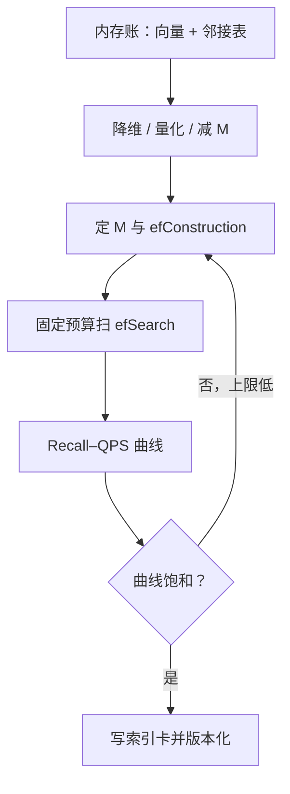

# 索引工程：HNSW 参数学

建索引的超参买图的质量，查询的超参买当次的延迟；两本账混着记，召回掉了不知道该找谁。

<footer>—— Malkov 与 Yashunin 的 HNSW 论文；据 ANN 调参工程实践整理</footer>

[上一课](/llm/rag-embedding-selection)钉住了向量空间：选型走自建验证集，微调走双评测。空间就绪，本课把它变成能扛住千万级库与延迟预算的索引。HNSW 的结构与图直觉在主干[HNSW / IVF](/llm/hnsw-ivf)课：多层图、贪心搜索、近似换延迟。本课只写工程要回答的三件事：参数各管什么、内存怎么算、召回–延迟曲线怎么在自己的分布上画出来并存档。

## 问题

HNSW 的参数分两套预算。建索引侧：$M$ 是每个节点保留的邻居数（第 0 层约 $2M$），$M$ 太小则图稀疏甚至局部不连通，召回上限被锁死，之后调任何查询参数都补不回来；$\mathrm{efConstruction}$ 是建图时的候选队列宽度，决定边选得好不好。查询侧：$\mathrm{efSearch}$ 是搜索时的候选队列宽度，是每次查询现付的延迟。两套混淆的典型病症：召回不达标就无限加大 $\mathrm{efSearch}$——延迟翻倍而召回纹丝不动，因为瓶颈在图质量；或者反过来，用默认 $M$ 上线，靠加大 $\mathrm{efSearch}$ 硬撑，尾延迟随流量崩。

## 方法

先算内存。每向量占 $4d$ 字节浮点，加邻接表约 $2M$ 条边（第 0 层）乘每条几字节的邻居编号；以 $d=768$、$M=32$ 计，向量约 3 KB、边约 0.3 KB，一千万向量约 35 GB 上下。降内存三路：降维（上一课的 Matryoshka 截断）、量化（[乘积量化](/llm/pq-vector-index)与标量量化）、减 $M$——三者的召回代价都要单独测。

再画曲线。固定 $k$ 与查询分布，从 $k$ 起扫 $\mathrm{efSearch}$（经验上 $2k$ 到 $10k$ 之间找拐点），记录 Recall@$k$ 对 QPS 与 p99；然后回到建索引侧，加 $M$ 或 $\mathrm{efConstruction}$，看整条曲线是否上移——上移才是买到了图质量，曲线不动则查询侧已饱和。把曲线（不是单点）连同 $M$、$\mathrm{efConstruction}$、嵌入版本写进索引卡，随索引一起版本化。

最后过一遍过滤：带权限的查询先过滤后搜索会把图上指向已过滤节点的边打断，遍历困在远处局部极小，召回骤降；边搜边滤则要确认候选预算不被过滤耗尽。过滤与遍历的交互属于正确性而非性能，主干[HNSW / IVF](/llm/hnsw-ivf)课已有此口径，这里要补的是：过滤查询的召回曲线要按「过滤后保留集」单独画，与全库曲线不是一条。

## 机制

为什么 $\mathrm{efSearch}$ 有饱和点：贪心搜索的候选宽度超过图质量上限后，多扫只是重复访问同一片邻域，额外延迟买不到召回；图质量由 $M$ 与 $\mathrm{efConstruction}$ 一次性买断。为什么过滤如此危险：HNSW 假设全库连通，过滤后的保留集在图上可能只剩稀疏散点，遍历要么提前断路、要么绕远——工程上要么放大 $\mathrm{efSearch}$ 补偿，要么换支持过滤感知遍历的实现。为什么难查询先崩：平均召回掩盖切片，近邻密集且易混的查询上，近似的丢真近邻概率远高于均值，曲线必须按查询切片重画。

$M$ 常见 16–48、$\mathrm{efConstruction}$ 常见 100–500 是经验区间，不是验收标准；「$M=16$ 够不够」在你自己的嵌入空间上没有二手答案——换一版嵌入，同一条曲线整体作废，必须重画。

## 边界

HNSW 支持动态插入，但边质量随插入缓慢退化，大规模更新宁可分区重建，策略在增量更新课展开。库更大、内存更紧时，IVF 加 PQ 是另一条路线，结构与取舍见主干课与 PQ 课；本课的曲线方法学不变，只是横轴换成 nprobe。ANN 调参修不了坏嵌入：空间本身塌了，图再密也搜不到，先回上一课的选型与微调。曲线画完、索引卡立住之后，第二条通道（词法）怎么并进来、两路分数怎么合，是下一课的缺口。

## 小结

- 建索引参数（$M$、$\mathrm{efConstruction}$）买图质量，查询参数（$\mathrm{efSearch}$）买当次延迟，两本账分开记。
- 内存账先算：浮点向量加邻接表，降维、量化、减 $M$ 三路的召回代价单独测。
- 验收物是 Recall–QPS 曲线加索引卡，不是某个参数组合的单点数字。
- 过滤与遍历的交互是正确性问题；平均召回掩盖难查询切片。
- 换嵌入即重画曲线；ANN 不修复坏嵌入。
- 出处：Malkov 与 Yashunin，HNSW；Jégou 等 IVF；据 ANN 调参实践整理。
