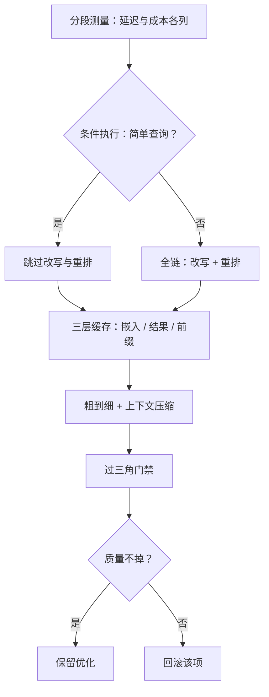

# 延迟与成本优化

链路上的段量级不同：把近邻从二十毫秒压到十毫秒，用户毫无感觉；把上下文砍掉一半，账单立刻看见。优化的第一步是分段测量，不是动手。

<footer>—— 据推理成本模型与检索工程实践整理</footer>

[上一课](/llm/RAG-eval-triangle)立了三角门禁：任何优化都要过三角，单角大涨先查代价藏在哪。本课写优化本身：一条 RAG 查询的时间与钱花在哪几段、砍哪里不伤质量、缓存与条件执行怎么设计。

## 问题

链路各段的量级不同：查询嵌入与 ANN 在毫秒与亚毫秒级，改写与规划是一次 LLM 往返（几百毫秒），重排是几十到几百毫秒的 GPU 前向，生成段是秒级且占成本大头。不先测量就优化的两种典型：把 ANN 从二十毫秒压到十毫秒，端到端无感，白付一次工程；或者砍掉重排省钱，前排精度掉，三角门禁阻断——又回滚。更隐蔽的是成本侧：检索段的自建成本（索引内存、批处理 GPU）是固定开销，生成段随答案长度线性，两者的容量规划逻辑完全不同，混在一个「单查询成本」里就找错了杠杆。

## 方法

分段测量先立住：p50、p95、p99 每段分开报，嵌入、ANN、融合、重排、生成 TTFT 与 TPOT 各一列；成本按推理成本模型的口径——租时除以有效吞吐，加利用率与重试，提示与生成分列。然后三个杠杆按序动。第一，条件执行：第六课的复杂度路由本来就是预算工具——简单查询跳过改写与重排，直接单次检索；只有困难切片走全链，多数流量付多数场景需要的钱。第二，缓存三层：块向量与查询嵌入缓存（语料不变即有效）、检索结果缓存（查询归一化后命中）、生成侧前缀缓存（系统提示与块模板预计算，[Prompt Cache](/llm/prompt-cache) 的模块化口径；块顺序稳定是复用前提，重排恰好保证这点）。第三，粗到细与压缩：[Matryoshka](/llm/matryoshka-embeddings) 短前缀粗召回加全维精排，省 ANN 时间；上下文压缩（[RAG 压缩](/llm/rag-context-compression)）直接砍生成段的输入 token，这是成本大头上的杠杆。

## 机制

缓存在 RAG 为什么特别有效：查询高度重复——FAQ 型流量里头部查询占比可观，块向量与块文本天然可缓存且不变；前缀缓存要块顺序稳定，重排后的顺序是确定性的，反而成了复用条件。条件执行为什么可行：查询难度分布长尾，多数是单跳直答型，为百分之几的难查询让全部流量付全链延迟，是错配。压缩为什么动的是大头：生成段计费与延迟都随输入加输出 token 走，检索段的毫秒级优化在秒级面前不显眼——但这不意味着检索侧可以烂，检索烂了忠实度掉，门禁会拦住。每一项优化单独上、单独过三角：多项一起上，回退时说不清是谁伤了质量。

缓存有正确性面：不同权限用户共享检索结果缓存会跨租户泄漏；缓存键必须带权限范围。这一条与增量更新课的删除同步是同一类问题——性能优化改动了安全边界。

## 边界

条件执行的路由错误由第六课的回退兜住，但降级路径的延迟与质量也要进评测。压缩率不是指标：压缩到忠实度掉线，省的钱赔进错误答案。前缀缓存对块顺序敏感，重排策略换版即缓存全失效，失效风暴要算进发布成本。成本模型别假设无限线性扩展：容量墙之上排队延迟接管曲线，见成本模型课的容量口径。每查询的钱和时间都进了账本之后，还剩一个时间维度：语料天天变，索引怎么跟上——增量更新与一致性。

## 小结

- 先分段测量再动手：p50 与 p99 每段一列，成本提示与生成分列。
- 杠杆按序：条件执行、三层缓存、粗到细与上下文压缩；大头在生成段。
- 每项优化单独过三角门禁；回滚要有版本，混着上说不清。
- 缓存键带权限范围；块顺序稳定是前缀复用的前提。
- 压缩率与延迟不是指标，忠实度不掉才是约束。
- 出处：据 Pope 等推理成本口径、Gim 等 Prompt Cache 与检索工程实践整理。
