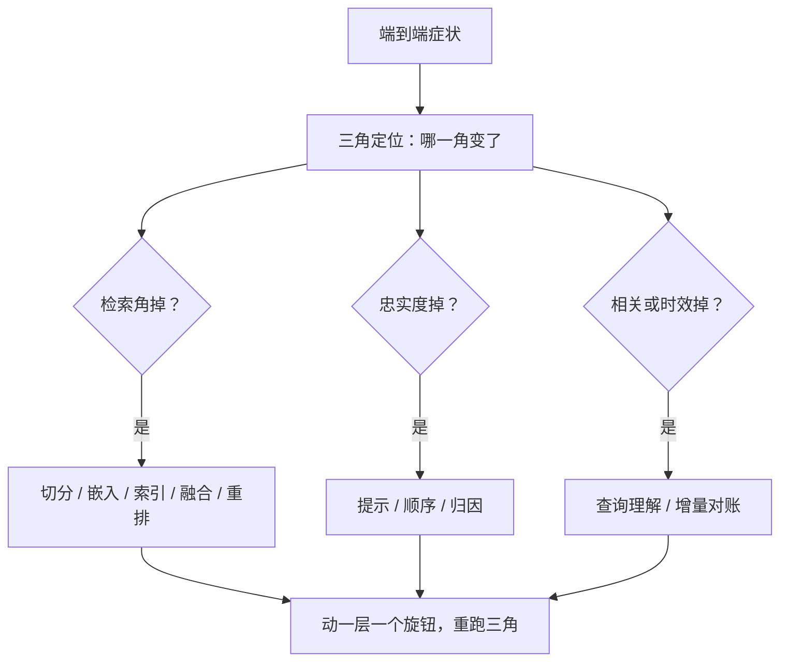
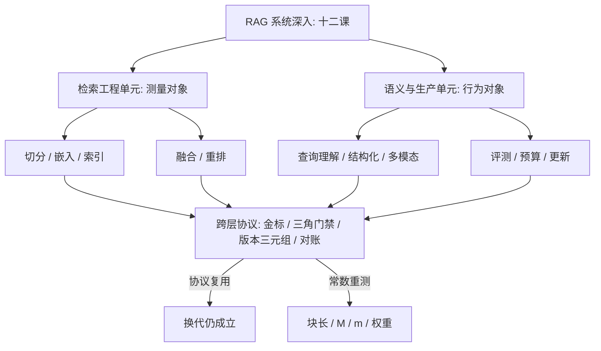

# 失败模式与收束

生产的故障都长在端到端上，病根埋在某一层里；排查法就是从症状走到层、从层走到旋钮的那张地图。

<footer>—— 据本课程整理</footer>

[上一课](/llm/rag-incremental-consistency)把更新与版本一致性立起来，至此检索工程与语义与生产两个单元全部落地。本课做两件事：把失败编成跨层排查法，把课程收进几条线。这是本课程最后一课——本课程到此收束。

## 问题

生产故障的表现永远在端到端：答错、答旧、拒答、泄漏、引用虚构。缺的是从症状到层的协议：先问[评测三角](/llm/RAG-eval-triangle)里哪一角变了，再问该角对应哪几课的旋钮。没有协议的团队会在错误的一层反复调参——检索明明给对了，却在调提示；生成明明在抄错，却在换嵌入。收束的问题因此不是复述，是提炼：前十一课里哪些是跨层不变的结构，哪些只是本次部署的常数。

常见误区：初学者容易「哪里不对改哪里」——答案不好就换提示词、换模型，改了十几处还是时好时坏。没有先问「三角哪一角变了」，你连故障出在检索还是生成都不知道；两层参数互相打架，任何单点修改都会被另一层的噪声淹没。

## 方法

按层的失败清单，每层三件套：症状、验证、旋钮。

- 解析与切分：金标跨度覆盖率低、引用粒度碎——修抽取与切分策略（第一课）。
- 嵌入：域内查询集体偏、近邻不相关——看域漂移与微调（第二课）。
- 索引：p99 抖、难查询切片召回掉——重画曲线、查过滤交互（第三课）。
- 融合：某类查询系统性偏一路——查权重漂移、退回 RRF（第四课）。
- 重排：前排精度低、拒答率异常——查 $m$ 饱和与阈值（第五课）。
- 查询理解：多跳断链、改写跑偏——关切片改写、查路由（第六课）。
- 结构化与多模态：聚合口径错、图表数值错——查 schema 卡与数值校验（第七、八课）。
- 生成：忠实度掉、引用不可解析——查提示、顺序与归因（第九课）。
- 时间维度：答旧、幽灵块——查对账与通道同步（第十一课）。
- 安全：被诱导引用毒块——查鉴权、隔离与多源一致（[投毒防御](/llm/retrieval-poisoning-defense)）。

排查纪律：一次只动一层的一个旋钮，动前动后跑三角，分数与版本三元组一起存档。

术语翻译：每层的「三件套」就是病历写法——症状（用户看到了什么）、验证（用什么数据确认病根在这层）、旋钮（这层有哪个参数可调）。排查纪律「一次只动一个旋钮」就是控制变量实验：同时改两个，好了不知道归谁，坏了不知道赖谁。

## 机制

收束回大图。本课程十二课是同一句话的展开：RAG 工程是把「检索什么、给多少、怎么排、何时信、如何更新」全部变成可测量、可门禁、可回滚的对象。检索工程单元（切分、嵌入、索引、融合、重排）给测量对象；语义与生产单元（查询理解、结构化、多模态、评测、预算、更新）给行为对象。与主干的分工：[向量检索与切分](/llm/rag-chunking)、[混合检索](/llm/hybrid-retrieval)、[重排序](/llm/rerank)立第一性与默认，本课程把默认变成你自己分布上的实测决策——协议（金标、三角、版本三元组、门禁、对账）跨语料与模型复用，常数（块长、$M$、$m$、权重）每次换代重测。

直觉类比：协议像体检流程——量血压、验血、对比历史，换了个病人照样适用；常数像处方剂量——同一个流程开出的克数因人而异。换嵌入模型相当于换病人：流程照走，但上一版测出的块长、$M$、融合权重一个都不能直接抄。

一句自检：任何「RAG 优化」若说不清动的是三角哪一角、版本三元组哪一维、门禁哪条线，它就还是一个技巧——技巧在语料或模型换代时静默失效，协议不会。

## 边界

清单不能替代三角数据：先看指标在哪层变，再动旋钮；反着来就是玄学调参。深钻层收束一门课，不收束一个领域：语料、嵌入、查询分布都会换代，本课程的曲线与常数会过期，协议不过期。检索之后的推理——多跳之后的规划、反思与预算分配——属于推理链与规划的课，此处交接。维护一张活的失败台账：每个新故障按本课三件套入册，台账比清单多一层时间，是团队真正的记忆。

## 小结

- 排查协议：症状到三角角度，角度到层，层到旋钮；一次动一个。
- 十一课收两线：检索工程给测量对象，语义与生产给行为对象。
- 主干立第一性，深钻把你自己的分布变成决策；协议复用，常数重测。
- 跨层不变的结构：金标跨度、三角门禁、版本三元组、对账台账。
- 检索之后的推理另课交接；失败台账随时间生长。
- 出处：本课程各课口径汇总；Lewis 等 RAG、Karpukhin 等 DPR、Es 等 RAGAS 等见各课小节。
