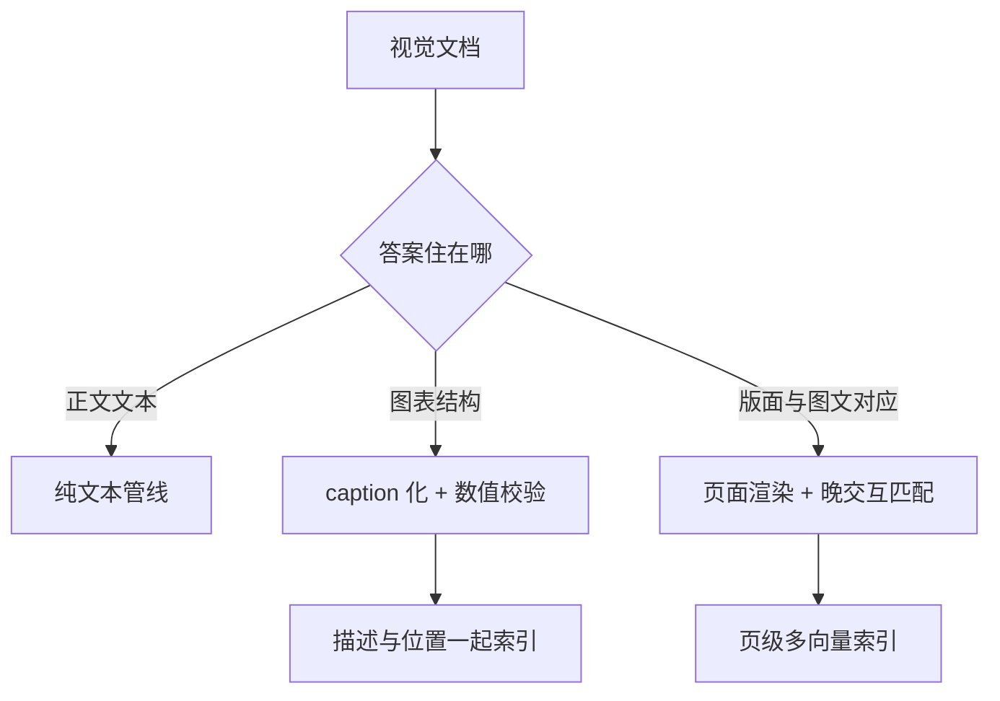

# 多模态 RAG

答案住在图里时，caption 是翻译，嵌入是罗盘，页面渲染是原件；翻译会丢数，罗盘找得着但读不了，原件最贵也最忠实。

<footer>—— Radford 等 CLIP 的双塔口径；Faysse 等 ColPali 的视觉文档检索路线</footer>

[上一课](/llm/rag-structured-data)把表格与关系库接进路由。语料的另一大类是视觉：扫描件、图表、幻灯片、带版面的 PDF。第一课说过「切分修不了烂抽取」，在多模态这里抽取本身就是问题——两栏排版、表格嵌图、图注分离，解析器输出的常是乱码与孤儿图。本课写视觉对象怎么进索引、怎么被引用：caption 化、跨模态嵌入、页面级视觉检索三条路线的选择与代价。

## 问题

默认管线把 PDF 拍成纯文本，图表要么丢失要么变成残句；检索根本看不见这些对象，生成器自然也引用不了。三条路线各有代价：caption 化用 VLM 描述图像再把描述当文本索引——图表可被文本查询命中，但描述是「翻译」，精确数值与坐标刻度被概率化；跨模态嵌入用 CLIP 式双塔把图块与文本查询放进同一余弦空间（[多模态嵌入](/llm/multimodal-embeddings)的口径）——找得着图，但向量读不了图；页面级视觉检索把整页渲染成图，查询与页面版面块做晚交互匹配（ColPali 路线）——绕过解析整条链，索引与匹配都贵。选择困难在于：答案到底住在哪。

## 方法

按「答案住在哪」选路线。答案在正文文本，图只是装饰：纯文本管线足够，别为它付视觉税。答案在图表的视觉结构（趋势、形状、布局）：caption 会丢、单向量抓不住，选跨模态或页面级。答案在图文对应（「图 3 那条曲线说明什么」）：引用要能指回页面区域，页面级检索或「caption 化 + 原图锚点」都行，但引用粒度必须是区域不是整页。caption 化管线的工程纪律：让 VLM 输出结构化描述（图表类型、轴、关键数值、结论），数值走校验回环——关键数值 OCR 或回读原图比对，不一致丢弃；描述与原文位置一起索引，引用才能落回原页。图文混排的块定义扩成「文本跨度或页面区域」，第一课的金标跨度协议照用，只是标注对象多了一类。

## 机制

caption 化为什么有损却常值：VLM 的描述把图接入文本查询的词汇空间，可与文本块融合排序、共享重排；损失在数值——概率化的「约 34%」在下游就是错误引用，所以数值校验回环不是可选项。跨模态嵌入为什么找得着读不了：双塔对齐的是「查询短语与图像区域」的绑定关系，判定相关可以，支撑答案不行，命中后仍需 VLM 读图生成。页面级检索为什么规避了解析：它把「解析–切分–嵌入」整条链换成「渲染–匹配」，对烂 PDF 是降维打击；代价是每页多向量、索引体积涨一个量级、专用匹配器与推理服务。三条路线不是互斥：正文走文本、图表走 caption、版面敏感域走页面级，路由按域与问题类型分，与上一课的意图路由同一套纪律。

图表问答里最常见的静默失败：描述里写「约增长三成」，原图是 41%——判官看描述打分是高分，看原图是错。验收多模态 RAG 必须让评审判官看见原图，而不是只看 caption。

## 边界

多模态嵌入与 VLM 早融合是两种系统，检索对绑定、生成对读图，别让一个组件干两件事。图像进索引前过隐私与版权筛，可写索引的注入面在投毒防御课的口径下同样适用，图不是法外之地。视频是多一条时间轴的问题，镜头切分与帧采样另成体系，本课不展开。视觉解析质量低到一定程度，先修 OCR 与版面模型再谈路线——它与文本侧同一条边界：管线修不了上游的烂输入。检索之外，视觉 token 的上下文预算与生成侧服务见多模态推理服务的课。

## 小结

- 按答案住址选路线：正文文本、图表结构、版面对应，各走各的管线。
- caption 化有损但接入词汇空间；数值必须校验回环，不然就是错误引用。
- 跨模态嵌入管找不管读；命中后读图交给 VLM。
- 页面级视觉检索绕过解析链，代价是索引体积与专用服务。
- 图文混排的金标跨度扩成「文本跨度或页面区域」，评测判官要看原图。
- 出处：Radford 等 CLIP；Faysse 等 ColPali；据多模态检索工程实践整理。
