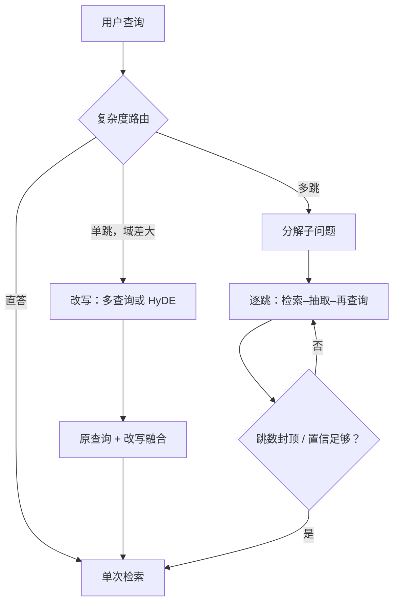
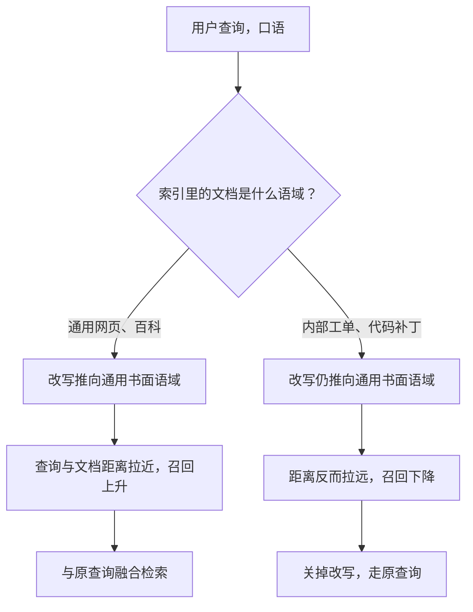

# 查询改写与规划

改写与规划都是用额外的模型调用买对齐；每一次调用既是延迟，也是新的错误源，开口子之前先量鸿沟。

<footer>—— Gao 等 HyDE；Trivedi 等 IRCoT；Jeong 等 Adaptive-RAG</footer>

[上一课](/llm/rag-reranker-engineering)把重排做成有预算的工程，检索侧五课到此齐了。本课转到查询侧：用户的问题与索引对象之间隔着两道鸿沟——词汇鸿沟（口语对文档语域）与结构鸿沟（单跳对多跳）。改写的第一性在[查询改写与 HyDE](/llm/query-rewrite-hyde)，多跳循环在[多跳检索](/llm/multi-hop-retrieval)，复杂度路由在 [Adaptive-RAG](/llm/adaptive-rag)。本课写深一层的工程：干预强度怎么分级、什么时候反向、每跳的停损怎么设。

## 问题

两道鸿沟对应两类失败。词汇鸿沟：用户问「请求拆成几段预填」，索引里是「chunked prefill」，零召回；改写把口语推回文档流形。

词汇鸿沟可以理解为「你说人话、文档说术语」：两边字面一个词都对不上，检索器按字面找相似，就什么都搜不到。改写的本质是提前做一次翻译——把口语翻译成文档的「方言」，再拿去检索。结构鸿沟：「A 和 B 的作者谁所属机构更早」需要分解、逐跳取证据、再比较；一次检索拿不齐证据链。而改写与规划都是额外的 LLM 调用：每次一次往返的延迟与费用，以及新的错误源——改写偏了比不改更糟，规划错了第一跳，后面全链陪葬。没有分级与停损，这条链会变成不可调试的延迟黑洞。

## 方法

干预强度分级，从便宜到贵：查询扩展（加同义词，无模型调用）；多查询改写（一次调用生成 $N$ 个变体，分别检索再融合）；HyDE（一次调用生成假文档，用其嵌入检索，假文档不进上下文）；逐步回退（先问上层概念再落细节）。规划侧：先路由——让小模型或分类器判断直答、单跳、多跳（Adaptive-RAG 的复杂度阶梯），只有多跳进分解流程：拆子问题、逐跳检索、中间抽取宜短、跳数封顶（三到四跳常见上限）。三条纪律贯穿：原查询永远保留一路，与改写路融合而非替换；改写开关按切片评测——「改写对不写对照」，只对直答失败率高的切片开；路由器独立监督，用标注类型而不是模型自述验证。

多查询改写里的 $N$ 常取 3 到 5：一次调用把原问题改写成 3 个不同说法，各自检索取回几组结果再融合去重。相当于花 1 次模型调用的钱，换 3 倍的检索覆盖面——检索本身很便宜，所以这笔账通常划算；真正贵的是那一次改写调用。

## 机制

改写为什么会在域差大时反向：改写模型把查询推向它先验里见过的文档语域，而你的索引若是内部工单、代码补丁，先验语域离你的文档更远——改写等于把查询推离目标。缩小鸿沟的根本手段是上一单元的域内微调；改写是鸿沟大时的补丁，不是万能前置。规划的错误为什么放大：第一跳检错，中间抽取跟着错，子问题偏离原意，证据链断在中间——每跳都要有停损：跳数上限、逐跳置信阈值、失败回退到原始查询的单次检索。路由为什么必须独立监督：让生成模型自述「这题我需要多跳」，它会倾向于表演复杂度；路由器的错分直接决定延迟与质量，要用人工标注的类型集验收。

这张图回答的问题是「改写什么时候帮倒忙」。改写模型只认识它训练时见过的通用语域；如果你的索引全是工单、法律条文这类小众文本，改写等于把查询推离了目标。所以开改写前先问一句：我的文档长什么样？

一次改写等于一次 LLM 往返，p50 常见加几百毫秒。先统计「不改写的单次检索失败率」：多数系统的失败集中在少数切片（多跳、术语鸿沟、时间约束），只对这些切片开改写，钱花在刀刃上。

## 边界

改写错误会放大检索偏置（HyDE 课口径）：改写路只在评测证明有增益的切片上开。跳数封顶不是能力声明而是停损：超限即回退并降级回答置信度，不要静默用不完整证据链硬答。中间抽取宜短——长中间结论会把第一跳的幻觉固化为第二跳的条件。规划延迟乘跳数，预算见后面成本课；检索失败的模式清单在收束课汇总。查询侧到齐后，下一课处理索引侧最难的一块：结构化数据。

初学者容易把「三到四跳封顶」当成模型推理能力的上限，实际上它是止损线：跑到上限还没查齐，说明前几跳大概率已经走偏，与其拖着一串断掉的证据硬答，不如回退降级、坦白告诉用户「没查全」。停损保护的是答案的可信度，不是模型的尊严。

## 小结

- 两道鸿沟两种药：词汇鸿沟用改写，结构鸿沟用分解规划；都是要付费的模型调用。
- 干预强度分级：扩展、多查询、HyDE、逐步回退；先便宜后贵。
- 原查询永远保留一路；改写只开在评测证明有增益的切片。
- 路由走直答、单跳、多跳阶梯，独立监督，不认模型自述。
- 多跳逐跳设停损：封顶、置信阈值、失败回退。
- 出处：Gao 等 HyDE；Trivedi 等 IRCoT；Jeong 等 Adaptive-RAG。
