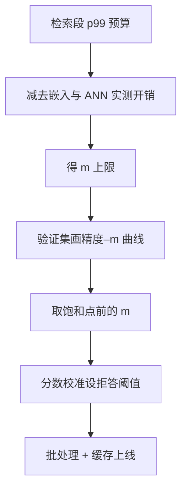

# 重排序器的工程

重排是检索链上最贵的可选项，也是最容易被默认开着、从不重审的一段；预算要倒着推，精度要挨着量。

<footer>—— Nogueira 与 Cho 的 BERT 重排路线；Santhanam 等 ColBERTv2 的蒸馏口径；据重排工程实践整理</footer>

[上一课](/llm/rag-hybrid-weight-learning)把融合权重做成可学习的对象；融合保召回，前排精度由重排买。重排的原理与两段式分工在主干[重排序](/llm/rerank)课：双塔召回、交叉编码器逐对打分、点式对式列表式之分。本课写把它做进生产的四件事：窗口 $m$ 怎么定、模型怎么选与蒸馏、阈值拒答怎么设、什么时候才轮到 LLM 列表排序。

## 问题

重排的延迟近似是 $m$ 次编码器前向（可批），$m$ 从 50 加到 200，延迟约线性涨四倍，而精度增益先升后饱和——增益的上界是上一课融合列表里的有效真值深度，列表里没有的真值，重排变不出来。生产病症有两种：重排默认全开，简单查询也在为个位数点的增益付几百毫秒；或者从不重审 $m$ 与模型，召回换代后难负例分布已变，旧重排器把新的真值块打低，前排精度悄悄回退。

## 方法

预算倒推。定检索段 p99 预算，减去嵌入与 ANN 的实测开销，剩余除以批量后的单条前向时间，得到 $m$ 上限；再在验证集上画精度–$m$ 曲线，取饱和点之前的值。模型选型把深度当旋钮：层数少的检查点换延迟，层多的换精度，[BGE Reranker v2](/llm/bge-reranker-v2) 的 layerwise 口径即此；更大提升来自蒸馏——用大交叉编码器或 LLM 对候选逐对打分当教师，训小模型学相对序，ColBERTv2 用同一思路去噪监督。难负例直接取上一课融合列表的高排名非答案块，比随机负例有用。

阈值拒答是重排独有的产品能力：点式分数校准后，低于阈值不送生成器、直接回「证据不足」，比硬凑 $n$ 块安全；分数分布不稳时用相对规则——至少留一块、分差小于 $\delta$ 多留。缓存同查询的重排结果，批内按长度分桶减少 padding 浪费。

## 机制

蒸馏为什么有效：教师逐对分数比人工标签细，学生学的是候选间的相对结构而非绝对分，绝对分随域漂移，相对序稳定得多。$m$ 为什么饱和：超过融合列表的有效真值深度后，重排只是在排列噪声，精度曲线走平而费用继续线性。LLM 列表排序为什么不上热路径：一次调用的延迟与费用接近又一次生成，且提示里的位置偏差让窗口中部候选吃亏；它的正确用途是离线标注与当蒸馏教师，线上热路径默认小模型点式重排。

重排窗口里的重叠切块不去重，前三名会是同一节的三份拷贝——近重复在重排后放大，因为交叉编码器对同一文本给出几乎相同的分。去重要在进重排窗口之前做。

## 边界

重排不创造召回里没有的真值，召回侧（切分、嵌入、索引、融合）仍决定上限。重排器与双塔、切分版本绑定：召回换代要重挖难负例、重蒸馏或重校准阈值。拒答率是必须报告的量：阈值收紧，拒答升、忠实度看似升——只是把难题推出了管道，端到端价值要用带拒答分支的评测算。多跳场景逐跳重排会叠延迟，通常只在把结果送生成器前的那一次重排。预算与降级路径怎么在服务里编排，是后面延迟与成本课的缺口。

## 小结

- $m$ 由延迟预算倒推、精度曲线收尾；饱和之后全是白付的延迟。
- 模型选型把深度当旋钮，大提升走蒸馏：教师逐对打分，学生学相对序。
- 难负例取融合列表高排名非答案块；召回换代必须重训或重校准。
- 点式分数校准换阈值拒答；拒答率是要报告的量，不是丑话。
- LLM 列表排序留在离线与教师位，热路径用小交叉编码器。
- 出处：Nogueira 与 Cho；Santhanam 等 ColBERTv2；BGE Reranker v2 模型卡。
