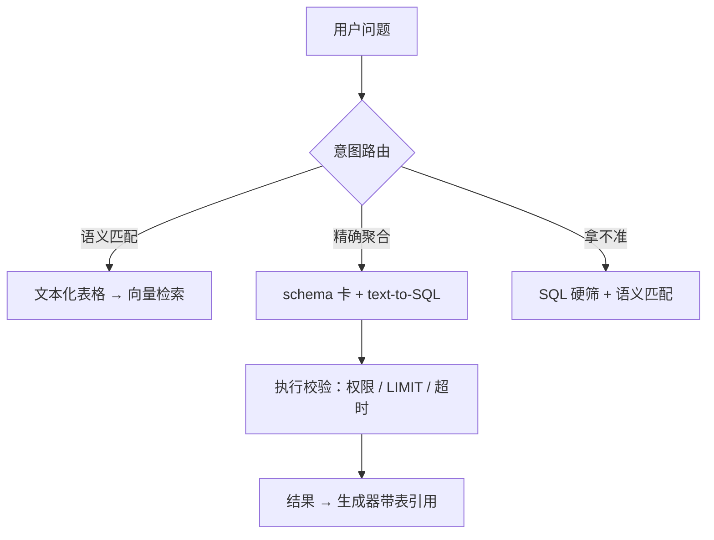
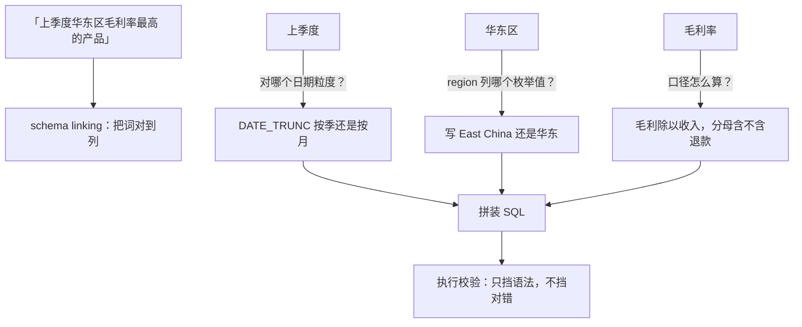

# 结构化数据的 RAG

「哪个产品被抱怨物流慢」要语义，「哪个产品退货率最高」要符号引擎；把两类问题喂给同一个向量索引，一半必然答错。

<footer>—— 据 Yu 等 Spider 的 text-to-SQL 基线与检索工程实践整理</footer>

[上一课](/llm/rag-query-rewrite-plan)在查询侧装了改写与规划的分级控制。语料里最难的一块是结构化数据：表格、关系库、指标仓。第一课说过表格按逻辑行切、复制表头，那是把表格当文本的极限；本课写越过极限的部分——什么时候拍平、什么时候走 SQL、路由怎么判。

## 问题

嵌入空间里没有列约束、类型与聚合这些符号结构。「上季度华东区毛利率最高的产品」对向量检索是灾难：它需要过滤、JOIN、聚合与排序，是查询不是匹配；语义近邻会返回「讲毛利的章节」而不是那行数据。反方向，「哪个产品常被用户抱怨物流慢」需要语义泛化，SQL 写不出「抱怨」。两类问题混在一条向量链上，失败模式互相污染：该精确的模糊了，该模糊的精确不了。缺口是路由与两条各自正确的通路，外加把两者串起来的混合路径。

向量检索的直觉是「按意思找邻居」：擅长「哪些内容在讲这件事」，天生不擅长「算个数再排序」。「毛利率最高」要过滤、分组、比大小，这是数据库的符号引擎的本职。两者像算盘和计算器——各管一类题，硬让一个包场，必有一半算错。

## 方法

三条路。第一条，文本化走向量：把表序列化——Markdown 行、表头复制进每行、或行叙述化；适合「查行」「找相似案例」类问题；金标沿用第一课协议，只是跨度变成单元格区间。第二条，text-to-SQL：把 schema 卡（表、列、注释、枚举值、指标口径、few-shot 示例）放进提示，生成 SQL；执行前强制校验——语法、行级权限、LIMIT 上限、超时；评测用执行准确率（金标答案集上比对执行结果），不是字符串匹配。第三条，混合：SQL 先做硬约束筛（时间窗、类目），筛后的小结果集再语义匹配；或先向量找候选实体，再让 SQL 取这些实体的精确指标。路由：规则先行（「最高、平均、增长率、环比」触发 SQL 意图），分类器兜底，两类都拿不准时走混合并降级置信度。

执行校验里的 LIMIT 与超时像保险丝：生成模型偶尔会写出没加限制的全表查询，在千万行大表上一跑几分钟，把整库拖垮。加上「最多返回 100 行、超时 5 秒」这类硬闸后，一条坏 SQL 的代价就从「事故」降级成「返回空结果重试」。

## 机制

文本化为什么必然丢约束：嵌入把一行压成平均语义，列类型、主外键、聚合语义不在余弦的分辨范围内——它与混合检索同构：词法对标识、向量对改写，这里 SQL 对约束、向量对语义，分工由问题类型定。text-to-SQL 为什么错：主要失败点不是「不会写 SQL」而是 schema linking——问题里的「华东」该对上 region 列的哪个枚举值、「上季度」对哪个日期粒度；所以先补列注释与枚举值清单，再谈提示工程，执行校验挡得住语法错，挡不住「跑通但答非所问」，后者只能靠金标答案集验收。路由为什么规则先行：聚合意图在词汇上有强信号，规则可解释、零延迟、错误可审计；分类器只处理规则的漏网部分。

这张图回答「SQL 明明跑通了为什么还答错」。语法校验只检查 SQL 合不合法，不管「华东」有没有对准数据库里真实存的那个字符串——一个枚举值对不上，查询合法、执行成功、结果全错，且系统毫无报错。这正是要靠金标答案集验收的原因。

指标口径必须随 schema 卡给模型：「活跃用户」是按天去重还是按月、退货率分母含不含取消，模型不知道口径时生成的 SQL 语法全对、数字全错——这类错误执行校验永远发现不了。

## 边界

权限必须下推到 SQL 层的行级安全，提示词里的「请只查你有权的」不是安全边界，与向量侧的权限过滤同一纪律。大表聚合要设超时与扫描上限，防一次提问拖垮库。自由文本备注列仍走向量；半结构化（JSON 日志）介于两者之间，抽取成行再路由。schema 漂移要当发布管理：加列、改枚举值都触发 schema 卡更新与回归题集重跑。文本化表格的切分仍受第一课协议约束——它只是结构化问题里「语义那一半」的权宜。

常见误区：以为在提示里写「请只查你有权限的数据」就是权限控制。对模型来说那只是礼貌建议，它照样可能生成越权 SQL。真正的闸门要装在数据库层——行级安全让越权查询被数据库直接拒绝，这和「门锁在门上」而不是「贴张告示」是一个道理。

## 小结

- 先路由再检索：聚合与约束走 SQL，语义与模糊走向量，拿不准走混合。
- 文本化是语义那一半的权宜，列约束与聚合在嵌入空间里不存在。
- text-to-SQL 的主要失败是 schema linking：列注释与枚举清单先于提示工程。
- 执行校验挡语法，金标答案集挡答非所问；权限下推行级安全。
- 指标口径进 schema 卡；schema 漂移当发布管理。
- 出处：Yu 等 Spider；据 text-to-SQL 与检索工程实践整理。
