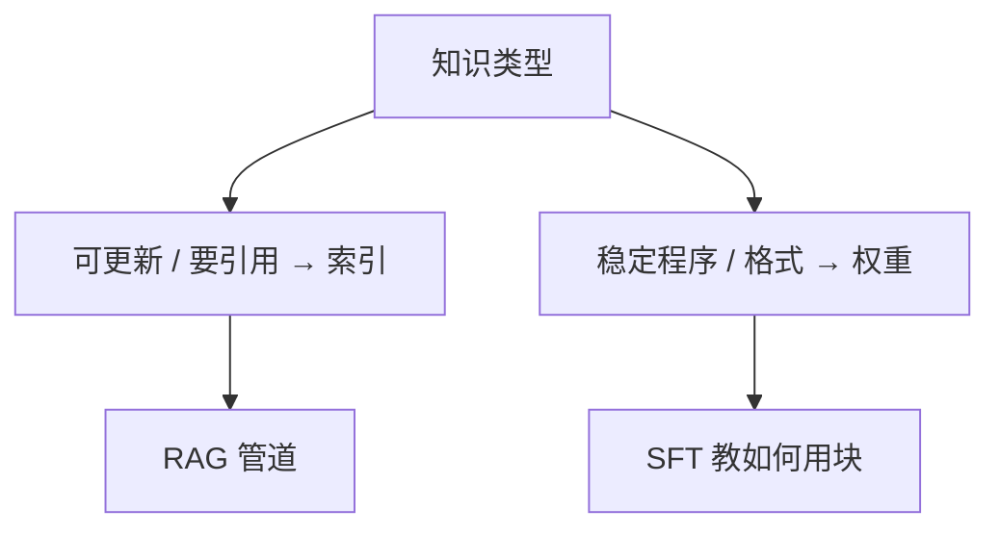

# RAG 对微调

私有知识要更新、要可引用、要能撤销，放索引。格式、语气、任务程序放权重。用微调背手册，过时与幻觉会绑在参数里。

<footer>—— Ovadia 等对微调与检索的比较；Lewis 等 RAG 的非参数记忆</footer>

[上一课](/llm/pq-vector-index)用子空间码本换内存，查询侧保持浮点，最终短列表用精确重排。索引已经能省；还要决定知识写在哪。缺口是 RAG 对微调的决策边界——避免「再训一遍就不用检索」。本课写这一边界，不重推 PQ 的码本。后课投毒防御默认：索引可被攻击，不等于该把知识熔进权重。

## 问题

微调能抬领域术语与答题格式，对**封闭、稳定、不许外泄到提示**的程序有效。对日期、价格、条款、内部工单，微调刚结束就过时，且无法逐条引用、无法按权限过滤。检索相反：更新是写文档，引用是块 ID，权限是元数据。代价是管道复杂、延迟、以及本单元写过的忠实度问题。

混合是常态：轻量 SFT 教会「如何用检索到的块作答」，知识仍在索引。用 SFT 把手册抄进权重，再加 RAG，会让参数与块冲突，归因更难。

长上下文窗口变大，不自动取消这道题。窗口是容量，索引是可更新集合与权限边界。见长上下文对 RAG 课。

## 方法

决策表：变更频率高 → 索引；需引用与权限 → 索引；任务格式与工具规程稳定 → SFT / 指令。评测用时间切片：新文档进索引后未经微调是否立刻可答；过时文档删除后是否立刻不再被当事实。微调组应在同一切片上失败，才说明职责分对。

## 机制

参数记忆是压缩过的统计，单条事实没有地址。非参数记忆有地址，才能撤销与审计。微调把新事实写入权重的同时，也扰动无关能力（灾难遗忘）。检索不扰动权重，但扰动上下文条件。冲突时阅读器需要明确指令「以块为准」，否则统计先验会赢。

## 边界

极小语料、极强保密、禁止任何文档出域时，可能只能微调且不上检索——那是约束，不是精度更优。下一课：索引可写意味着对手也可写，需要投毒防御。

## 小结

- 可更新、可引用、要权限的知识放索引；稳定程序放权重。
- SFT 应教「如何用块」，而不是把手册背进参数。
- 用时间切片验收更新与撤销。
- 出处：Ovadia 等微调对检索；Lewis 等 RAG。
