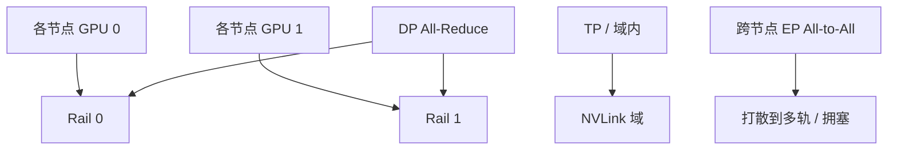

# rail-optimized 拓扑

轨优化把「第 $i$ 张 GPU」对齐到同一条上行。数据并行的 All-Reduce 喜欢这种对齐；专家并行的 All-to-All 不一定买账。

<footer>—— NVIDIA DGX SuperPOD 一类参考架构中的 rail-optimized 脂肪树；对照 Clos 分层</footer>

[上一课](/llm/collective-bandwidth-model) 把 $\beta$ 当成链路常数。本课给常数一个拓扑：GPU 集群常见的 **rail-optimized** 脂肪树——每个节点第 $i$ 张 GPU 接到第 $i$ 条轨（一组叶子–脊柱），希望同号 GPU 之间的集合通信不打到别的轨上。缺口是：这种设计为哪一种集体流量优化，以及它与 [全互连 vs Clos](/llm/all-to-all-vs-clos) 里柜外 Clos 如何咬合。[NVLink](/llm/nvlink) 域仍是节点内或超节点内；轨是 Scale-Out 层的画法。

## 问题

普通 Clos 上，网卡哈希可能把同一 DP 组的流量打散到多条上行，再在脊柱汇聚时极化。GPU 训练的集体流量高度同步：所有 rank 几乎同时发出同样大小的块，哈希极化会让一条轨过载、其余空转，step 被最慢轨绑住。轨优化的假设是：把拓扑做成「平面 $i$ 只承载 GPU $i$」，再让并行网格把 DP 组画在同号 GPU 上，于是 All-Reduce 的跨节点段走一条干净的平面，不必与 TP 的节点内流量争同一条上行。

问题立刻变成两问：进程绑定是否真的让 rank 落在设计的轨上；流量模式是否真是「同号到同号」。后者对 DP 梯度同步大致成立，对 EP All-to-All 不成立——置换是任意到任意，轨对齐帮不上，还可能把本可打散的流量关进 $N_{\mathrm{gpu\_per\_node}}$ 张彼此隔离的平面里，平面内部更挤。

「Rail」在这里不是铁路隐喻作文，而是编号对齐：rail 0 连接各节点的 GPU 0。文献与厂商参考架构都这么用。不要和存储的 rail 或电源轨混谈，除非设施文档明确同一根铜排。

## 方法

规划分三步。第一，物理：每张 GPU 尽量对应一张（或一组）NIC 端口，PCIe 亲和在同一交换机下，GPU Direct RDMA 走得通。第二，逻辑：NCCL 拓扑与 `CUDA_VISIBLE_DEVICES`、进程绑定保证 rank 的 GPU 号与 NIC 号一致。第三，并行网格：DP 维沿「同轨」展开，TP / CP 维留在 [NVLink](/llm/nvlink) 域内，不跨轨。

超节点（NVL72 一类）把第一层轨的半径扩大：域内不再需要轨，柜间 Clos 仍要轨优化。不要把柜内 Switch 当成若干 rail——软件看见的是平坦域。柜间若不用轨优化，72 卡域的对外 All-Reduce 会在叶子层变成随机哈希，超节点买到的 Scale-Up 优势到柜边被吐掉。

验收：`nvidia-smi topo` 与网卡亲和；`nccl-tests` 在「只含同号 GPU」的进程组上 busbw 应接近该轨规格；把进程故意错绑后 busbw 应掉档。没有这组对照，不能声称集群是轨优化的——只能声称图纸是。

## 机制

同步集体在 Clos 上的经典失败是 incast：多对一在某一跳汇聚。轨优化把 DP All-Reduce 的汇聚限制在平面内，平面的订阅比按全集群哈希更可预期。它不消除 $\alpha$，只让 $\beta$ 更接近空载模型。自适应路由可以在平面内绕开热点，但若把流量绕到别的轨，就破坏了「GPU $i$ 只走 rail $i$」的隔离，可能帮了 All-to-All、害了 DP。策略要按流量类型，不能全局开一种。

多租户时，两个作业的 DP 组若共享同一轨，隔离被打破。调度需要把作业的 GPU 号与轨当成资源的一部分，而不是只分配「8 张卡」。后课公平调度会回到 gang 与拓扑感知；本课只要求轨是调度输入。

以太网 RoCE 与 InfiniBand 都能做轨优化脂肪树。差别在拥塞控制（后课），不在「可不可以编号对齐」。把厂商名词当成拓扑发明是错的；对齐是布线与编号纪律。

## 边界与工程取舍

不要为了轨优化把 TP 组拆到多节点同号 GPU 上——同号 GPU 之间是网卡 $\beta$，不是 NVLink。不要假设 All-to-All 自动受益。不要在超分严重的 Clos 上只靠轨优化：平面内部仍然可以过订阅。Dragonfly 等非 Clos 拓扑用另一套局部性，下一课对照，不要把 rail 概念硬套过去。

检查点与存储流量若走同一套 NIC，会周期性污染轨的 $\beta$。存储平面分离是运维选项；做不到至少错开检查点与梯度同步的峰值。

## 小结

- Rail-optimized：同号 GPU 对齐到同一上行平面，服务 DP 类同步集体。
- TP 留在 NVLink 域；DP 沿轨展开；EP All-to-All 与轨假设冲突。
- 绑定错误等于没有轨优化；要用错绑对照验收。
- 轨是调度输入，多租户共享同一轨会毁掉 $\beta$ 模型。
- 出处：DGX SuperPOD 一类 rail-optimized 参考架构；Clos 见上一拓扑课。
