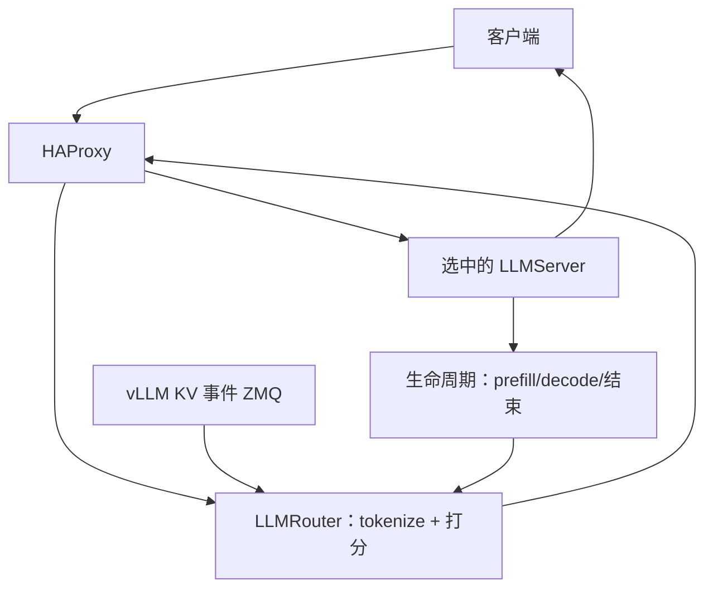

# Ray 2.58 KV-aware 路由

    
只追 KV 重叠会把所有共享前缀打到同一副本；还要加上这条副本上还剩多少 prefill 与 decode 活。

    <footer>—— Ray 2.58.0 发行说明；Ray Serve LLM *KV-aware routing* 用户指南</footer>

集群路由若只做会话哈希或提示前缀树，看不见引擎里块的创建与驱逐，也不看见这条副本已经在算多少 token。Ray Serve LLM 在 2.57 预览、**2.58.0 收完** KV 与 token 感知路由：`KVAwareRouter` 根据 vLLM 的 KV 事件估计重叠，再叠上副本的 token load，把请求送到估计负载最低的引擎。概念层见 [KV 感知路由](/llm/kv-aware-routing)；本篇钉 2.58 的控制面：决策做在 `LLMRouter` 入口副本里、事件广播、CPU 卸载也算命中、以及 alpha 限制。

## 问题

轮询摊请求，对无状态服务正确，对带 KV 的 LLM 会把同一系统提示在 $R$ 个副本上各算一遍。一致性哈希按 `x-session-id` 粘滞，多轮友好，但长会话会把一张卡打满，其它卡空着。`PrefixCacheAffinityRouter` 在网关侧用提示文本近似缓存，队列失衡时退回 power-of-two choices，仍然不是引擎块表。真正缺的是：**每张卡现在有哪些 KV 块、每张卡还剩多少 prefill/decode 工作**。

若把选择做成集群里唯一的 actor，每个请求一次 RPC，入口一多就成热点；actor 挂了，全局负载视图一起没。2.58 把选择挪进已经位于路径上的 ingress 副本，去掉这条同步 RPC。代价是多 ingress 必须同步 KV 事件与负载，视图是最终一致，不是线性一致。

### 重叠不是唯一目标

Anyscale 的配套说明把问题说死：只优化 KV 复用，热前缀会吸干单个引擎，TTFT 反而差。正确目标是 **token load**：扣掉 GPU 上已有重叠之后，这条请求还要做多少 prefill，再加上该副本正在进行的 prefill 与 decode。CPU 上的卸载块也算重叠，但信用低于 GPU 块，因为要先搬回 HBM。

文档标明 `KVAwareRouter` 仍是 alpha。API、环境变量与 Dynamo 选择服务的权重名可能在稳定前改。不要把 2.58 的类路径写进不可改的 Helm 里当永久合同。

## 方法

安装选择服务：`pip install "ai-dynamo>=1.4.0"`。启动前三个环境变量必须齐：`RAY_SERVE_ENABLE_HA_PROXY=1`、`RAY_SERVE_LLM_ENABLE_DIRECT_STREAMING=1`、`RAY_SERVE_INGRESS_REQUEST_ROUTER_FORWARD_BODY=1`。路由按 prompt token 打分，所以 HAProxy 要把请求体转到 ingress；体超过缓冲区（默认 256 KiB）会被截断，指标 `serve_haproxy_ingress_router_truncations_total` 上涨时再加大，内存与 TTFT 会一起涨。

配置是把 `request_router_class=KVAwareRouter` 放进 `LLMConfig.deployment_config.request_router_config`。引擎侧打开 `enable_prefix_caching`。2.58 的 #65063 让原生 CPU 卸载事件进入同一套索引：`OffloadingConnector` 发出 `medium="CPU"` 的 BlockStored/Removed，选择服务把 HostPinned 层算进重叠。引擎参数形态是 `kv_offloading_backend="native"` 加每副本 CPU 缓存 GiB。

请求路径：客户端 → HAProxy → 某 `LLMRouter` 入口（本地 tokenize + Dynamo 打分）→ HAProxy 把请求送到选中的 `LLMServer` → 直接流式回客户端。KV 生命周期事件广播到**所有** ingress；ingress 之间异步同步 token load。Token 经旁路发给引擎，避免引擎再 tokenize；旁路是尽力而为，过期则引擎重做 tokenize。`RAY_SERVE_LLM_KV_TOKEN_STAGING_*` 控制暂存 TTL、条数与字节。

### 打分权重

`runtime_env` 里的 `DYN_*` 传给 ingress 上的选择服务。`DYN_ROUTER_PREFILL_LOAD_SCALE`（默认 1）拉高则偏 prefill 重的流量；`DYN_ROUTER_KV_OVERLAP_SCORE_CREDIT` 控制 GPU 重叠能抵多少 prefill，设 0 则只看负载；`DYN_ROUTER_KV_OVERLAP_SCORE_CREDIT_DECAY` 在副本已经堆积时衰减命中红利，避免亲和把忙卡越打越忙；`DYN_ROUTER_DECODE_ACTIVE_REQUEST_WEIGHT` 给「正在服务的请求数」加成本。Decode 进度上报默认关（`RAY_SERVE_LLM_ENABLE_DECODE_BLOCK_PROGRESS`），打开更准，但每个引擎要向每个 ingress 发更新，高并发有网络税。

## 机制

Token load 用 KV 块当单位。Prefill 项：未命中 token 加上该副本已在飞的 prefill；GPU 块全额抵扣，CPU 块打折。Decode 项：活跃请求的 KV 块，按 `max_tokens` 估计剩余输出加权。请求去估计总和最低的副本。这把 [前缀感知扩缩容](/llm/prefix-aware-autoscaling) 里「利用 vs 探索」收成一个标量，而不是两段启发式。

入口侧 tokenize 必须与引擎同一 renderer / chat 模板，否则重叠按 token id 计算会系统性算错——差一个 BOS 就整段前缀对不上。这是 ingress CPU 成为瓶颈的原因，也是 `RAY_SERVE_INGRESS_ROUTER_REPLICAS_PER_NODE` 默认 1、可调到 2 的原因。视图最终一致：刚写入的 KV 块可能尚未出现在另一个 ingress 的树上，短窗口内会次优路由，不应假设全局精确命中。

2.58 还把 tokenization 放在进程内、token 带外传输，使引擎跳过二次分词（#64642、#64920、#65095）。这是延迟路径优化，不是正确性必需：暂存丢失时引擎回退到自己分词，路由决策已经做完，最坏是这次没命中缓存。

## 边界与工程取舍

文档限制：只支持直接流式；每个应用一个模型；无 LoRA / multiplex 感知路由；**还不给数据并行 rank 打分**；**还不支持 PD 分离**（均写 planned）。均匀、短提示、无共享前缀的流量，额外开销可能付不出。HAProxy 截断体会让长多模态请求被错误打分。多租户下 KV 事件是缓存元数据，键必须含模型与模板版本，与引擎前缀缓存同一套指纹。

### 和文本前缀路由、会话哈希怎么选

`PrefixCacheAffinityRouter` 不依赖 Dynamo、不要求 KV 事件套接字，用提示文本在网关侧建树，适合「还没有 vLLM 事件、但共享长前缀」的过渡。它近似引擎状态，队列一歪就退回 power of two，热前缀仍可能打偏。`ConsistentHashRouter` 要客户端带 `x-session-id`，多轮对话稳，但长短会话不均时会把单卡打满。`KVAwareRouter` 吃的是异构长度、GPU 已近满、以及前缀共享超出系统提示的流量；代价是直接流式约束、每应用单模型、以及选择服务的运维面。同一 `request_router_config` 可以换类，先用哈希把会话稳住，再在观测到假命中或热卡之后切 KV-aware，而不是第一天就上 alpha。

扩容时新副本的 KV 树是空的，选择服务会暂时把它看成「无重叠、负载低」而灌冷 prefill，直到事件追上。这与 [前缀感知扩缩容](/llm/prefix-aware-autoscaling) 的「先复制热前缀再接流量」要配合：只加空副本、立刻让 KV-aware 看见，等于用路由把缓存打散。缩容相反，先从选择集摘掉、等块引用归零，再下实例。

出处：https://github.com/ray-project/ray/releases/tag/ray-2.58.0（KV cache and token aware request routing、CPU KV 感知 #65063）；https://docs.ray.io/en/master/serve/llm/user-guides/kv-aware-routing.html。选择服务细节见 NVIDIA Dynamo standalone selection service 文档。

## 小结

- Ray 2.58 的 `KVAwareRouter` 用引擎 KV 事件加 token load 选副本，而不是只做前缀哈希。
- 决策在 `LLMRouter` ingress 内完成；KV 事件广播，负载最终一致。
- CPU 卸载块计入命中但信用更低；token 在入口分词并带外传递。
- 需要 HAProxy、直接流式、转发请求体；alpha，且暂不支持 DP 与 PD 分离。
- 权重用 `DYN_ROUTER_*` 按 prefill/decode 形态调。
- 出处：Ray 2.58 发行说明与 Serve LLM 用户指南。
