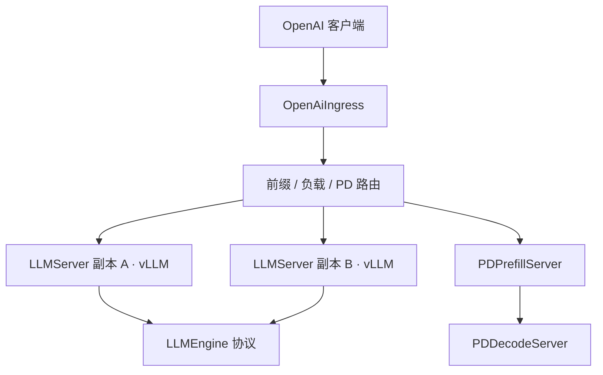

# Ray Serve LLM

把单引擎的吞吐接到 Ray 的部署图上：副本、放置、自动扩缩和入口路由是基础设施；vLLM 或 SGLang 仍然负责连续批与 KV。

<footer>—— Ray Serve LLM Architecture 文档；底层运行时见 Moritz et al., Ray, OSDI 2018</footer>

单进程 vLLM 能把一张节点吃满，却回答不了「三个模型、两套 LoRA、前填池和解码池、按 QPS 扩缩」这类集群问题。Ray Serve LLM 把 Ray Serve 的 Deployment 特化成 LLM 工作负载：`LLMServer` 包住一个引擎实例，`OpenAiIngress` 暴露 `/v1/chat/completions` 一类入口，中间用协议而不是硬编码把请求送到 vLLM 或 SGLang。编排层来自 Moritz、Nishihara、Stoica 等人的 Ray（OSDI 2018）：任务、Actor、对象存储与调度器已经能跨节点放 GPU。本篇写这层特化，不把 [PagedAttention](/llm/vllm-paged) 再讲一遍。

## 问题

生产 LLM 服务的控制面需求与训练不同。流量按分钟变，要按副本数而不是按作业步数扩缩；同一基座要挂多个 LoRA；有的请求该打到前缀缓存命中的副本，有的该打到更空的副本；前填与解码可能要拆成两类 Deployment。把这些写进一份 bash 里起多个 `vllm serve`，亲和、健康检查和多模型路由都要自己做。

Ray 给出的原语是 Actor 与 Deployment：每个副本是一个可调度的进程，带资源声明（几张 GPU、哪种加速器）。缺的是 LLM 语义——OpenAI 请求体、流式 token、引擎启动顺序、以及「前缀感知」这种不能用轮询替代的路由。Serve LLM 要填的就是这层语义，而不是再实现一套注意力核。

### 引擎无关不是性能无关

文档把 `LLMEngine` 写成抽象基类：入参出参都是 OpenAI 形状的请求/响应，分词与采样藏在引擎里。这让 Ingress 和扩缩逻辑不用改就能接 vLLM 或 SGLang。性能模型并不因此相同：vLLM 与 Ray 的深度集成包括 worker 的细粒度放置、PD 的 KV 传输、自动前缀缓存；SGLang 路径是社区维护的进程内引擎加 [RadixAttention](/llm/sglang)。选引擎仍是一等决策，协议只保证控制面可替换。

`build_openai_app({"llm_configs": [...]})` 看起来像一行部署。真正占卡的是每个 `LLMConfig` 展开出的 `LLMServer` 副本与引擎子进程。资源配置写在 `LLMConfig` 的 `engine_kwargs` 与加速器字段里，而不是写在 FastAPI 路由上。

## 方法

核心有两块。**`LLMServer`** 是一个 Serve Deployment，管理一个引擎实例。副本可以三种方式存在：独立复制（数据并行式的多副本）、在同一 Deployment 内做张量/流水线/专家并行、以及跨 Deployment 协同（PD 分离里的 `PDPrefillServer` / `PDDecodeServer`）。异步构造函数保证引擎 `start` 完成才接请求，避免副本未就绪时被 Ingress 打满。

**`OpenAiIngress`** 提供 FastAPI 入口：`/v1/chat/completions`、`/v1/completions`、`/v1/embeddings`。它执行路由策略（前缀感知、会话感知、或默认负载均衡），并处理 LoRA 多路复用——基座副本共享，适配器按请求挂载。Ingress 与 Server 的比通常小于 1，避免把 CPU 上的 HTTP 与 GPU 上的前向绑死在同一进程；这与 [vLLM V1](/llm/vllm-v1) 把 API 进程和 `EngineCore` 拆开是同一方向。

构造复杂图用 builder：声明若干 `LLMConfig`（模型、并行度、引擎参数、扩缩规则），生成 Deployment 图再 `serve.run`。官方列出的能力包括张量/流水线/专家并行、数据并行注意力、PD 分离、前缀感知路由、多 LoRA、以及 vLLM/SGLang 后端。指标接到 Ray 的 dashboard 与 Grafana 模板。Anyscale 的托管服务在同一套 Serve 之上补基础设施，但开源合同仍是 `ray.serve.llm`。

### 路由：前缀命中与负载是同一条分数

自定义路由在 Ingress 执行。前缀感知把提示的 token 前缀映到已有 KV 的副本，提高引擎内自动前缀缓存或 radix 的命中；纯会话粘滞会把同一用户的无关任务绑在一起，造成局部过热。Ray 文档把 KV 感知路由描述为在缓存重叠与当前 token 负载之间取舍，避免「所有命中同一系统提示的请求涌进同一副本」。这与 [SGLang Router](/llm/sglang-router)、Dynamo Smart Router 是同一调度问题在不同控制面上的实现。PD 模式下 Ingress 要先选前填 Deployment 再把 KV 句柄交给解码 Deployment，亲和规则见 [decode 亲和](/llm/decode-affinity)。

扩缩按 Deployment 独立做：前填副本数可以跟解码不同，这是 [分离 Prefill 资源池](/llm/disagg-prefill-pool) 在 Ray 图上的表达。扩缩信号用队列长度、并发流数或自定义指标，而不是 GPU 利用率一个数——解码可以利用率不高但 KV 已满。

## 机制

水平扩展的机制是**复制引擎 + 入口分流**。每个 `LLMServer` 副本带一份权重（或一份 TP 分片组），Ingress 把无共享前缀的请求尽量均匀洒开，把有共享前缀的请求尽量送到已有页的副本。吞吐上限近似为副本数乘单引擎吞吐，再减去路由不均与 PD 传输税。Ray 的调度器负责把声明了 `GPU: 8` 的副本放到有八张卡的节点；Serve LLM 不重新发明放置，只把 LLM 的并行度翻译成资源形状。

多 LoRA 的机制是基座常驻、适配器按请求换入。路由必须把「同一基座 + 指定适配器」视为缓存键的一部分，否则会把 A 适配器的 KV 当 B 的前缀用。引擎侧 vLLM 已经支持多 LoRA 与分页；Serve 层要保证请求体里的适配器标识传到 `LLMEngine`，并且扩缩时新副本能拉到适配器权重。

OpenAI 兼容只保证路径与 JSON 形状。采样参数、logit bias、水印钩子、约束解码是否透传到引擎，取决于当前 `VLLMEngine` 实现。不要用一份 curl 通过 `/v1/models` 来推断所有解码特性都已接通。

### 与「多个 vLLM 进程 + 外部网关」的差别

用 Nginx 或自写路由器挂多份 `vLLM` 也能做复制。Serve LLM 多出来的是：放置与 GPU 标签进同一套调度器、副本就绪与引擎启动绑定、Deployment 图把 PD 与多模型写成可版本化的配置、以及路由策略作为一等 Python 对象而不是网关 Lua。代价是集群要跑 Ray，故障域从「一个 vLLM 进程」变成「Ray 头节点 + Serve 控制器 + 副本」。小规模单模型常常不值得；多模型、弹性、PD 图才开始划算。

## 边界与工程取舍

Ray 头节点与 GCS（全局控制存储）是新的单点与延迟来源。引擎已经把 CPU 开销从 GPU 循环里拆走之后，Serve 的序列化与跨进程转发仍可能在短解码上露出尾巴。文档称 Ingress 对延迟的影响是毫秒级，但仍要把探测打在「经 Ingress」和「直连引擎」两条路径上。

PD 分离、专家并行、数据并行注意力可以组合，组合后的失败模式也组合：KV 传输失败、EP 负载不均、Ingress 选错池。builder 让声明变短，排障仍要沿 Deployment 图走到具体引擎日志。SGLang 后端的功能覆盖落后于 vLLM 路径时，不要假设 radix 的所有前端原语都能经 OpenAI Ingress 到达。

多租户下，Serve 的请求路由默认不提供密码学隔离。前缀感知会把相同系统提示的租户打到同一副本——这是吞吐优化，不是安全边界。密钥、水印密钥、适配器文件必须按 Deployment 或请求元数据切开。

出处钉 Ray 文档 *Serving LLMs* 与 *Architecture: overview / core components*（https://docs.ray.io/en/latest/serve/llm/），以及 Moritz et al., *Ray: A Distributed Framework for Emerging AI Applications*, OSDI 2018。Anyscale 产品说明是托管层，数字不要写回开源 Serve。

## 小结

- Ray Serve LLM 用 `LLMServer` + `OpenAiIngress` 把引擎复制、扩缩与 OpenAI 入口接到 Ray 部署图上。
- `LLMEngine` 协议让 vLLM / SGLang 可替换；细粒度放置与 PD 传输目前与 vLLM 集成更深。
- 前缀感知路由在缓存重叠与负载之间取舍；PD 拆成独立 Deployment 以便按阶段扩缩。
- 多 LoRA 在入口做多路复用，适配器身份必须进入 KV 键。
- 单模型小集群未必需要这层；多模型弹性与分离图才是它的主场。
- 出处：Ray Serve LLM 架构文档；运行时 Ray，OSDI 2018。
