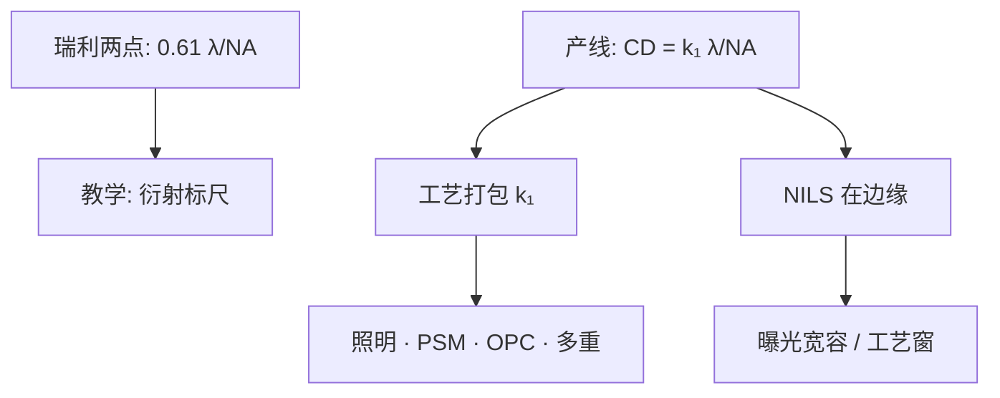

# 瑞利判据与光刻分辨率

    
光学教材里的瑞利两针孔，给出的是「刚能分开两个艾里斑」；产线要的是在剂量、焦距与胶对比都合格时能稳定印出的线宽。Mack 把后者写成带 k₁ 的工程式，并用图像对数斜率去谈工艺窗，而不是只报一个分辨距。

    <footer>—— Rayleigh 1879 的两源分辨讨论；Chris A. Mack, Fundamental Principles of Optical Lithography, Wiley, 2007</footer>

[瑞利判据：CD = k₁ λ / NA](/llm/rayleigh-litho) 已经钉过产线公式与三个旋钮。本篇作 **Mack 讲义式的笔记**：瑞利原来在比什么、为什么光刻不能直接写 0.61、以及为什么同一套 $\lambda$ 与 $\mathrm{NA}$ 下，对比度、归一化图像对数斜率（NILS）往往比单个 $k_1$ 更能预告窗口。波长台阶、浸没与 EUV 机台放在后续各篇；这里不把某代未公开的 $k_1$ 内部表填进来。

## 问题

显微镜里，瑞利把「刚可分辨」定义成：两个非相干点源的像，一个艾里斑的中央极大落在另一个的第一暗环上，角距约 $0.61\,\lambda/\mathrm{NA}$（阿贝常用 $0.5\,\lambda/\mathrm{NA}$）。那是视觉或探测器上的两点判据，假定的是点物、非相干、以及「刚能看见分开」。晶圆上的物是密线、孤立线、孔和二维拐角；接收器是抗蚀剂加显影，要把连续空中像切成二值浮雕。两点刚可分，并不保证线宽落在公差内，更不保证离焦与剂量一偏还能合格。

若把 0.61 直接叫成光刻分辨率，会得到一个与工艺无关的硬下限。真实产线却能靠离轴照明、相移掩模、OPC 把有效半节距往下推，也能因为胶对比不足而远差于该数。缺少一个工艺打包系数，这两种方向都写不进公式。Mack 的处理是：承认衍射极限给出 $\lambda/\mathrm{NA}$ 这一标尺，把比例系数交给 $k_1$，并把「好不好印」从单点分辨率改写成空中像在图形边缘的陡度。

### 瑞利两针孔不是产线 CD

产线临界尺寸写成

$$
\mathrm{CD} = k_1 \frac{\lambda}{\mathrm{NA}}.
$$

$k_1$ 不是贝塞尔函数的第一零点。它打包照明空间相干性、掩模类型、图形密度、胶对比与计算光刻把能量打进哪些空间频率。同一 $\lambda$ 与 $\mathrm{NA}$ 下，$k_1$ 可以从大约 0.8 的宽松工艺走到接近 0.25 的激进工艺。光学上，二维逻辑的单次曝光很难无限制逼近 0；业界把大约 0.25 当作单次曝光的经验地板，对应两束成像刚好还能进瞳。写成 $\mathrm{CD}=\lambda/\mathrm{NA}$ 等于暗中令 $k_1=1$；写成 $0.61\lambda/\mathrm{NA}$ 是把显微镜判据误贴到晶圆上。

焦深伴随量常写成 $\mathrm{DOF}=k_2\lambda/\mathrm{NA}^2$。$\mathrm{NA}$ 越大 CD 越小，焦深按平方变差。$k_2$ 同样是工艺因子，不要与 $k_1$ 混用同一个数值。

公式必须带 $k_1$。节点名（「7 nm」）不等于某层 CD；代入式子的必须是该层曝光波长、该机台 NA、以及该层工艺的 $k_1$。

## 方法

Mack 建议用空中像的局部陡度来谈「这一刀能不能稳」。图像对数斜率 $\mathrm{d}\ln I/\mathrm{d}x$ 在目标边缘取值，再乘特征宽度 $w$ 得到 **NILS**（normalized image log-slope）。NILS 大，意味着剂量稍偏时边缘移动小，曝光宽容度宽；NILS 小，窗口先死在 CD 上，即使瑞利式看起来「还没到极限」。对比度 $(I_{\max}-I_{\min})/(I_{\max}+I_{\min})$ 适合一维密线，对二维热区不够；NILS 把评价钉在**这条边**上。

三条缩小 CD 的路仍然成立：缩短 $\lambda$、增大 $\mathrm{NA}$、减小 $k_1$。笔记要补的是第四句：减小 $k_1$ 往往先伤 NILS 与焦深，必须用 RET——离轴照明、[PSM](/llm/phase-shift-mask)、[OPC](/llm/opc)、[SMO](/llm/smo)、多重曝光——把边缘陡度买回来。胶把空中像变成潜像再变成浮雕，对比度 $\gamma$ 与扩散长度会再糊一次；光学 NILS 合格而胶对比不够，线仍会并。

### NILS 比单一 k₁ 更接近工艺窗

$k_1$ 是层的摘要数，便于路线图；NILS 是图形类别的诊断数，便于改照明与掩模。密集金属与孤立栅极可以有同一 $k_1$ 叙事、完全不同的 NILS。OPC 移动边、SRAF 抬窗口，目标常常是把 PV-band 里的 NILS 拉回阈值，而不是把瑞利式左边的 CD 再除一次。EUV 光子少，随机效应会在光学 NILS 尚可时先打死接触孔——那是另一篇的统计，但提醒：瑞利式不包含泊松。

例：ArF 浸没 $\lambda=193\,\mathrm{nm}$，$\mathrm{NA}=1.35$，$k_1=0.30$ 则 $\mathrm{CD}\approx 43\,\mathrm{nm}$。要更小半节距，不是改瑞利式写法，而是再降 $k_1$ 或换 EUV 的 $\lambda$。Mack 讲义里浸没单次实用半节距大约 38–40 nm 量级，对应 $k_1$ 贴近 0.25 地板。

## 机制

物理图像与显微镜同源：入瞳有限，掩模衍射的高频进不了镜头，晶圆上的像是低频近似。瑞利/阿贝给出分辨距与 $\lambda/\mathrm{NA}$ 成正比。光刻把比例系数改称 $k_1$，因为它还包含「胶把连续强度切成二值图形」这一非线性步：对比度够，线宽可以比光学瑞利距更瘦；对比度不够，即使光学可分，胶也并线。

部分相干照明改变传递函数。某些节距的调制传递更好，于是密集线的有效 $k_1$ 可以低于孤立线。这不是公式失效，而是 $k_1$ 对图形类别敏感。计算光刻在掩模上预畸变，用物体侧自由度换更小的有效 $k_1$，约束仍是镜头能收集的最大空间频率 $\mathrm{NA}/\lambda$。

### Mack 把分辨率写成过程量

教科书反复强调：不存在独立于工艺的单一「分辨率极限」。剂量、焦点、胶、显影、刻蚀偏置，都会移动「刚能印出」的那条线。瑞利式的价值是给三个旋钮共同的单位；它的滥用是把一次曝光的 $k_1$ 地板当成节点路线图的全部依据。High-NA 改善 CD，同时恶化焦深；EUV 改善 $\lambda$，同时引入反射光学与抗蚀剂随机性。套刻、缺陷、吞吐量都不在式子里。

## 边界与工程取舍

不要把训练日志里的「分辨率」或模型里的「Nyquist」和这条式子混为一谈。不要用显微镜 0.61 去反推 EUV 机台能印多细。不要在没有声明图形类型时比较两家的 $k_1$。本篇不引用未公开的某代 EUV $k_1$ 内部表，也不把商业节点名当 CD。

后续篇分别写波长台阶、浸没、多重曝光、NXE/EXE。凡是谈光刻分辨率，先写出 $k_1$、$\lambda$、$\mathrm{NA}$，再用 NILS 或 PV-band 说明窗口，而不是只报一个瑞利距。

出处：Rayleigh 1879；阿贝成像原理；Mack, *Fundamental Principles of Optical Lithography*（Wiley, 2007）及配套讲义中的 $k_1$、DOF、$k_2$ 与图像对数斜率。工程形式 $\mathrm{CD}=k_1\lambda/\mathrm{NA}$ 是产线惯例，不是把 0.61 改了个名字。

## 小结

- 显微镜瑞利距约 $0.61\lambda/\mathrm{NA}$；产线 CD 是 $k_1\lambda/\mathrm{NA}$，$k_1$ 为工艺因子。
- Mack 用 NILS / 对比度把「能否稳定印出」从单点分辨改写成工艺窗。
- 单次曝光 $k_1$ 约有 0.25 经验地板；再往下靠多重图形或换波长。
- 出处：Rayleigh；Mack 2007 教科书。
