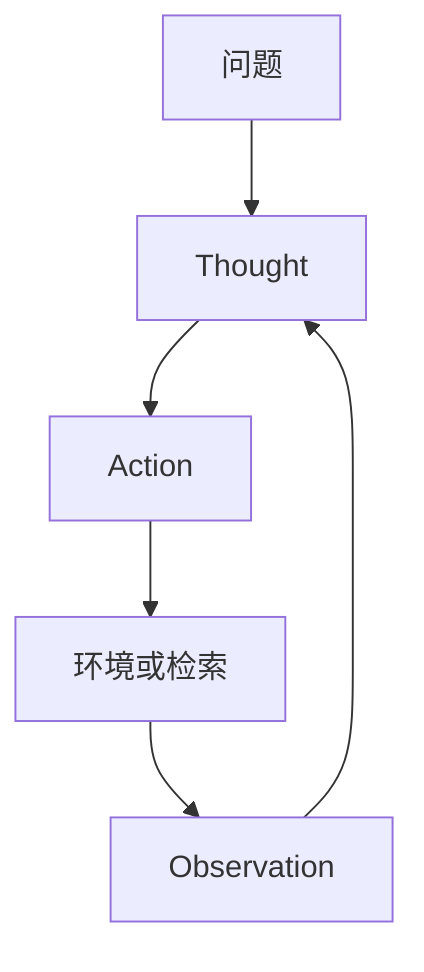

# ReAct 论文

把推理轨迹与动作交错：Thought 决定下一步查什么或做什么，观察写回后再想，而不是先写完一篇静默证明再一次性行动。

<footer>—— Yao, Zhao, Yu, Du, Shafran, Narasimhan, Cao, ReAct: Synergizing Reasoning and Acting in Language Models</footer>

[Diffusion-LM](/llm/diffusion-lm-paper) 对照并行去噪。本篇回到智能体控制流：Yao、Zhao、Yu、Du、Shafran、Narasimhan、Cao 的 **ReAct**（ICLR 2023）。主干 [多步 ReAct](/llm/react) 与 [规划 vs 反应](/llm/plan-vs-react) 已用这篇当反应式默认。附录钉原文的问题——纯 CoT 不能碰环境，纯 RL 智能体当时又缺语言模型的常识推理——以及 HotpotQA / ALFWorld 等实验怎么说。

## 问题

Chain-of-Thought 只在语言模型内部想，事实错误无法用检索纠正。传统智能体动作策略缺少 LM 的分解与常识。作者把二者写成同一种交错格式：`Thought` / `Action` / `Observation`。动作可以是搜索 API 或环境步。问题是：交错能否同时提高可解释性与任务成功，相对「只想」或「只动」。

提示是少样本示范，不是 schema SFT。工具面是论文里的检索与游戏动作，不是 OpenAI tools 字段。

### 格式即方法

原文的贡献很大程度上是 **提示格式与示范**，使现成 LM 能进入环，而不训新权重。后来的 function calling 训练是另一阶段。题名 *ReAct: Synergizing Reasoning and Acting in Language Models*。会议 ICLR 2023。Thought 不是必须对用户可见；它是给模型自己与日志看的工作记忆。

## 方法

### 少样本交错与基线

少样本交错轨迹 → 冻结 LM 生成 Thought 与 Action → 执行器返回 Observation → 再生成。基线包括 CoT-only、Act-only、以及当时的检索增强变体。领域：多跳问答（需搜索）、交互环境（ALFWorld 等）。度量：任务成功 / 答案正确，外加定性案例说明 Thought 如何改口。

## 机制

观察把外部环境的真值（或噪声）写进上下文，Thought 可以修正前一步幻觉——这是相对静默 CoT 的机制。失败模式原文也能读到：Thought 很长但不行动、重复同一检索、被无关观察带跑。这些正是主干后来用规划、预算、沙箱要管的。

没有学到的路由：工具选择全靠提示里的动作名。工具一多，少样本撑不住，才有后文 Toolformer 与 schema SFT。

ReAct 不是强化学习算法。轨迹不回传梯度。把它写成「RL 智能体」是张冠李戴。信用分配课处理的是后一阶段。

### 对照下一篇 Toolformer

Toolformer 自学何时插入调用，训练目标是语言建模 + API。ReAct 是推理期交错格式。一个改权重如何调用，一个改提示如何交错思考。产品上两者叠：SFT 会调，提示仍可要求 Thought。不要用一篇的 Hotpot 数字证明另一篇的自监督。

## 边界与工程取舍

少样本对模型能力敏感：弱模型不会稳定遵守格式。评测规模小于后来的 SWE-bench / OSWorld。活网搜索不可复现，原文部分任务用 API。引用成功率必须带模型名与示范条数。

Thought 泄漏到用户产品要另做隐藏；原文当研究日志。安全上，Observation 可含注入，原文未当主线——后续安全课补。

作者包括 Shunyu Yao、Jeffrey Zhao、Dian Yu、Nan Du、Izhak Shafran、Karthik Narasimhan、Yuan Cao。

## 小结

- 原文用少样本交错 Thought–Action–Observation，让冻结 LM 能想也能动。
- 机制是观察纠正幻觉；不是 RL、不是 schema 训练。
- 失败：空转思考、重复动作、格式脆弱。
- 与 Toolformer 分工：提示交错 vs 自监督插入调用。
- 出处：Yao 等，ReAct，ICLR 2023。
