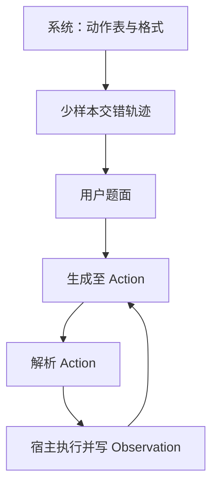

# ReAct 提示形态

少样本轨迹要同时示范推理与行动的交错写法：Thought 之后是可解析的 Action，Observation 只能来自环境回填，不能由模型代写。

<footer>—— 对照 Yao et al., ReAct, ICLR 2023 的提示协议；交错循环的系统含义见多步 ReAct 专文</footer>

[多步 ReAct](/llm/react) 写的是控制流：Thought–Action–Observation 循环、停止条件、错误如何随步数累积。本篇只写 *提示形态*：少样本里一条轨迹长什么样、槽位如何命名、怎样示范失败后改口、自由文本格式如何退化，以及它与 [function calling](/llm/function-calling) 信封的对应。不把规划器、MCP 拓扑或产品编排再讲一遍。读完应能写出一套与线上动作空间一致的示范，而不是再实现一个智能体运行时。

## 问题

纯 [CoT](/llm/chain-of-thought) 示范只有 $z$ 和 $y$，没有「调用什么、看到什么」。纯 Act 示范只有动作与结果，没有可模仿的选择理由。ReAct 的少样本必须把三种行交错出现，并使 Action 行能被确定性解析。格式一松，模型会把检索结果写进 Thought、把分析写进 Action、或发明示范里没有的工具名。提示形态要解决的是 *表面协议*，不是检索质量。

另一问题是示范与线上工具清单漂移。提示里写 `Search[实体]`，线上却是 `hybrid_search(query=...)`，模型会复述旧名字。少样本的动作空间必须是当前白名单的子集，参数写法必须与解析器或 schema 一致。这与 CoT 示范写错进位不同：那里错的是推理，这里错的是接口合同。

### 三种行，三种受众

Thought 的受众是模型自己的后续 token，有时也是日志审计。Action 的受众是解析器或工具运行时。Observation 的受众是下一步 Thought，且必须由宿主写入。把三种受众写成同一种散文，运行时就无法切分。提示里应用固定前缀（`Thought:` / `Action:` / `Observation:`）或等价的标记，并在系统说明里写清 Action 的语法（函数名、括号、参数分隔）。少样本每一条都要遵守，不能只在系统段写 BNF、示范里却自由发挥。

Observation 行出现在少样本里是为了教模型 *如何读* 返回，不是为了让模型在测试时自己编造观察。测试轨迹中的 Observation 必须来自真实执行。示范里的观察可以是虚构的，但应像真的：含噪声、可为空、可打脸。

## 方法

系统段：列出允许的动作、结束动作（如 `Finish[答案]`）、最大步数、以及「没有把握就先搜」的偏好。少样本：2–6 条完整轨迹，覆盖成功路径与至少一条「观察否定 Thought 后改查询」的路径。Yao 等人强调后者——没有打脸示范，模型会在空结果上重复同一 Action。用户题面接在示范后，停止词设在 `Observation:` 之前，以便宿主插入真实返回再继续生成。不要让模型一次吐出 Thought、Action 和伪造的 Observation。

Action 语法要穷尽且可解析。两种常见形态：`工具名[一个字符串]`（原文检索风格）；或多参数 `工具名[k=v, ...]`。参数值不要嵌套未转义的括号。迁移到 tools 字段时，少样本可以缩短成「何时该调用」的自然语言，参数交给 schema；但若仍用自由文本 ReAct，就必须把 JSON 或伪 JSON 写稳定。混用「有时自由文本、有时 JSON」会毁掉解析器。

### 示范打脸比示范完美轨迹更重要

完美轨迹教的是快乐路径，模型学不会空结果、实体歧义、看错片段。至少准备：检索为零时改写查询；检索到近义但错误实体时在 Thought 里明确否定；已经够用时 `Finish` 而不是再搜。Thought 应短，只写当前决策相关的断言，不要在示范里写小作文——测试时模型会模仿长度，把窗口填满。Observation 在示范里应截断到与决策相关的句子，与线上截断策略一致，否则模型期望全文、线上只给片段，会以为工具坏了。

停止与重复也要在提示里出现，而不是只写在代码注释。系统段写清：同一 Action 与同一参数不得连续重复；达到步数输出 `Finish` 并承认不确定。提示不写，模型就不会在格式层停止。解析器对未知工具名应回填明确错误观察（`unknown tool`），让下一步 Thought 有材料纠正，不要静默丢弃该步——静默会让模型以为调用成功。

## 机制

提示形态通过条件前缀规定 token 的角色。`Action:` 之后的分布被示范收窄到工具名集合；`Thought:` 之后被收窄到短推理。停止词把一次解码截在调用边界，使交错成为可能。没有停止词，模型会继续写「Observation: …」并进入自嗨。function calling 把 Action 从自由文本里拿出来，提示形态就从「教括号语法」变成「教何时调用、如何在 Thought 里用上一条 tool 消息」。形态变了，交错没变。

格式漂移是长轨迹上的主要失效。步数增多后，模型丢掉前缀、改用中文冒号、合并 Thought 与 Action。缓解：每步由宿主重贴格式提醒或重置为「请只写 Thought 与 Action」；或彻底改用 tools 字段。少样本再长也压不住二十步之后的漂移，这是窗口与格式学习的极限，不是再加两条示范能解的。

把 ReAct 写成聊天人设（「你是会用工具的助手」）而不给交错示范，对已训过 tools 的模型可能够用，对基座模型不够。是否还需要少样本，取决于对齐数据里有没有同类轨迹，要实测，不要从论文的 HotpotQA 提示直接下结论。

### 自由文本槽位与 tools 字段的对应

自由文本：`Action: search[query]` ↔ `tool_calls[].function.name/arguments`。`Observation:` ↔ `role: tool` 的 content。`Thought:` 在协议里常常没有专属字段，只能放在 `content` 里或被省略。省略 Thought 等于提示形态退化成纯 Act，稀疏决策会变差；若产品不想把 Thought 给用户看，仍应让模型在隐藏的 content 或内部信道里写，再剥掉展示。评测「是不是 ReAct 提示」看的是示范与解码是否保留交错与可解析动作，不是看字符串里有没有英文单词 Thought。

与 [Self-Ask](/llm/self-ask) 的格式差别：Self-Ask 的后续问是给自己或检索的问题句，不一定有工具名语法；ReAct 的 Action 必须落在动作表上。与 PAL 的差别：PAL 一次交整脚本；ReAct 每步一个动作并等待观察。不要在同一套少样本里混「先写完 Python 再 Search」，解析器无法定义回合边界。

## 边界与工程取舍

提示形态管不了检索器、权限、超时。它也不能替代[规划](/llm/plan-vs-react)：少样本里可以出现「我计划先确认实体」，那只是 Thought 散文，不是可调度 DAG。工具很多时，少样本覆盖不全，应改成 schema 描述加一条极短格式示例，把「何时用哪一个」交给工具 description，而不是堆十条过时轨迹。动态 MCP 工具尤其不要写死示范里的名字。

安全：示范里的 Observation 不要含有可被当成系统指令的句子，以免模型学会「观察里的文字可以改规则」。测试时应把不可信网页只放在 Observation 槽，并用明确分隔。Thought 日志可能含用户隐私，提示形态设计时就要假定 Thought 会被存盘。引用以 Yao et al. ICLR 2023 的提示协议为准；具体 HotpotQA 数字随检索器变化，不要抄进本篇。

本篇与[多步 ReAct](/llm/react) 分工：那边是循环、累积误差与工程运行时；这边是示范、槽位、停止词与格式漂移。改提示先看本篇；改步数上限与观察截断看那篇。

## 小结

- ReAct 提示形态用固定槽位交错示范 Thought、可解析 Action、以及宿主回填的 Observation。
- 少样本必须含打脸后改口；动作名与参数语法必须与线上一致。
- 解码应在 Observation 前停止，禁止模型伪造观察。
- 长轨迹上格式会漂；tools 字段是槽位的协议化，不是另一种论文。
- 提示形态不替代规划器、检索质量与工具安全。
- 出处：Yao et al., *ReAct: Synergizing Reasoning and Acting in Language Models*, ICLR 2023（提示协议）；系统循环见同主题的多步专文。
