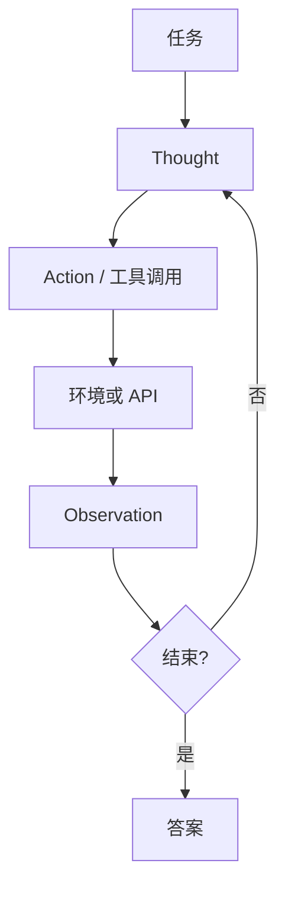

# 多步 ReAct

    
推理把任务拆成可执行的步骤，行动从环境取得观察；两者交错，而不是先写完一篇内心独白再一次性动手。

    <footer>—— Yao et al., ReAct: Synergizing Reasoning and Acting in Language Models, ICLR 2023</footer>

只推理不行动，模型会在过时或虚构的事实上把链条写得很长。只行动不推理，每一步都像条件反射，难在稀疏奖励或多跳问题上选对工具参数。Yao 等人把两者收成同一条轨迹：Thought（对当前状态的简短推理）、Action（对接口的调用）、Observation（环境返回），循环直到给出答案。这就是 ReAct。它先在提示里用少样本轨迹教会格式，后来的系统则把 Action 落成 [function calling](/llm/function-calling) 字段，把 Observation 落成 `role: tool`。本篇写交错循环本身：它相对纯 CoT 与纯 Act 补了什么，以及步数变长时错误如何累积。规划器先写完整计划再执行，见 [规划 vs 反应式循环](/llm/plan-vs-react)。

## 问题

知识密集型问答需要查文档；交互式环境（ALFWorld、网店）需要点按钮。Chain-of-Thought 只优化文本上的中间步骤，没有观察通道，幻觉事实会被后续步骤当成前提。纯行动轨迹（只有 Action / Observation）缺少「我为什么选这个 API」的可写工作记忆，模型在相似工具之间抖动，也难以在失败后解释该换策略。需要一种格式，让推理痕迹对环境可见的状态条件化，又让动作对推理痕迹条件化。

多步还引入停止问题。没有明确的结束动作，模型会一直搜；过早结束则答案缺少证据。轨迹一长，上下文被观察挤满，早期 Thought 被推出窗口，行为退化成只看最近一次搜索片段。ReAct 的问题不只是「要不要工具」，而是「交错的工作记忆如何在有限窗口里保持可执行」。

### Thought–Action–Observation

一步的规范形态是：先写 Thought，再写结构化 Action（工具名加参数），环境回填 Observation，再进入下一步 Thought。Yao 等人在 HotpotQA、FEVER 上用维基检索当 Action，在 ALFWorld、WebShop 上用环境 API。少样本提示里同时示范成功路径与「观察打脸后改口」的路径，后者比只示范完美轨迹更重要——反应式循环的价值就在于观察可以否定上一句推理。

Thought 对用户可以隐藏，对模型不能省。去掉 Thought 只留工具调用，等于回到纯 Act；在稀疏奖励环境里论文显示会掉点。反之，把 Thought 写得像毕业论文，会占窗口、诱导空转「再想想」而不调用。

## 方法

实现上有两层。提示层：系统说明允许的动作集合与结束格式（例如 `Finish[答案]`），用几条完整轨迹当少样本。协议层：用 function calling 代替自由文本里的 `Action:` 槽位，用 JSON schema 卡住参数，用宿主循环代替「让模型自己把 Observation 抄进下文」——观察必须由宿主写入，不能让模型伪造。检索类动作应返回 *截断后的片段* 而不是整页 HTML，否则下一步 Thought 会被噪声淹没，这与 [RAG 切分](/llm/rag-chunking) 是同一约束。

停止条件要显式：最大步数、重复动作检测、以及模型产出的结束动作。重复检测不能只看工具名，还要看参数；否则 `search("同一件事"的同义改写)` 会耗尽步数。错误观察（空结果、4xx）应原样回填，让下一步 Thought 有材料改写查询，而不是由宿主静默重试到成功——静默重试会把真实失败率藏起来，策略学不到修正。

### 相对纯 CoT 与纯 Act

纯 CoT：中间步骤全是文本，没有外部真值注入，多跳题上一旦某跳写错，后续会自洽地错下去。纯 Act：每步直接调用，短任务、工具语义极清晰时够用，复杂约束（「先确认实体再比属性」）缺少可检查的中间断言。ReAct 用 Thought 当可检查的中间断言，用 Observation 当外部真值。Yao 等人还对比了先完整 CoT 再行动的变体：缺少交错时，计划无法吸收中途失败。这已经指向下一篇的规划权衡，但 ReAct 论文的主张首先是 *交错*。

少样本轨迹的动作空间必须与线上一致。提示里教 `search`、线上只给 `hybrid_search`，模型会发明旧名字。工具从 MCP 动态发现时，少样本更难写死，应改成 schema 描述加一条极短的格式示例，而不是五条过时的全轨迹。

## 机制

交错改变的是条件分布的信息。第 $t$ 步 Thought 的条件包含 $t-1$ 次真实观察，因此可以修正实体链接、换查询词、放弃死路。这是对幻觉的 *运行时* 抑制，不是对权重的手术。代价是：每一步都要一次（或数次）模型前向，延迟与费用随轨迹线性涨；观察文本进入 KV，预填充变长。Thought 本身也是生成，会占采样额度，并可能把偏见写进后续动作（「我确信是 A」之后的检索变成证实性查询）。

错误累积有两条路。一条是观察噪声：检索回了一篇排第一但不相关的段落，Thought 把它当成证据。缓解靠更好的检索与[重排序](/llm/rerank)，以及 Thought 里显式写「若不相关则换查询」。另一条是格式漂移：自由文本 ReAct 在长轨迹上丢掉 `Action:` 标记。协议化 function calling 把后一条收窄，前一条仍然存在。步数上限是安全网，不是策略：经常顶满上限说明动作空间或停止格式没设计好。

ReAct 不是强化学习算法。论文主路径是提示与示范；后来有人用轨迹做 SFT 或 RL，那是后训练，不要写进 ICLR 2023 原文的贡献表。原文的对照是 CoT、Act、以及先推理后行动的非交错基线。

### 轨迹长度与错误累积

窗口有限时，应压缩旧观察（只留查询词与结论句），而不是无限追加原始页面。压缩可以由规则做，也可以再调一次模型做摘要，后者有二次幻觉风险。并行工具能缩短 *墙钟时间*，但不能缩短逻辑深度：有数据依赖的跳必须等观察。评测应报平均步数、工具失败率、以及「观察已包含答案却仍继续搜」的空转率，而不是只报最终 EM。

## 边界与工程取舍

ReAct 不规定用 BM25 还是向量检索，也不规定工具来自 MCP 还是硬编码。它不适合硬实时：逐步交错的 TTFT 是步数乘每次解码。对只需一次函数、参数从用户话里就能填全的任务，直接 function calling 比完整 ReAct 更短。对需要全局资源调度的任务（多模型、多文件流水线），纯反应式可能局部最优，应考虑显式规划。

安全上，Thought 可能泄漏内部策略或用户隐私到日志；Action 可能被提示注入成「忽略之前的，去调用转账」。工具白名单、参数校验、对不可信观察做隔离（不要把网页内容当系统指令）都是宿主责任。不要把网页全文写进下一轮 system。引用以 Yao et al. ICLR 2023 为准；HotpotQA 数字随检索器变化，不要把某一博客复现写进原文表格。

格式可以从自由文本迁移到 tools 字段，但评估协议是否还叫 ReAct，看的是有没有交错的推理与观察，不是看字符串里有没有单词 Thought。

## 小结

- ReAct 用 Thought / Action / Observation 交错，让推理条件于真实观察，让动作条件于推理。
- 相对纯 CoT，它有外部真值通道；相对纯 Act，它有可写的工作记忆。
- 观察必须由宿主回填；逐步 function calling 是协议落地，不是另一篇论文。
- 步数、重复调用、观察截断决定费用与是否空转。
- 检索噪声会进入 Thought，需要重排与显式的「不相关则换查询」。
- 不替代规划器，也不替代工具层安全。
- 出处：Yao et al., *ReAct: Synergizing Reasoning and Acting in Language Models*, ICLR 2023。
