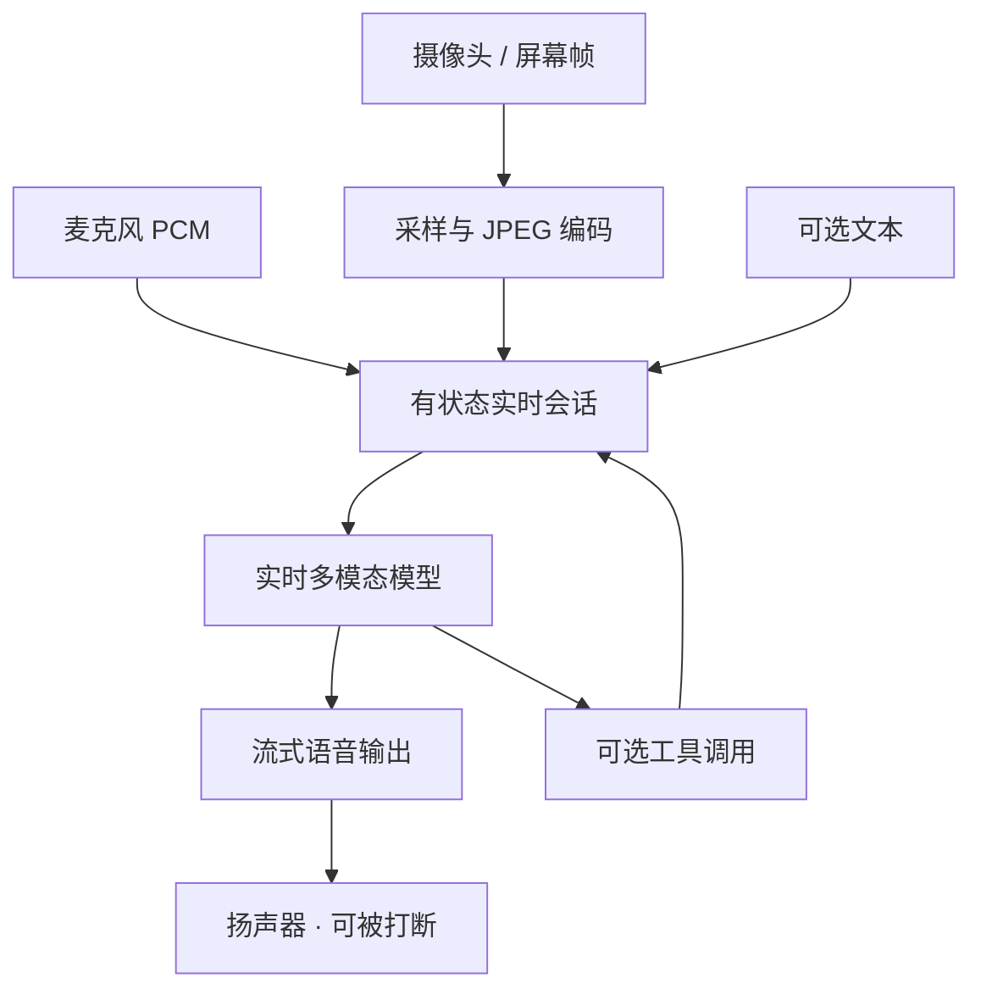

# 实时视频交互

    
低延迟语音之外，把摄像头或屏幕当成连续观察：帧按秒级进入同一会话，模型用语音或文本立即回应正在发生的画面。

    <footer>—— 对照 Google Gemini Live API 文档（音频 + JPEG 帧、有状态 WebSocket）与 OpenAI Realtime 对图像输入的公开说明</footer>

实时视频交互不是文生视频，也不是 [Genie 3](/llm/genie-3) 那种生成可玩世界。它是**理解侧**的流式多模态：用户边说边展示镜头或桌面，模型边听边看，用语音打断、确认、指路。Gemini Live API 的公开合同：输入为 16 kHz PCM 音频、JPEG 图像（文档写约 ≤1 帧/秒量级的视频帧）、文本；输出为 24 kHz PCM 音频（及文本）；传输为有状态 WebSocket。OpenAI 将 Realtime API 推到生产语音代理时，增加 **image input**：把照片或截图作为会话中的内容块，官方强调这更像「往对话里插入一张图」，由应用决定何时送帧，而不是默认把摄像头当成无压缩电影流。LiveKit 等集成文档描述：启用视频后按说话时约 1 fps、静音时更低的采样把帧当成图像消息。本篇写会话架构与采样合同。不写窃听、未授权抓屏或绕过设备权限。

## 问题

回合制视觉问答是：拍一张、问一句、等完整回答。真实辅助（看仪表灯、看作业、看 IDE）需要重叠的时间轴：用户还在说话，画面已变；模型必须在旧帧过期前回应。若走「ASR → 文本 LLM → TTS」再另打 Vision API，延迟叠三段，口型与指代（「这个」）对不齐。语音到语音的实时模型把声学与语言放在同一低延迟环；视频问题是：**视觉 token 比音频贵、帧率却诱惑人调高**。1 fps 的 JPEG 与 30 fps 相机原生完全不是同一带宽。设计问题是选采样、选何时送帧、选服务器还是经后端中转，以及工具调用如何插进仍在发声的会话。

威胁模型与桌面代理不同。Computer use 在隔离虚拟机里点 GUI；实时视频交互往往在用户设备上，权限是摄像头与麦克风授权。屏幕共享把通知、密码框、聊天记录送进模型上下文，属于数据最小化问题：应在产品层裁剪、暂停敏感窗，而不是靠模型「自觉不看」。本篇只讨论用户同意的辅助场景。

### 连续视频与会话内插图是两种合同

Gemini Live 把视频写成与音频并行的模态，帧率刻意压到约 1 fps 级，避免 token 爆炸。OpenAI Realtime 的公开 GA 叙述以图像内容块为主：应用挑选关键帧。集成层可以模拟「直播」——定时截帧当 `input_image`。写架构时必须声明走的是哪一种：原生视频模态，还是图像消息心跳。不要把 24 fps 生成世界的帧率（Genie）写进理解 API 的 SLA。

Live API 文档列出电商导购、教育、车机与眼镜等方向，那是场景举例。协议层仍是 WebSocket 上的音频块 + 稀疏帧。生产若用 WebRTC 合作伙伴，传输变了，模态合同应仍以模型文档为准。

## 方法

高层循环：采集音频与视频 → 编码（PCM、JPEG）→ 有状态会话 → 模型流式音频输出 → 客户端播放并可 barge-in。Turn detection（VAD）决定何时算用户说完；视频采样器决定帧密度。工具：实时会话里的 function calling 必须能在说话过程中触发（查库存、读日历），结果以语音说回。Gemini 文档区分 client-to-server（低延迟、密钥要用短时令牌）与 server-to-server（密钥留后端、多一跳）。OpenAI Realtime 提供 WebRTC、WebSocket 与 SIP 电话。视觉细节档（low/high/auto）在部分集成里出现，用于换 token。

评测不能只用离线 VQA 准确率。应报：端到端语音延迟、打断后的停顿、指代消解（用户说「左边那个」时帧是否仍涵盖该物体）、工具调用是否在过期画面上执行。帧率实验要成对：0.3 / 1 / 3 fps 对准确与账单的影响。屏幕共享任务应在授权的合成桌面上测，不要用生产账号。

### 采样策略是产品，不是模型彩蛋

说话时提高帧率、静音时降低，是为了把 token 花在「画面可能在变」的区间。静止的白板不需要 1 fps。应用也可以只在用户说「看这里」时送一张高分辨率图。官方 Realtime 图像接口把控制权交给应用，正是避免默认直播把账单与隐私打满。Gemini 把上限写进 Live 文档，是另一类硬合同：超过的帧会被丢或拒。harness 应把采样当一等配置，与系统提示同等重要。

## 机制

实时语音模型省略独立 ASR/TTS 级联，用声学条件直接生成语音 token 或波形，以换延迟与韵律。视觉以稀疏帧进入同一上下文：每张 JPEG 占用固定量级的视觉 token（具体以当时模型卡为准），因此 1 fps 已是刻意节流。状态会话保存对话与近期帧，使「刚才那个红色按钮」可解；上下文腐烂同样发生——长会话要摘要或丢旧帧。Barge-in 会取消未播完的音频，视觉侧则可能丢弃基于过期帧的半成品回答。

与 GUI 代理：后者输出键鼠，观察是虚拟机截图；本设定输出是语音建议，副作用若存在，应走显式工具且需确认。与文生视频：方向相反（像素是输入不是输出）。与世界模型：不预测下一帧环境，只解释当前帧。三者不要混名「实时视频」。

OpenAI *Introducing gpt-realtime* 把图像说成会话中的图片，由应用选择时机。LiveKit 插件文档给出默认 1 fps / 3 s 心跳一类实现细节，属于集成默认值，可改。引用时分层：模型合同 vs 编排默认。

### 隐私与最小画面是同一机制

能看就能进日志与训练选择（以厂商政策为准）。产品应默认：本地预览、明确指示灯、可暂停视频轨、敏感窗口不共享。企业部署用短时令牌与 server 中转，避免把长期 API 密钥埋进客户端。这些不增加模型智能，但决定实时视频能否上线。注入方面：屏幕上的文字与网页代理一样可含指令，需把视觉区当不可信数据，参见 [Spotlighting](/llm/spotlighting-defense) 与工具闸门，而不是假定「看见了就会安全」。

## 边界与工程取舍

### 不要用生成模型的帧率衡量理解 API

24 fps 交互属于世界模型或游戏；理解 API 的 1 fps 是 token 经济。强行提高帧率会线性推高费用与上下文，准确未必升——运动模糊与重复帧浪费预算。弱网下应先保音频。多模态输出（边说边出图）是另一产品，见 [Gemini 原生图像](/llm/gemini-native-image)，不要塞进 Live 的默认能力表。

厂商差距会变：某一季度谁先做原生摄像头轨、谁先做全双工，以当时文档为准。本篇冻结的是架构类型，不是 2026 年某周的功能清单。无浏览器实测时，以文档与官方博客为合同。

出处：Google AI for Developers / Cloud，Gemini Live API overview；OpenAI，*Introducing gpt-realtime* 与 Realtime 会话指南中的图像输入。集成对照 LiveKit OpenAI Realtime 插件说明。仅高层会话架构。

## 小结

- 实时视频交互 = 流式语音环 + 稀疏视觉帧 + 有状态会话，用于理解与协助，不生成电影。
- Gemini Live 将视频写成约 1 fps JPEG 模态；OpenAI Realtime 以应用提交的图像块为主。
- 采样、打断、工具与密钥路径是 harness 决策。
- 屏幕内容按不可信数据处理；权限与最小化先于模型能力。
- 出处：Gemini Live API 文档与 OpenAI Realtime 公开说明。
