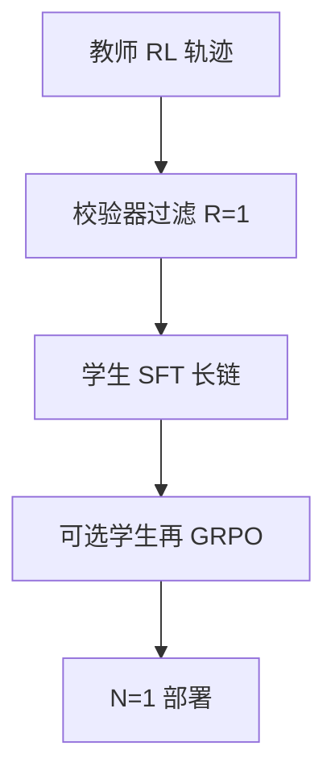

# 推理蒸馏到小模型

教师用 RL 长出长链，学生只做 SFT 模仿轨迹；小模型得到的是文本上的搜索痕迹，不是自动再来一遍 GRPO。

<footer>—— DeepSeek-AI 把 R1 轨迹蒸馏到 Qwen / Llama；对照 Hinton 蒸馏与 Long CoT SFT</footer>

[上一课](/llm/parallel-thinking)的教师可以 $N$ 大、链长。部署要小模型、$N=1$。缺口是：**把推理行为迁过去，默认路径是 SFT 蒸馏，不是把学生再套一次昂贵 RL。** R1 报告明确：约 80 万样本、仅 SFT、再 RL 留给社区。本课写这条迁徙，接到 aha：学生可能模仿「wait」而不具备教师的纠正统计。

## 问题

教师分布是长链 + 自检。学生基座若只见过短答，直接 GRPO 探索不够、格式也乱。SFT 先把学生拉进教师邻域，校验器通过率才能作为 RL 信号。R1 选择停在 SFT。结果：小模型会写长链，能力随学生规模降，但仍可观。不要把蒸馏学生叫做 R1-Zero——没有从基座纯 RL。

数据：只模仿最终答案不够，必须含思维段。仅答案蒸馏回到普通指令模型。过滤：教师 $R=1$ 的轨迹，避免教错链。过程错误但碰巧对的链会被学走，与 GRPO 结果监督同一病。

### 学生没有教师的奖励器

蒸馏不传递校验器，只传递文本。学生会在无校验的题上也写长链（过度思考）。混合模式与长度控制要在学生上重做，不能假设从教师继承。教师若用工具解释器，学生部署没有同一沙箱时，链上的调用块会变成无效文本，准确率塌——蒸馏集应标明是否含工具，或同时蒸馏「无工具回退」轨迹。

弱到强是弱标签训强学生；本课是强教师训弱学生。方向相反。

## 方法

采样教师（可并行 + 校验过滤）→ 仅回复损失 SFT 到学生 → 评测。可选：学生上再 GRPO，用同一校验器，通常更小 $G$、$L$。词表与模板对齐，否则思维标签失效。不要对学生用教师的 RM：规模差会导致过优化更快（Gao）。

## 机制

学生学的是条件语言：在题后写像搜索的文本。若小容量装不下真搜索，会变成修辞性「让我们一步步」+ 错答案。规模是上限。aha 类标记作为表面形式容易学，作为有效纠正难学——应用翻转统计评学生，不要只看「wait」词频。

多教师混合（R1+人类短答）才能做混合思考学生；纯 R1 轨迹会没有短模式。

## 边界与工程取舍

许可与数据污染：教师输出可能含评测题。蒸馏集要去污染。下一课 aha：教师报告里的质性现象，蒸馏后要重新测量是否还在。

蒸馏集要标明是否含工具轨迹，并去评测污染。学生不会继承教师的校验器、混合模式或长度政策。

对学生再做 GRPO 是可选下一阶段，不能写进「已蒸馏即对齐」的发布说明。

## 小结

- 推理蒸馏默认是过滤后的长链 SFT，不自动包含学生 RL。
- 必须蒸馏思维段；仅答案不够。
- 长度、混合模式、过思考要在学生上重调。
- 表面自检词 ≠ 有效回溯，用答案翻转率衡量。
- 出处：DeepSeek-AI R1 蒸馏；Long CoT SFT 课；Hinton 蒸馏仅作对照。
