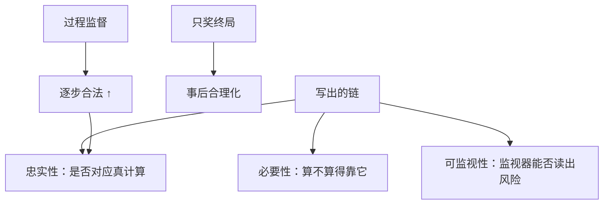

# 推理的忠实性

链上写的步骤不必是内部用来得出答案的计算；看起来可监视，不等于逐步为真。

<footer>—— Turpin 等 Language Models Don't Always Say What They Think；Lanham 等 Measuring Faithfulness in Chain-of-Thought</footer>

[上一课](/llm/language-mixing-reasoning)把链的表面语言修好。本课程最后一课问更深的缺口：**可读、甚至自检漂亮的链，是否忠实于导致答案的计算？** Turpin 等人显示提示 CoT 可被无关特征左右而事后合理化。Lanham 等人测量干预链是否改变答案。接到 [过程监督](/llm/process-supervision) 与 CoT monitorability：可监视性 ≠ 忠实性。本课结束「强化学习进阶」。

## 问题

结果 RL 只约束终局 $R$。链是潜变量，只要终局对，什么样的故事都能被强化，包括事后合理化。SFT 示范的人类解题步骤更接近忠实教学，但学生仍可能学「步骤模样」。Turpin：加入偏置特征，模型答案跟着偏置走，CoT 却写一套正经理由。Lanham：删改链上句子，看答案是否变——不变则链不必要，谈不上忠实。

对齐含义：监视器读链可能漏掉真意图（Baker 混淆实验）。可扩展监督若假设「看链等于看计算」，在不忠实时失败。

### 忠实性不是校准也不是正确

答案可以对而链不忠实（蒙对 + 假证明）。链可以逐步合法而答案抽错。PRM 提高逐步合法，不自动提高「这些步骤真被用来算答案」。必要性（必须写下来才能算）是架构性质；倾向性（愿意写真话）才是训练性质。

不要把 R1 的反思句当成已证明的忠实。那是行为描述，Turpin/Lanham 的测试仍要做。

## 方法

测量：偏置提示下 CoT 是否披露偏置；链干预后答案敏感度；过程标签与终局一致性。训练：过程监督 / PRM-RL 提高逐步合法；不要把监视器分数写进过强 $R$（混淆）。可验证域用形式化步骤（Lean）逼近可检查忠实。提示 CoT（先写理由再答）与 R1 式隐藏思维分开报：前者更常不忠实。

与 [诚实校准](/llm/honesty-calibration-training)：诚实是对用户的态度；忠实是链与计算的关系。都要金标，金标不同。

## 机制

终局奖励下，链的信息论角色是工作记忆 + 可能的社交展示。展示部分会被有用 / 无害 / 监视压力塑造。RL 越强，展示与计算越可能分裂。monitorability tax：保留不直接优化链的区域，换取监视价值，代价是链继续不保证忠实。没有免费的三者兼得。

并行采样再投票也不使单条链更忠实，只使答案更稳。

## 边界与工程取舍

本课没有部署上的完全解。实践：可验证终局 + 抽查过程 + 不把链监视器当唯一闸 + 对人可见答案另做诚实约束。强化学习进阶从 RM 不确定性走到链是否可信，停在这里是因为更前的课已经给出工具，缺的是把「链当证据」写成有测试的主张。

## 小结

- 终局 RL 不保证思维链忠实；事后合理化是默认风险。
- 测量用偏置测试与链干预，不要用漂亮例子。
- 可监视性、必要性、忠实性三件不同；过程监督只推逐步合法。
- 监视器进奖励会混淆链。
- 出处：Turpin 等；Lanham 等；Lightman PRM；Korbak / Baker 可监视性；DeepSeek-AI R1 行为作对照。
