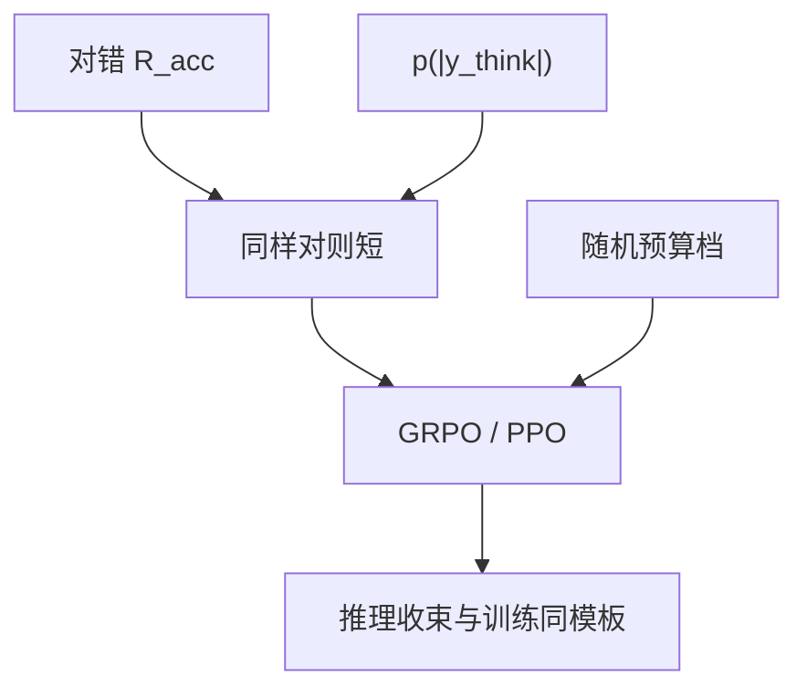

# 推理长度控制

把长度写成目标的一部分：同样答对，短的赢；或在预算内强迫收束，而不是事后截断。

<footer>—— DAPO 软超长塑形；s1 预算强迫；产品侧按档位训练多条长度策略</footer>

[上一课](/llm/overthinking)诊断了无价格的长度。本课写控制手段：奖励塑形、多档预算训练、解码强迫。缺口是工程：**控制必须进入训练目标，解码截断只是最后闸。** 接到自我验证：压长度时不要把「再验一次」全部删掉。对照 [长度归一化偏差](/llm/length-normalization-bias)——这里不靠除 $|y|$ 偷长度。

## 问题

除以长度会伤害长证明。要的是条件偏序：正确集合里偏好短。实现：$\tilde R = R_{\mathrm{acc}} + p(|y|)$，$p$ 在阈值后为负；或分层：$R_{\mathrm{acc}}=0$ 则不管长度，$R_{\mathrm{acc}}=1$ 再比长度。后者更接近「同样对则短」。DAPO 的线性尾部惩罚是前者的平滑版。

解码侧：budget forcing、收束提示、到达 $B$ 强制 boxed。只在推理做、训练没见过，准确率会掉。应把若干 $B$ 写入 RL 采样。

### 控制的是思维长度还是答案长度

用户可见答案应短；隐藏思维可长。分别塑形：思维段用 $B$，答案段用短惩罚。混成一个 $|y|$ 会把证明写进用户答案或把思维压死。

GSPO / 样本级损失改的是梯度测度，不是长度目标。不要用换算法代替 $p(|y|)$。

## 方法

训练：$R = R_{\mathrm{acc}} + \lambda p(|y_{\mathrm{think}}|)$，$\lambda$ 按分桶金标扫。多档：每个 prompt 随机 $B\in\{2\mathrm{K},8\mathrm{K},16\mathrm{K}\}$，超 $B$ 走截断协议（过长过滤课）。评测：各 $B$ 的准确率表。解码：与训练 $B$ 对齐的收束模板。

与混合模式：短模式 $\lambda$ 极大或 $B$ 极小；思维模式 $\lambda$ 小。两个头比一个全局 $\lambda$ 干净。

## 机制

$\lambda$ 过大，模型牺牲难题搜索换短；过小，过度思考还在。分桶扫 $\lambda$。首次正确位置损失（对有校验器的可中途判）能直接惩罚尾部废话，但训练要能多次调用校验器，贵。

长度控制会改变语言混杂与「wait」频率，因为那些 token 都占预算。后课 aha 可能被压掉，要看难题桶。

## 边界与工程取舍

开放生成没有 $R_{\mathrm{acc}}$，长度控制退回 RM 惩罚，过优化风险回到 Gao。本课主场可验证推理。$\lambda$ 与过长过滤的 $L_{\max}$ 不要两处各罚一次，叠罚等于把预算偷偷砍半。下一课自我验证与回溯：被长度控制删掉的可能是有用的「wait」。

对则偏短是多目标，不要除以 |y|。思维段与用户答案段分开塑形，λ 与过长阈值不要叠罚。

## 小结

- 长度控制是「对则偏短」的多目标，不是除以 $|y|$。
- 训练见过多档 $B$ 与 $p(|y|)$；推理截断只是最后闸。
- 思维长度与用户答案长度分开塑形。
- $\lambda$ 按难度分桶扫，防止打压长证明。
- 出处：Yu 等 DAPO shaping；Muennighoff 等 s1；R1 长度问题作动机。
