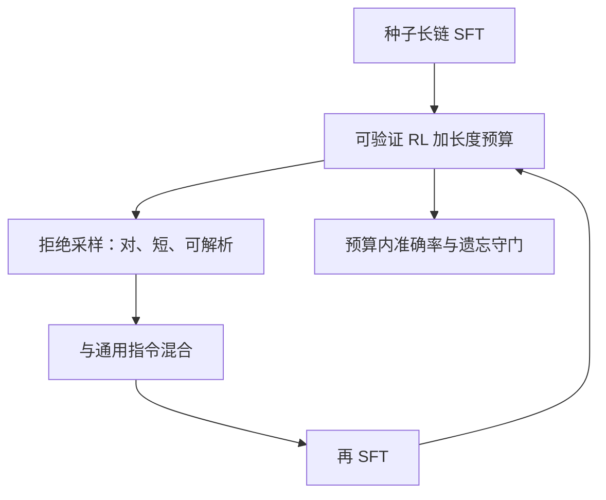

# 推理 RL 闭环

冷启动模仿长链，校验器给对错，预算管长度，拒绝采样再把新的对链写回监督——几段不是并列菜单，而是同一条环上的相位。

<footer>—— 归纳 DeepSeek-R1 一类「监督冷启动 → 可验证 RL → 再对齐」的流程，而不是某一家的超参表</footer>

前面三课分别给了 [Long CoT SFT](/llm/long-cot-sft)、[可验证奖励](/llm/verifiable-reward)、[长度预算](/llm/length-budget-rl)。本课把它们收成 **闭环**：输出会成为下一轮的教师数据，路由与超参随相位切换，而不是训完 SFT 就停或无限 RL 到崩溃。缺口是相位之间的接口——何时停止 RL、哪些轨迹可以进下一轮 SFT、如何避免对校验器过拟合之后把错误格式锁死。后课 PRM 进环是在这条环上再插一个过程信号，不是另起炉灶。

## 问题

只做 SFT：策略停在教师邻域，新题型的探索不足。只做 RL：格式、停写、可读性没有先验，稀疏 0/1 学得很慢，还可能毁掉聊天能力。只做长度惩罚：在还不会算的时候压缩，变成短猜。闭环的主张是分相位，每相位一个主目标：

1. **冷启动 SFT**：格式、切步、抽取、中等长度。
2. **可验证 RL**：在预算内最大化 $R$，允许变丑。
3. **拒绝采样 / 再 SFT**：把 RL 之后 $R=1$ 且长度合格的轨迹当新教师，蒸馏回更稳的 CE，顺带混入通用指令以防遗忘。
4. **可选的偏好对齐**：只对开放域，不要覆盖校验器。

问题是相位切换的判据。看准确率平台、看长度是否仍在爬、看 skip / NaN 率、看通用基准是否掉点。没有判据的「交替」会变成随机复读整条流水线。

### 环上的数据流向哪

RL 新采的对链若直接覆盖全部 SFT 数据，分布变窄，风格崩。应 **混合**：保留一批人类 / 教师种子，加上按题分层的 RL 成功轨迹，控制新数据占比。校验器黑客轨迹（过测但过程胡写）一旦进蒸馏，会被 CE 锁死，比 RL 噪声更难洗。闭环不是自动机器学习。拒绝采样的阈值、是否允许同一题多条对链、是否按难度升采样，都是数据工程。R1 报告里的「冷启动 / RL / 再对齐」是相位名；你的题库与校验器决定每个相位该停在哪。

## 方法

### 最小闭环与守门指标

最小闭环实现：固定校验器版本与抽取器。相位 1 用种子长链 SFT。相位 2 用群体 RL，带长度项，连续 $k$ 次评估无提升则停。相位 3 从相位 2 检查点对训练题（及同分布新题）采样，过滤 $R=1$、$\ell<L$、格式合法，与通用指令混合再 SFT。可再进相位 2'，学习率更小。评测集永不进拒绝采样池。

检查点选择用 **固定预算下的准确率**，不用无预算准确率。否则闭环会选出最能买计算的模型。通用能力用一个小的非推理集守门，掉点超过阈值则在下一轮 SFT 加大混合比。

## 机制

CE 蒸馏有降方差作用：RL 策略的高熵采样被压回一条或几条高回报链，服务更稳、长度更可预期，但探索暂时关闭。所以再 SFT 之后通常需要再开一轮轻量 RL，否则模型在新题上又只会复述蒸馏模板。环的「心跳」是 **探索（RL）与收敛（SFT）交替**。只 SFT 或只 RL 都停在半拍。

遗忘来自相位 2 的分布偏移：推理题占满梯度，聊天与工具格式被冲掉。混合比是针对这个机制，不是美学。工具调用若要保留，相位 3 必须含 schema 样本，否则闭环会把产品从助手变成竞赛机。

学习率与 batch 在两相位不可共用一套 [B–η 规则](/llm/batch-vs-lr)。RL 的有效 batch 是轨迹数，噪声来自 $R$；SFT 的 batch 是 token。从 RL 切回 SFT 时若沿用 RL 的大 η，会把刚学到的校验器行为冲掉。

### 何时不要闭环

校验器弱、题量极小、或评测与训练同题，闭环会迅速背答案。此时应停在 SFT + 测试时搜索，或先扩题、加强隐藏测例。开放域为主的产品，可验证闭环只能当子模块，不能当唯一训练。

## 边界与工程取舍

墙钟上 RL 采样最贵，再 SFT 次之。工程优化应优先：校验器并行、轨迹截断、对已满窗口的早期 abort。不要先上 PRM 再把闭环跑通——过程模型是下一课的增益，不是本课的前置。

版本管理：每个相位的校验器、抽取器、预算 $L$、题库哈希要进检查点元数据。否则三个月后无法解释「为什么第二轮 SFT 掉点」。这与评测种子课将强调的可复现是同一纪律。

不要把某篇技术报告的层数、群体大小、是否先训奖励模型当成闭环定义。本课定义的是数据与目标的相位，以及守门指标。超参表属于你的实验日志。

## 小结

- 闭环 = 长链 SFT → 可验证 RL（含预算）→ 过滤后蒸馏 → 再探索，带守门。
- 切换看固定预算准确率与遗忘，不看无约束分数。
- 拒绝采样必须挡校验器黑客，并与种子数据混合。
- RL 与 SFT 的 batch / η 机制不同，切换时重标定。
- 校验器弱则不要闭环，以免背题。
- 出处：DeepSeek-R1 类流程的相位划分；s1 说明轻量 SFT 也可作冷启动。
