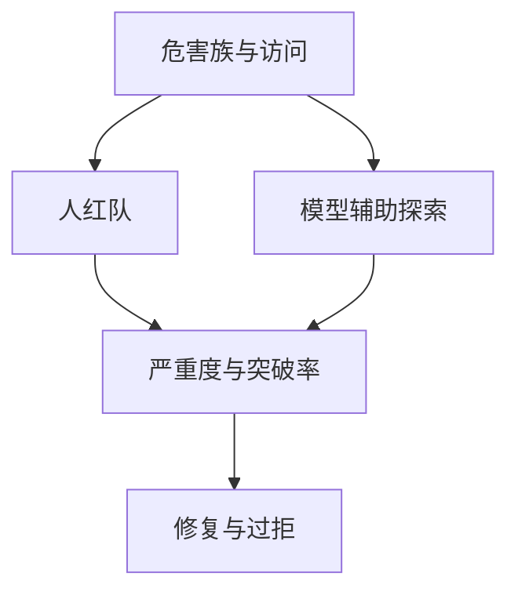

# 红队评测

红队要的是覆盖失败模式，不是覆盖训练集。一次「没找着」只说明这次的时间与权限不够，不能写成安全证明。

<footer>—— Ganguli 等对人红队的报告；Perez 等用模型辅助红队的协议取向</footer>

[上一课](/llm/dangerous-capability-eval)把门禁写成专家门槛。红队评测问另一面：在**声明已拒绝的行为**上，对抗者能否找漏洞。[越狱](/llm/jailbreak)课写过攻击形态的存在；本课写评测怎么抽样、怎么计分、怎么不把剧本变成公开教程。缺口是覆盖率，不是新的越狱分类学。后课偏见基准处理的是分布性伤害，与「单次突破防护」不同。

## 问题

Ganguli 等人展示人红队能收集多样有害成功案例，供后续拒答训练。Perez 等人展示语言模型可以规模化生成攻击性提示，降低人时。评测上的陷阱：用固定公开越狱表当回归，很快被训穿，分数变好但新文风仍成功。静态表是回归，不是红队。

第二陷阱是把红队成功率当唯一 KPI：防御方会过拒，伤害覆盖下降但可用性崩溃。应分列：突破率、过拒率、严重度，以及是否在工具/多轮/间接注入条件下更易突破。

自动化红队会把生成器自己的偏见写成「攻击分布」。人仍要抽检新簇，否则评测在刷生成器的众数。

## 方法

协议：范围（哪些危害族）；访问（是否给工具、是否多轮）；时间盒；成功判据（完成有害目标的哪一步算成功，由专家定义）；记录与最小留存。公开报告只给族级统计与修复项，不给可复制的成功提示。内部保留样本供回归，回归集与探索集分开，探索集持续轮换。

与部署监控衔接：线上新文风应回流成下一轮红队种子，而不是只加一条过滤器。

## 机制

防护是训练过的边界，红队是在边界上做对抗搜索。搜索预算（人时、模型调用、轮数）决定「没找着」的含义。预算应写入报告，否则无法比较两版模型。成功判据若只看「模型说出了违禁词」，会漏掉工具链上的实际危害、也会把文学引用算进去——判据必须绑定后果。

## 边界

本课不提供越狱配方或绕过产品安全的特征。下一课改看静态与半静态的偏见/毒性基准：它们测的是分布，不是对抗搜索的可达集。

## 小结

- 红队是有预算的对抗搜索；静态越狱表只是回归。
- 分列突破、过拒、严重度；公开报告不附可复制剧本。
- 「没找着」不等于安全证明。
- 出处：Ganguli 等人红队；Perez 等模型辅助红队。
