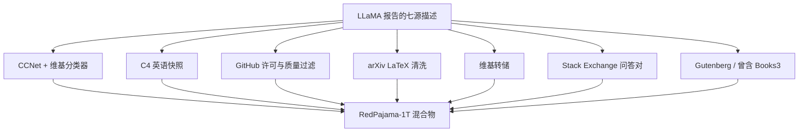

# RedPajama

LLaMA 的技术报告只给了七个来源各一段话；把这段话收成可下载的一点二万亿 token，缺口、歧义与版权风险才会变成社区能改的配方。

<footer>—— Together Computer, RedPajama: An Open Source Recipe to Reproduce LLaMA training dataset, 2023；后续见 Weber et al., 2024</footer>

Together、Ontocord.ai、ETH DS3Lab、Stanford CRFM 与 Hazy Research 在 2023 年发布 RedPajama-Data-1T，目标很具体：按 Touvron 等人 LLaMA 论文里那一页数据描述，拼出一份可复现的开源混合物。七个切片合计约 1.2T token——Common Crawl 878B、C4 175B、GitHub 59B、arXiv 28B、书籍 26B、维基 24B、Stack Exchange 20B——比例刻意靠近 LLaMA 的 1.25T。它不是「更好的网页」，而是第一次把闭源基座的数据叙事写成可审计清单。后来的 INCITE 模型、SlimPajama、Dolma 的多源结构，都从这份清单出发：要么瘦身去重，要么换掉有版权风险的桶，要么把网页桶换成更狠的过滤。

## 问题

LLaMA 开了权重，却把预训练数据留在实验室里。报告写了来源名字与大致 token 数：五份 2017–2020 的英语 Common Crawl、整份 C4、BigQuery 上按许可证筛过的 GitHub、二十种语言的维基、Gutenberg 加 Books3、arXiv 的 LaTeX、Stack Exchange 最大的二十几个站点。每一段都留下实现缺口。Crawl 用哪几个快照、CCNet 的 head 切在哪、GitHub 的「质量启发式」阈值是多少、书籍如何近重复、arXiv 要不要展开宏——这些决定会让两个「都按 LLaMA 复现」的语料变成不同的分布。开源社区若不能把缺口补成代码，所谓复现只是用别的混合物训一个同尺寸 Transformer。

第二问题是治理。Pile 的 Books3 后来成为版权诉讼的焦点；RedPajama 起初跟着 LLaMA 收录，随后撤下。维基与 Stack Exchange 的模板、GitHub 的许可证噪声、Crawl 与 C4 的交叉重复，都不会因为「我们在复现 Meta」而自动消失。问题从「如何接近 LLaMA」变成「如何在可发布的约束下接近 LLaMA 的来源结构」。

### 复现的是配比，不是字节

token 比例接近，不等于文档集合接近。LLaMA 的 Common Crawl 经过「像维基」的分类器；RedPajama 用 CCNet 管道再加一个维基参照的线性 / fastText 分类器去逼近，但参照快照、阈值与英文定义都是自己的。C4 直接用 AllenAI 的 `c4_en`，这一桶倒是字节级可对齐。GitHub 按 Apache、BSD、MIT 留项目，再按文件长度与字母数字比例砍低质量文件，文件级去重；LLaMA 原文的启发式并未完全公开，这里只能「同方向猜测」。附录里他们列出了所有不确定点。读 RedPajama 却不读这份歧义表，会把实现选择误当成 Meta 的原配方。科学上有用的是「已知缺口下的一个可运行点」，不是声称比特级复制。

## 方法

网页两条路并行，对应 LLaMA 把 CC 与 C4 都算进混合物。CC 侧跑 Wenzek 的 CCNet：规范化、段落去重、fastText 语言识别、维基 KenLM 分层，再叠加「像维基」的分类器，取五个 2017–2020 快照，得到 878B。C4 侧不再重抽，直接纳入 Raffel 等人已经按终结标点、脏词与三句去重处理过的英语 C4，175B。两桶都来自 Crawl，但抽取年份、规则与去重粒度不同，这是刻意的多样性，也是跨桶重复的来源——同一新闻可能既在 C4 又在 CCNet 头档。

GitHub 从 BigQuery 公共表取许可友好的仓库，过滤过短、符号墙和重复文件，得到 59B，少于 LLaMA 报告的约 100B。arXiv 从 requester-pays 桶拉 LaTeX，切掉导言之前的内容、注释、参考文献并展开宏，对齐 Gao 等人 Pile 里的 arXiv 处理，28B。维基用 Hugging Face 上 2023-03-20 的转储，去超链接与样板，24B，覆盖约二十种语言。Stack Exchange 从 Internet Archive 取最大的二十八站，去 HTML，把问答收成一对、答案按票数排序，20B。书籍原计划 Gutenberg PG-19 加 Books3，用 SimHash 近去重；Books3 因版权问题下线后，这一桶的公开版本不再与论文表格里的 26B 一一对应。

### 从 1T 混合物到 V2 信号层

2023 年底的 RedPajama-V2 改了问题。它不再追求 LLaMA 配比，而是对八十四个 Common Crawl 快照跑 CCNet，放出约 30T 级网页，并为其中约 30B 文档附上质量信号：CCNet 困惑度、C4 / MassiveText / RefinedWeb 启发式、维基参照 fastText、Bloom 精确去重与 MinHash 近去重标签。使用者自己决定切点。这把「数据集」变成「带标注的池子」，后来 DCLM 的竞赛协议与 FineWeb 的消融，都受这种「先给信号再让你滤」的思路影响。V1 回答如何复现一个已知混合物；V2 回答如何让网页过滤成为可比较的研究。

不要把 V1 与 V2 当成版本升级。V1 是多源、已混合、面向「接近 LLaMA」；V2 是单源网页、未充分过滤、面向「自己选阈值」。在 V2 上直接训、却报告「用了 RedPajama」，等于把未洗碗的池子当成 1T 配方。

## 机制

多源混合物的机制是显式配比。设来源 $s$ 的自然token分布为 $p_s$，训练集是 $\sum_s w_s p_s$。LLaMA 把 $w$ 写进报告；RedPajama 用公开抓取去逼近每个 $p_s$，再按表内 token 数设 $w$。网页分类器改变的是 $p_{\mathrm{CC}}$ 的支撑，不是 $w_{\mathrm{CC}}$。GitHub 许可证过滤改变的是代码桶的合法子集。跨源重复则让名义 $w$ 失真：维基既在维基桶里，也嵌在 CC 与 C4 的镜像里；不去掉跨源复制，你以为加了 2% 百科，实际百科已经被网页上采样。

INCITE 在 Summit 上按这份数据训 3B/7B，是对「配比是否足够接近」的下游检验，不是对「每个缺口都选对了」的证明。和原版 LLaMA 的差距里，混着架构、训练步数、tokenizer 与数据歧义，不能单记到某一种启发式上。SlimPajama 随后证明 V1 内部重复极重：去掉近一半字节后，同样 token 预算往往更值。也就是说，RedPajama 的历史贡献是把来源图公开，而不是给出最终去重状态。

### 开放配方与封闭权重的不对称

权重可下载、数据只给一段话，社区只能在猜测空间里爬山。RedPajama 把猜测空间收成 GitHub 仓库：每一种过滤都是可改的脚本。它没有消除与 Meta 内部语料的差异，但把差异从不可讨论变成可 diff。Dolma 后来明确写：V1 是最接近的前辈，但科学论文与 Reddit 等来源、以及更严的 PII 与质量清理，是 RedPajama 没有走完的部分。读懂这一点，才不会在 2026 年还把 1T 混合物当成「当前最强公开数据」。

## 边界与工程取舍

Books3 下线说明：复现闭源配比会撞上不能开源的桶。Gutenberg 填不满书籍的多样性，模型在长文书写上会偏。GitHub 只留宽松许可，训练分布相对真实 GitHub 更「干净」，对专有风格与 copyleft 项目的补全会弱。CC 与 C4 双桶放大新闻转载，若只做桶内去重，跨桶泄漏仍在。多语言维基占比很小，英语网页仍主导，不能把 RedPajama 当多语言语料。

V2 的信号层把选择权交给用户，也把踩坑权交给用户。没有统一切点，论文表格里的「RedPajama-V2」不可比。质量信号本身基于旧参照，生成垃圾上升后维基分类器会把通顺空文打高。任何生产训练都应在 V2 上重做阈值扫描，并另加数学与代码桶——V1 的 GitHub 加 arXiv 只有几十 B，远远不够现代代码模型。

tokenizer 会改表格里的「B」。LLaMA 用 SentencePiece，公开统计若换 GPT-2 或 Llama-3 词表，同一字节流的 token 数会漂。比较 RedPajama 与 Dolma、FineWeb 的规模时，先对齐词表，再谈万亿。

## 小结

- RedPajama-1T 按 LLaMA 报告复现七源混合物，约 1.2T token，是开源多源配方的起点，不是网页质量的终点。
- 网页走 CCNet 加维基分类器，并并行纳入整份英语 C4；代码、论文、维基、问答、书籍各有入口规则。
- 报告中的歧义被写成实现选择；Books3 因版权撤下，公开桶与原始表格不再全等。
- V2 改为带质量信号的超大网页池，用途与 V1 不同，不能当同名数据集混用。
- 跨源重复与桶内重复都重，SlimPajama 证明去重能砍掉近一半字节。
- INCITE 检验的是可训练性，不能单独证明与 Meta 语料对齐。
- 出处：Together Computer，*RedPajama* 博客与 GitHub，2023；Weber 等，*RedPajama: an Open Dataset for Training Large Language Models*，arXiv:2411.12372；对照 Touvron et al. LLaMA、Wenzek CCNet、Raffel C4。
