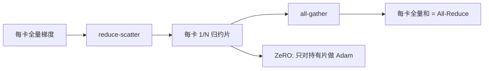

# reduce-scatter 与 all-gather

All-Reduce 不是原子：它是一次把和摊到各卡的 reduce-scatter，加上一次把各片收回来的 all-gather。ZeRO 把中间那一份「全量副本」删掉，于是这两步单独露面。

<footer>—— 对照 MPI 集合原语与 DeepSpeed ZeRO 对梯度 / 参数分片的用法</footer>

[上一课](/llm/ring-tree-allreduce) 把 All-Reduce 写成环上的两阶段。本课把两阶段升格为**一等原语**：reduce-scatter 与 all-gather。缺口不是再讲一遍环怎么转，而是 [数据并行与 ZeRO](/llm/data-parallel-zero) 为什么不再调用 All-Reduce：它只需要「每卡持有归约后的一片」和「每卡在前向之前拿回自己要用的参数片」。后课 all-to-all 是置换，不是归约；本课先把可加集合的一对原语讲清。

## 问题

All-Reduce 的语义是每卡得到**完整**的和。若下一步立刻用完整梯度做 Adam，这个语义是对的。ZeRO 把优化器状态按参数下标切走之后，第 $r$ 张卡只拥有第 $r$ 片：它只需要那一片的平均梯度，不需要别人那一片。若仍做 All-Reduce，等于先凑齐再扔掉 $\frac{N-1}{N}$，带宽白付。

对称地，前向需要完整权重时，并不是「从根广播一份」，而是各卡已经持有自己那一片，做一次 all-gather 就能拼回。张量并行的列切 / 行切，也是同一对：先局部 GEMM，再 all-gather 激活或 reduce-scatter 梯度，而不是每次都 All-Reduce 完整隐藏态。问题是：**什么时候必须看到全量，什么时候一片就够**。

MPI 把 `MPI_Reduce_scatter` 与 `MPI_Allgather` 写成独立调用。NCCL 同样暴露 `ncclReduceScatter` 与 `ncclAllGather`。训练框架若只封装 All-Reduce，ZeRO-2/3 与 Megatron 的序列并行会被迫多搬一倍字节。

## 方法

Reduce-scatter：输入每卡一份长度为 $n$ 的向量，输出每卡一份长度为 $n/N$ 的归约结果，第 $r$ 卡得到全局和下标区间 $I_r$。通信量下界约为每卡 $\frac{N-1}{N}n$，与 All-Reduce 的一半同阶——因为 All-Reduce ≈ reduce-scatter + all-gather，两段各一半。

All-gather：输入每卡一份 $n/N$，输出每卡一份拼接后的 $n$。没有加法，只搬数据。通信量同样约 $\frac{N-1}{N}n$。实现仍可以是环（每步把当前片转给邻居）或树（先集中再展开），选择逻辑与上一课相同：大消息环，小消息树。

[张量并行](/llm/tensor-parallel) 里，列并行的输出 all-gather、行并行的输入 all-gather，以及反向对应的 reduce-scatter，就是把这一对原语钉在层边界上。不要把它们再包装成层内 All-Reduce，除非实现真的需要每卡一份完整激活。

## 机制

环上的 reduce-scatter 与 all-gather 可以共用同一套 chunk 调度，只是本地操作不同：前者邻居数据要加进本地片，后者只覆盖或拼接。NCCL 因此能把一次 All-Reduce 做成两次集体调用的融合核，也可以让框架拆开，在中间插入「只更新本片优化器」。拆开之后，计算–通信重叠的窗口变了：reduce-scatter 可以在反向后几层还在算时发出；all-gather 必须在下一微批前向用到该片之前完成。ZeRO-3 的参数 all-gather 因此更容易撞上关键路径，这是分片换来的通信形状，不是网卡变慢。

数据量上，一对 RS+AG 与一次 AR 搬的字节同阶。省的不是「少一次集体」，而是 **省掉全量副本的显存**，以及在「不需要全量」时只做一半。若框架误把 ZeRO 写成「All-Reduce 后再切片」，通信回到 DDP，显存却按 ZeRO 宣传——这是配置事故。

序列并行 / 上下文并行常对激活做 all-gather 或 reduce-scatter，体积跟序列长度走，与梯度 All-Reduce 的「每步一次参数量」不是同一条屋顶线。并行维正交：不要把 CP 的激活集体算进 DP 的梯度预算。

## 边界与工程取舍

片必须整除，或至少在通信库里可填充。隐藏维、专家数、词表切分若不能被 TP/DP 度整除，会多出不均片，环的负载不再对称。In-network 归约通常针对 All-Reduce 语义；拆成 RS+AG 之后，交换机侧未必有同样的卸载，带宽模型要按主机侧集体重测。

All-gather 没有归约，不能靠「先节点内加再跨节点」减体积——层次化只能减控制开销，不能减数据。这与下一课 all-to-all 同类：不可加的数据必须真正送到对端。能加的才配 reduce-scatter。

## 小结

- Reduce-scatter 给出每卡一片归约结果；all-gather 把各片拼回全量。
- All-Reduce 在通信量上约等于二者串联；ZeRO 与 TP 常常只需要其中一步。
- 省的是全量副本与「不需要全量时的那一半」，不是魔法减字节。
- All-gather 不可加，层次化减不了数据体积。
- 出处：MPI / NCCL 原语；ZeRO 与 Megatron 类切分对二者的直接调用。
