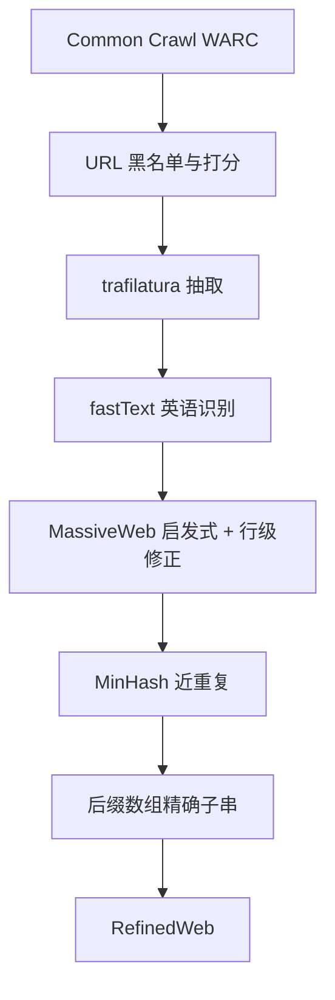

# RefinedWeb

仔细过滤并去重的网页本身就能训出强模型，甚至显著超过在 The Pile 上训练的同期公开模型；精选书籍与对话并非规模化预训练的必要前提。

<footer>—— Penedo et al., The RefinedWeb Dataset for Falcon LLM, NeurIPS 2023</footer>

Penedo 等人的 RefinedWeb 把一条当时还不算主流的主张写进公开实验：不必把书籍、论文、对话当作「高质量」的硬配比，只要把 Common Crawl 抽干净、过滤严、去重狠，网页单独就能支撑 Falcon 量级的零样本能力。他们把这条管道叫做 MacroData Refinement（MDR），产出约五万亿英语 token 的网页语料，并公开其中六千亿的抽取，以及只在 RefinedWeb 上训的 1.3B / 7.5B 对照模型。后续 FineWeb、DCLM 的网页支路，几乎都是在 MDR 的抽取器、启发式与双重去重上换刀，而不是另起炉灶。

## 问题

2022 年前后的主流叙事是：网页脏，精选源才是泛化的来源。Gao 等人的 The Pile、Brown 等人的 GPT-3 混合物、Rae 等人的 MassiveText，都把书籍、新闻、维基或对话做成显式桶并上采样。问题是，这些桶不可规模化。书籍有版权与扫描噪声，对话有平台条款，论文要单独解析；Hoffmann 等人的 Chinchilla 法则又要求参数与 token 一起涨，一百七十亿参数量级已经需要数万亿 token。Villalobos 等人当时甚至讨论「高质量数据会先于算力耗尽」。若精选源是瓶颈，开源实验室根本跟不上闭源混合物。

第二条裂缝是公开网页集本身偏弱。C4 与 OSCAR 被广泛当作「已经过滤过的网页」，但 WET 抽取残留导航、行级规则误杀合法短句、去重只做精确子串或行哈希。实验室若拿它们与 The Pile 比，会把「网页不行」和「这套网页管道不行」混为一谈。RefinedWeb 要回答的不是「网页里有没有知识」，而是：在固定模型与计算下，一套可规模化的网页管道能不能打过精心拼凑的多源语料。

### 中性过滤对抗分类器偏见

Penedo 等人故意不用维基分类器或教育价值头做质量门，只把机器学习留给语言识别。理由写在设计原则里：Dodge 与 Welbl 等人已经证明，内容级 NSFW 分类器和脏词表会系统性误伤少数群体、医学与法律文本。URL 屏蔽加启发式，偏见来源更可审计，尽管召回不如分类器。「中性」不是无立场。选 MassiveText 规则、选英语 fastText 阈值、选 trafilatura 当抽取器，都在定义什么叫可读文档。中性指的是：不把「像维基」或「像指令」写进监督标签，以免质量定义被参照集锁死。

## 方法

MDR 从 WARC 而不是 WET 起步。Lopukhin 与 Barbaresi 的评测里，trafilatura 在博客与新闻上抽主文最稳；Penedo 等人确认这点在更杂的 Crawl 上也成立，于是用 warcio 读原始 HTML，丢掉菜单、页脚与广告后再做正则：连续空行压到两行、去掉正文里的 URL。URL 过滤先于一切重计算：四百六十万域名黑名单，加上按严重度加权的 URL 词表打分。他们发现公开 NSFW 名单把博客平台和流行文化站也打进去，C4 式正文脏词又误伤医法页面，所以把成人内容判断收在 URL 侧。因为 RefinedWeb 预定会与精选源混合，维基、arXiv 等常见精选域名也从网页桶里剔除，以免跨源重复。

语言识别沿用 Wenzek 的 CCNet fastText，只留英语。质量启发式大量继承 Rae 等人 MassiveWeb 的文档统计：词数、停用词、字符重复率等，并加上自研的行级修正——社交计数、导航按钮一类短行被删；若修正超过文档的百分之五，整页丢掉。这一阶段结束的集合称为 RW-Filtered，大约只剩原始文档的百分之二十三。

去重是 MDR 与 C4 拉开差距的一刀。模糊侧用 Broder 的 MinHash 抓模板页、换了几个实体的许可证和 SEO 占位文；精确侧用 Manber–Myers 后缀数组找最短长度以上的完全相同子串，做法对齐 Lee 等人 2022 年的 ExactSubstr。消融表明：单用 MinHash 打不过精确子串；二者合用对零样本几乎不再加分。他们仍把 MinHash 放在前面，当作可扩展的预剪枝，再对留下的文档切跨度而不是整篇丢弃——整篇丢弃拒绝率太高，五万亿 token 的目标会破。去重前后大约再砍一半。公开的六千亿抽取是全量的一个许可友好切片，不是「更干净的头档」。

### 只在网页上训练的对照

为把「网页足够」从口号变成数字，他们训了 Falcon-RW-1B/7B，数据只用 RefinedWeb，并在同一套零样本聚合上对比自己复现的 Pile 训练。聚合分成 small / core / main / ext，任务来自 GPT-3、PaLM 与 BigScience 常见套件：HellaSwag、LAMBADA、PIQA、ARC、Winogrande 等。结论是：同等计算下，RW 训练的模型显著超过公开的 Pile 模型，并在他们的评测装置里接近 GPT-3 论文数字。Falcon-7B/40B 生产模型后来把 RefinedWeb 与精选源再混合，但论文要证明的是混合物并非前提。

公开的 600B 不能直接外推到内部 5T。快照覆盖、去重连通分量、英语阈值都会改分布。引用 RefinedWeb 时应写清：用的是 Hugging Face 上的抽取，还是按 MDR 对更新的 Crawl 重跑。后者才是配方，前者只是快照。

## 机制

启发式改变支撑：不像句子的页被置零。去重改变频率：同一模板不再按出现次数吃梯度。Hernandez 等人指出，重复对大模型的伤害随参数上升而加剧——十亿参数能容忍上百次复制，一千七百亿参数连几次都危险。Lee 与 Carlini 等人则把去重和记忆、训练-评测泄漏连在一起。网页比 Pile 更需要这套手术，因为转载与 CMS 模板是网页的默认生成方式，而书籍桶里同一段落复制一万次的概率低得多。这也解释了 Pythia 在 Pile 上 MinHash 去重收益偏小：精选源的重复结构本来就稀。

抽取质量是上限。WET 把样板留在主文里，后续任何规则都在给导航条打分。trafilatura 把问题提前结束：过滤器看见的是段落，不是 DOM 残骸。行级修正补的是抽取器仍会漏掉的「3 likes」短行。三者合在一起，质量定义是「像人写的连贯英文页」，不是「像维基」或「像教材」。这与后来 FineWeb-Edu、DCLM 的分类器正例正好相反——RefinedWeb 把分类器从管线里拿掉，是为了规模与可审计，不是因为分类器无效。

### 与精选混合物的真正差异

Pile 的多样性来自显式分桶。RefinedWeb 的多样性来自网页本身的长尾：论坛、文档、教程、新闻都还在，只是没有被贴上领域标签。零样本阅读与常识任务吃这种长尾很香；需要形式证明或仓库级代码的任务则不会自动出现，必须另开数学与代码桶。论文没有声称网页能替代一切领域，只声称：在通用零样本聚合上，网页管道的质量已经被低估。Falcon 后来仍混精选源，与这篇消融并不矛盾——生产模型优化的是产品能力，消融优化的是因果识别。

## 边界与工程取舍

英语中心是硬边界。fastText 与 MassiveWeb 阈值按英文书面语校准，直接搬到中文或代码会误杀列表、标题和无空格文本。成人过滤只看 URL，会漏掉内容脏、域名干净的页，也会误杀被黑名单污染的博客平台；Penedo 等人接受这种误差，以免内容分类器的社会偏见。精确子串会切掉名言、许可证和重复出现的公式，对记忆有益，对需要「常见表述」的风格模仿未必有益。

五万亿 token 依赖当时已有的 Crawl 快照。生成式垃圾变多之后，同样启发式会留下通顺空文——这正是 FineWeb-Edu 与 DCLM 重新引入分类器的原因。MDR 的中性原则在 2023 年是优点，在 2025 年可能不够。复现时不要把「不用分类器」当成教条，而应把它理解成：先用可审计规则把地板垫高，再决定要不要用参照集去收窄天花板。

URL 过滤里剔除维基与 arXiv，是为了给后续混合物留位置。若你的训练只有 RefinedWeb、没有另加维基，等于主动丢掉最稳的百科源。公开抽取是否已含这些域名，必须以数据卡片为准，不能从论文的设计意图反推文件内容。

## 小结

- RefinedWeb 用 MDR 从 Common Crawl 做出约 5T 英语网页 token，公开 600B 抽取与只在网页上训的对照模型。
- 设计原则是规模优先、严格去重、除语言识别外不做机器学习质量门。
- 抽取用 trafilatura 读 WARC；过滤用 URL 黑名单加 MassiveWeb 启发式与行级修正；去重是 MinHash 加后缀数组精确子串。
- 同等计算下，网页单源可超过 The Pile 训练的公开模型，挑战「精选源必要」的叙事。
- 中性过滤可审计，但对通顺空文、非英语与代码不敏感。
- 公开 600B 是快照，配方是可对更新 Crawl 重跑的 MDR。
- 出处：Penedo et al.，*The RefinedWeb Dataset for Falcon LLM: Outperforming Curated Corpora with Web Data, and Web Data Only*，NeurIPS 2023；对照 Gao et al. The Pile、Lee et al. 去重、Rae et al. MassiveText、Wenzek et al. CCNet。
