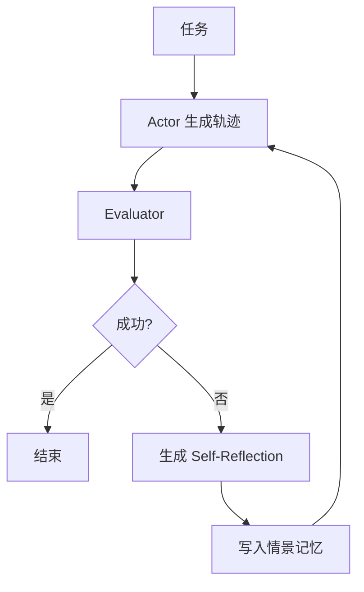

# Reflexion

用语言写下的反馈当强化学习的信号：智能体在失败后生成一段反思，存入记忆，在下一回合的同类任务上条件于这段话再试。

<footer>—— Shinn et al., Reflexion: Language Agents with Verbal Reinforcement Learning, NeurIPS 2023</footer>

[ReAct](/llm/react) 的轨迹在单次任务内交错，任务一结束，失败原因并不自动进入下一次尝试。Shinn 等人加了一层口头强化：Actor 生成轨迹，Evaluator 给出成功/失败或稀疏分数，然后模型写一段 Self-Reflection——自然语言总结「错在哪、下次改什么」——写入情景记忆，下一回合的 Actor 提示带上这些段落。这就是 Reflexion。它不更新权重，强化学习的「回报」被说成话，而不是变成梯度。本篇写这条记忆—反思—再试的提示形态，不把一般 RLHF 或过程奖励再讲成同一算法。

## 问题

单次 ReAct 或 CoT 失败后，重试若只用同一提示，模型往往会重复同一条死路：同样的错工具参数、同样的错假设。人类会在试卷空白处写「不要漏单位」，下次看见同类题就先看一眼。需要一种可写、可检索、仍是文本的失败记忆，使第 $k+1$ 次尝试条件于第 $k$ 次的教训，而不是条件于空洞的「再仔细一点」。

Reflexion 要回答的是：反思文本写什么、谁来评成功、记忆如何截断。若反思只是「我应该更认真」，下一回合没有可执行约束。若评估器不可靠，反思会朝错误原因努力，把系统锁在漂亮的错误叙事里。它也要与单次任务内的 Observation 区分：观察是环境即时返回；反思是跨尝试的元文本。

### 口头回报代替参数更新

经典 RL 用标量 $R$ 更新 $\theta$。语言智能体的尝试次数往往很少，轨迹是离散文本，用 REINFORCE 更新大模型既贵又不稳。Reflexion 把 $R$ 映射成一段话 $m$，通过提示拼接改变下一回合的 $\pi(\cdot\mid x,m)$。学习发生在上下文里，随会话或作业批次消失，除非宿主把 $m$ 持久化。这是特性也是限制：换模型、换系统提示，记忆不会自动迁移到权重里。

标题里的 reinforcement 容易让人写成 PPO。原文明确是 verbal reinforcement：没有反向传播。后训练若拿反思轨迹做 SFT，那是另一条线，不要写进 NeurIPS 2023 方法的必要条件。

## 方法

三角色，可以是同一模型的三种提示，也可以是分开的检查器。Actor：条件于任务、工具说明、以及记忆中的反思，生成一条 ReAct 式或 CoT 式轨迹。Evaluator：对终局打分——单元测试通过、环境成功信号、或启发式（答案是否可解析）。失败则进入反思提示：输入为轨迹摘要（不要原文无限长）、评估结果、任务说明，输出为若干条具体、指向可改行为的句子。宿主把反思 append 到该任务（或该任务类型）的记忆槽，再开新回合，Actor 的系统段或前缀里列出最近若干条。成功则可清记忆或保留正向笔记；原文主路径强调失败驱动。

轨迹摘要要结构化：用了哪些动作、哪一步评估失败、最后的错误观察。把整页 HTML 塞进反思提示，模型会写空洞感想。反思输出应限制条数与长度，并最好带可核对的承诺（「下次先调用 schema 校验再搜」），而不是情绪。记忆检索默认用同一任务的近期条目；跨任务共用记忆会串味，除非按任务类型分桶。

### 反思必须指向可改的行为

无效反思：「需要更仔细地推理。」有效反思：「Search 查询应使用完整实体名；上次用了缩写导致空结果。」提示里应用正反示范。评估器能提供的信息决定反思上限：只有 0/1 终局时，模型必须从轨迹里猜原因，可能猜错。能拿到失败的测试名、异常类型、环境的具体非法动作，应原样写入反思提示，让生成变成对错误消息的改写，而不是自由归因。这与 PAL 把 traceback 回填是同一原则。

重试预算是方法超参。没有上限的反思循环会在不可完成的任务上烧费用，并让记忆堆满互相矛盾的句子。应设最大尝试次数，并在记忆过长时做摘要或只保留最近 $n$ 条。矛盾检测很难自动做，简单策略是新反思覆盖旧的同主题句，或按时间衰减。不要对记忆做向量检索除非任务很多：同一题的几次尝试，线性拼最近几条更稳。

## 机制

Reflexion 改变的是跨回合的条件分布。第 $k+1$ 次 Actor 看见对第 $k$ 次失败的语言描述，相当于在提示里加入了负样本的文字化梯度。它能打破「同一提示下的模式崩溃」，因为前缀真的变了。它不能打破评估器盲区：若测试套件漏了某类错，反思会认为成功，记忆不再更新。它也不能把一次尝试内部的逐步纠错自动做好——那仍是 ReAct 观察的职责。两层记忆：回合内观察，回合间反思。

相对自洽：自洽并行采样，不读写失败教训；Reflexion 串行，依赖评估器。相对 ToT：ToT 在单次求解的中间状态上搜索；Reflexion 在完整尝试的失败上学习。相对过程监督：PRM 给步骤打分并可能更新或搜索；Reflexion 的评估通常在终局，反思是事后散文。把 Reflexion 接到逐步评估上是自然扩展，但原文不是 PRM。

记忆是提示的一部分，因此有注入面。不可信环境若能把字符串写进「失败原因」，下一回合 Actor 可能执行记忆里的恶意建议。反思槽必须与用户/网页观察隔离，并由宿主生成，不要让网页内容直接 append 进记忆。

### 评估器校准决定记忆质量

假失败：评估器过严，反思会针对并不存在的错误改策略，把对的路径改坏。假成功：过宽，错误策略被固化。启发式评估（「答案看起来像数字」）尤其危险。优先用环境真值或测试；不得已用模型当评估器时，应低温度、要求引用轨迹中的具体一步，并允许「无法判断」以免硬给 $R$。多次尝试的准确率曲线应同时报平均尝试次数，否则把预算换成次数的方法会看起来像免费涨点。

## 边界与工程取舍

Reflexion 适合有清晰成功信号、允许几次重试、失败模式可语言化的任务：编程练习、带胜负的环境、可核对的问答。开放聊天没有二元成功，反思会变成自我说教。不可重试的一次 API 调用也不适合先失败再学。记忆持久化要考虑隐私与过期：上周的 API 报错格式这周已变，旧反思有害。不要把 Reflexion 当成训练算法去替代对 Actor 的 SFT；它可以产生更好的轨迹再拿去蒸馏，那是流水线，不是原文必须步骤。

与 ReAct 提示形态一起用时：Actor 仍遵守 Thought/Action 槽位；反思放在系统段或记忆段，不要写进 Observation。Observation 是环境，反思是元策略。混在同一槽会让模型把教训当成当前工具返回。引用以 Shinn et al. NeurIPS 2023 为准；具体环境分数随 Actor 基座与工具变化。

「多试几次」本身就会涨点。对照实验必须包含无反思的同等次数重试（只换随机种子或温度）。否则增益可能来自 Best-of-N，而不是来自那段话。

## 小结

- Reflexion 用评估器判定尝试成败，再生成口头反思写入记忆，供下一回合 Actor 条件化。
- 它是上下文里的强化，不更新权重；学习随记忆的生命周期结束。
- 反思要具体、可执行；评估信号越结构化，归因越不胡编。
- 回合内观察与回合间记忆必须分槽，并防注入。
- 必须用同等重试次数的无反思基线，才能把增益算在反思上。
- 出处：Shinn et al., *Reflexion: Language Agents with Verbal Reinforcement Learning*, NeurIPS 2023。
