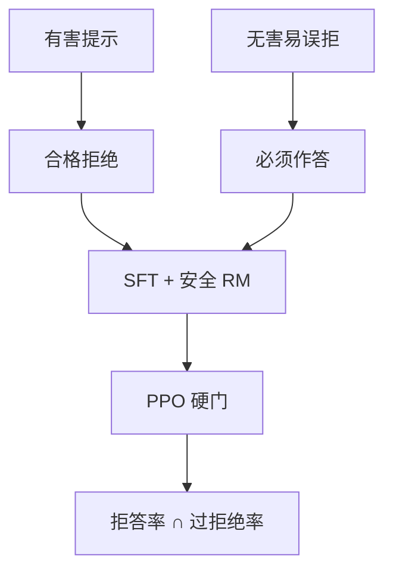

# 拒绝训练与边界

安全 RM 把拒答当高分时，模型会把边界扩到 innocuous 请求；过拒绝与漏拒绝要成对报告。

<footer>—— 对照 Llama 2 安全奖励；Bianchi 等 Safety-Tuned LLaMAs；XSTest / 过拒绝基准</footer>

[上一课](/llm/constitutional-rl-practice)用原则定义无害。落到行为上，最硬的动作是拒绝。缺口是：**拒绝是可优化的，默认会扩大；边界必须用正例与反例一起训。** 本课写拒绝训练，不提供越狱步骤，只写评测与数据协议。接到诚实课：拒答不是撒谎，但「我不知道」与「我不能说」要分开。

## 问题

[RLHF](/llm/rlhf-pipeline) 的安全比较里，拒答常常赢。PPO 于是提高拒答先验。Bianchi 等人显示：少量安全 SFT 就能让模型对无害题也拒。XSTest 一类基准专门测过度拒绝（把「如何杀死进程」当暴力）。漏拒绝是另一头：红队仍能找到配合。只报有害提示拒答率，是半张表。

边界依赖意图与语境，不是关键词。细则里「协助犯罪=拒、虚构写作=允」必须有成对数据，否则 RM 走捷径。

### 拒绝格式也是策略

长篇道德训诫、短拒、转移话题，安全 RM 可能都给高分。产品要短拒 + 解释可允许的替代。把格式写进细则或硬规则，不要指望标量 RM 自己长出。宪法条款应写「最小充分拒绝」。

不要用越狱成功率当唯一 KPI。它随提示分布漂移，且与过拒绝负相关。

## 方法

数据：有害请求 → 合格拒绝；看起来敏感实则无害 → 必须回答；边界题双标（专家）。训练：SFT 先锁格式，再安全 RM + 有用 RM 硬门（[多目标](/llm/multi-objective-reward)）。评测：有害集拒答率、XSTest 一类允答率、有用 Arena。RL 阶段对过拒绝给负奖励，需金标，不能让安全 RM 自己标——它正是过拒绝的来源。

与 [DPO](/llm/dpo) ：用「拒 vs 配合」对直接推边界，β 过大会回到 SFT 的过拒或过配，取决于 SFT 偏向哪边。

## 机制

拒答是短轨迹、高安全分、低有用分。硬门不对称时，梯度稳定推向拒。过拒绝是这条几何的默认终点，要用无害正例的正优势对冲。模型规模越大，越会从预训练里找回配合能力，安全 SFT 更像浅层开关——泛化到改写提示时开关失效。这是红队持续存在的原因，不是一次 RL 能封死。

可验证域很少需要拒答（题就是题）。本课主场是开放助手。

## 边界与工程取舍

法律与医疗的「拒 vs 给一般信息」各国不同，数据合同要地域化。下一课诚实：该答但不确定时，应校准而不是拒；把不知道当成安全拒，会伤害有用并教撒谎式推诿。

## 小结

- 拒绝可被 PPO 扩大；必须同时训无害正例并报过拒绝。
- 安全 RM 不能当过拒绝的金标。
- 拒绝格式写进细则：最小充分拒绝。
- 边界是语境而不是关键词，需要专家双标。
- 出处：Touvron 等 Llama 2；Bianchi 等 Safety-Tuned LLaMAs；XSTest 过拒绝评测。
