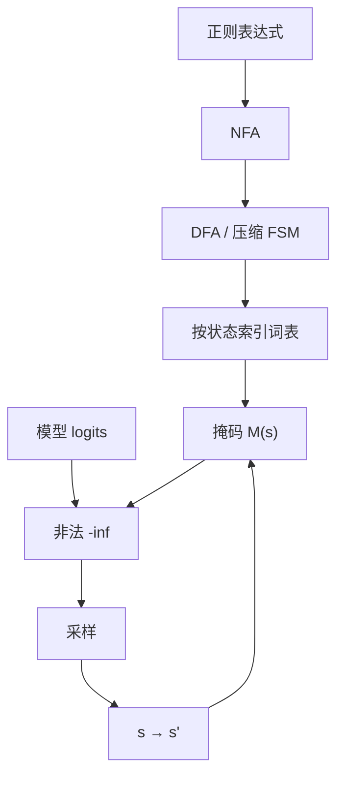

# 正则约束解码

    
把合法续写写成自动机上的转移，再对词表建索引：每一步掩码可以是查表，而不必扫描整个词表去跑一遍正则。

    <footer>—— Willard 与 Louf，Efficient Guided Generation for Large Language Models（Outlines）</footer>

日期、订单号、选项列表、「三个标签逗号分隔」这类输出，用正则描述往往比写一整份 CFG 更直接。正则约束解码把表达式编译成有限状态机，对每个状态预先算好词表里哪些 token 能推进，生成时只查表掩码。Willard 与 Louf 把这件事从「每步对整个词表跑部分匹配」改成编译期索引，使引导生成的逐步开销接近常数；实现落在 Outlines。它是 [约束解码总述](/llm/constrained-decoding) 里最干净的一档：没有栈，状态可全离线，也因此 **表达不了无限嵌套**。本篇谈正则与词表的对齐、状态爆炸、以及何时该升级到 [JSON Schema](/llm/json-constrained-decode) 或 [CFG](/llm/grammar-decode)。

## 问题

正则定义的是正则语言，识别器是 NFA/DFA。自回归模型的字母表却是子词。逐步合法性不能写成「把已生成字符串丢进 `re.match` 再扫一遍 $\mathcal{V}$」：词表 3 万–10 万时，每步线性扫描不可接受，Guidance 早期路径被 Outlines 论文当作这一对照。正确的问题是：对每个 DFA 状态 $s$，哪些 $v \in \mathcal{V}$ 对应的字节串能从 $s$ 走出一条路径（不必到达接受态），以及走完后落到哪个 $s'$。

正则还有经典的状态爆炸：粗心的 `.*`、重叠的选择、unicode 字符类，会让 DFA 在编译期先爆内存。表达式在字符面上「看起来不长」，编译后的状态数可以是指数级。约束解码把这场爆炸从「解析失败后重试」提前到了「服务启动或首次请求时编译失败」。工程上必须把编译预算当成 Schema 审查的一部分，而不是假定任意正则都能上线。

### 锚点、部分匹配与尚未写完的串

生成中途的前缀不是完整句子。`^` 只在串首有意义；`$` 只在结束时检查。逐步掩码需要的是 **活前缀**：当前字节是否仍可能是某条匹配的前缀，而不是已经是完整匹配。过早要求到达接受态，会逼模型立刻结束，写出最短合法串。过晚关闭接受，会在已经匹配之后仍允许垃圾续写。引擎要区分「还能继续」与「可以结束」：后者通常映射为允许 EOS 或允许停用序列，见停止符的一般讨论。

掩码改支持集，不改权重。正则约束得到的是截断分布，不是「更懂格式」的新模型。若 $p_\theta$ 在合法集合上质量差，正则只会逼它在合法的低概率 token 里爬，表现为重复分隔符或固定宽度字段被填满占位符。

## 方法

Outlines 的编译管线可以概括成：正则 → NFA →（可选）DFA → 对每个状态扫描词表，记录合法 token 与转移 → 生成时维护当前状态，查表得 $\mathcal{M}(s)$，采样后转移。索引把 $O(|\mathcal{V}|)$ 的逐步扫描挪到 $O(|Q|\cdot|\mathcal{V}|)$ 的预处理，$Q$ 为状态集。SGLang 的压缩 FSM 再把出度为 1 的链收成超边，固定前缀（如 `ID-`）不必逐步问模型。XGrammar 等后续引擎在 CFG 上扩展同一钩子；对纯正则任务，FSM 路径仍然更轻。

词表扫描必须按字节或按分词器的归一化规则消费，而不是按「token 字符串的 Python 字符」。BPE 的 `Ġ` 前缀、SentencePiece 的空格标记、byte fallback，都会让「正则里的一个空格」对应多个 token 变体。实现若只索引可见字符，空格与标点上的掩码会错。unicode 正则要声明引擎是哪一套字符类（Unicode 属性还是字节），否则 `\w` 在多语言标签上的行为与作者意图不一致。

### 与 JSON、CFG 的降级关系

JSON Schema 的 `pattern`、扁平枚举、固定分隔的记录格式，常被降成正则再走本管线。一旦出现任意深度的嵌套数组或互递归对象，正则写不出，应换 Schema/CFG 引擎，而不是用「假装有限深度」的 `(\[.*\]){0,8}` 去赌。有限展开会既漏掉更深合法实例，又因 `.*` 把状态数打爆。降级是表达力换编译确定性，不是免费的通用解析器。

### 多模式并与优先级

业务上常要「几种 ID 格式之一」。正则并运算对应自动机并，状态数为乘积级风险。更稳的做法是先让模型在一个短枚举里选出类型字段（可用 [JSON 约束](/llm/json-constrained-decode) 的 `enum`），再进入对应的专用正则。把所有格式揉进一条巨正则，调试时无法知道是哪一分支在吃 token。优先级（先匹配 A 再匹配 B）不是 DFA 的原生概念；若产品依赖「第一条规则赢」，应在文法层显式分支，而不是依赖某种正则引擎的搜索顺序。

## 机制

设 DFA 当前状态为 $s$，token $v$ 的字节为 $b(v)$。若存在从 $s$ 出发消费 $b(v)$ 的路径且不进入陷阱，则 $v \in \mathcal{M}(s)$。陷阱态表示已经不可能再匹配；一旦进入，掩码应为空并失败，而不是靠 EOS 强行结束——强行结束会输出不匹配的串，破坏保证。

完备性同样受分词器限制。正则允许的字符序列若必须经过某个「从当前 $s$ 看来非法」的中间 token，就出现可表示性空洞。典型场景：正则要求单个 ASCII 数字，分词器却把 `12` 当作一个 token，模型无法先写 `1` 再写 `2`；或反过来，正则要两位数，词表只有单数字 token，路径存在但更长。评测要在 **目标正则 × 具体分词器** 上做，而不是只在字符面上用 `re.fullmatch` 看最终串——最终串可能根本走不到。

`.*` 在约束解码里几乎总是错误默认。它让几乎任意 token 在多数状态下合法，等于关掉约束，还可能把 DFA 编译得巨大。需要「任意文本直到分隔符」时，应写成明确的字符类加否定，或把自由文本挪到无约束字段，外面用 JSON 结构包住。

### 温度、贪心与最短匹配

截断分布在合法 token 上归一化。贪心解码会偏向逐步局部最高分，经常对应正则的短匹配（先结束字段、少写可选组）。这与经典正则「贪心量词」不是同一算法，但产品观感类似：可选组被跳过、重复次数取下限。需要覆盖可选字段时，应把可选变成 Schema 里的显式键，或提高对「继续留在非接受态」的模型先验（靠示范，而不是靠把正则写得更宽）。

## 边界与工程取舍

不要用正则约束表达括号匹配或递归 JSON。那是 CFG 的工作。也不要在热路径上逐步执行通用正则引擎的反向引用、环视——这些已经超出严格正则，索引结构不再成立。Outlines 论文的复杂度结论针对可编译为 FSM 的语言；把 PCRE 当 FSM 用，是类别错误。

编译缓存以「正则字符串 + 分词器版本」为键。换词表而不重编译，掩码全错。多租户服务里用户提交的正则是拒绝服务面：恶意指数级状态应在编译沙箱里限时限内存，失败则回退到「不约束 + 生成后校验」，而不是把服务进程打满。生成后仍应用原正则做 `fullmatch` 断言，防止实现 bug。

出处钉在 Willard & Louf, arXiv:2307.09702。不要把某一版本 Outlines 的微秒数写成定律；SGLang 压缩 FSM（arXiv:2312.07104）与 XGrammar（arXiv:2411.15100）是后续工程，分别强化无分支压缩与 CFG，而不是取代「正则先编译再索引」这条基本路径。

### 评测应报的三件事

一是完整匹配率（结束时是否 `fullmatch`）。二是空洞率（生成中途空掩码、被迫失败）。三是相对无约束的质量变化（字段级准确、异常重复）。只报匹配率会选出过紧正则：匹配 100%，内容全是最短合法骨架。与 JSON 约束对比时，同一份扁平对象两种后端都应测，选编译更稳、空洞更少的那条，而不是按「正则更底层所以更快」的印象下结论。

## 小结

- 正则约束解码用 FSM 逐步掩码，保证输出属于该正则语言；Outlines 用词表索引避免逐步扫词表。
- 逐步要的是活前缀，不是完整匹配；过早接受会写出最短串。
- 状态爆炸与 `.*` 是编译期风险；用户提供的正则要限时限内存。
- Token 化会造成可表示性空洞，评测必须绑定分词器。
- 无限嵌套交给 CFG；带类型的对象交给 JSON Schema；正则适合行级模式与有限枚举。
- 生成后仍做 `fullmatch` 断言。
- 出处：Willard & Louf, *Efficient Guided Generation for Large Language Models*, arXiv:2307.09702；压缩与 CFG 延伸见 SGLang、XGrammar。
