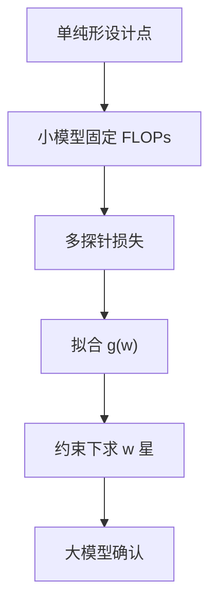

# RegMix

把数据配比当成回归问题的自变量：在小模型上扫一批混合物，拟合损失面，再在面上求满足约束的配比，接到大模型。

<footer>—— Liu 等，RegMix: Data Mixture as Regression for Language Model Pretraining</footer>

[上一课](/llm/doremi)用代理模型上的 group DRO 求一组照顾最差桶的权重。DRO 每步都要训代理，桶一多、$w$ 一切约束，实验图就不好画。本课不重讲超额损失。缺口是：能否用一批小规模训练的结果，把混合物到验证损失的映射拟合成可查询的面，从而少训几次、多回答「若代码再加 5% 会怎样」。Liu 等人的 RegMix 把配比写成回归。

## 问题

[配比定律](/llm/data-mixture-laws) 希望 $w$ 随规模可外推。DoReMi 给出的是一个稳健点，不是一张面：你很难问「在单纯形上沿某条边移动时损失怎么变」，除非再开一串 DRO。网格穷举 $k$ 维单纯形又太贵。需要实验设计：用远少于穷举的配比点训小模型，用回归（线性、核、或带交互项）预测未见过的 $w$ 的损失，再在预测面上做约束优化。

回归的风险是外推。训练点若都挤在均匀配比附近，面在顶点（单桶）处不可信。DoReMi 的最差桶逻辑在顶点附近最敏感，RegMix 若没采到那些点，会画出过于乐观的网页独大解。

### 响应变量选错则面无用

用网页验证损失当 $y$，回归会推荐多喂网页。应用与 DoReMi 相同的多探针：把 $y$ 做成向量，或做成加权标量并报告帕累托。RegMix 的工程价值在于一次设计回答多个反事实，而不是替换掉探针纪律。

小模型的损失面平移到大模型时，最优 $w$ 可能移动。RegMix 原文强调小到大的迁移；实践仍应在目标尺度做少量确认点，与 DoReMi 同一条警告。

## 方法

选定 $k$ 个桶与单纯形上的设计（单纯形格点、Dirichlet 抽样、或把人工配比当作中心再扰动）。每个设计点训一个固定 FLOPs 的小模型，记录各探针损失。拟合 $y\approx g(w)$，在 $w\in\Delta^{k-1}$ 且盒约束上最小化 $g$，得到推荐 $w^\star$。用一两个未参与拟合的设计点做持出检验；误差大就加密采样或降低多项式阶数。

与 DoReMi 的分工：RegMix 适合「想看面、想做预算问答」；DRO 适合「明确要压最差桶」。可以先用 RegMix 缩小区域，再在该区域跑一次 DRO 精修。不要同时把两套 $w$ 写进同一加载器。

### 设计点必须是真实加载器

每个设计点的 $w$ 要落实到与大模型相同的切分、相同的去重后集合。否则回归拟合的是另一套离散测度。fertility 高的桶在「按 token 的 $w$」下已经少句，面里会自动体现——前提是 $w$ 的定义始终是 token 份额。

回归系数可以当诊断：某桶的主效应为负，说明加它普遍降损失；交互项为正，说明它与另一桶互相抢信号。这比只交出一个 $w^\star$ 更有用。

## 机制

在固定架构与步数下，混合物 $w$ 改变梯度期望，从而改变收敛到的参数，再改变探针损失。若该映射平滑，少量点就能拟合。不平滑的来源：某桶含污染或重复，权重一过阈值模型开始背评测；或某能力只在足够比例后才出现，面呈平台后陡降。此时应分段拟合或加设计点，而不是提高多项式阶数去振荡。

## 边界

RegMix 仍是桶级方法，不选文档。桶内若质量双峰，面会被平均值糊掉。规模迁移没有理论保证，只是经验上「比随机猜 $w$ 好」。下一课把分辨率从桶降到文档，用影响函数问「这一份对目标探针的贡献」，计算更贵，换来的是配比无法表达的细选择。

## 小结

- 本课不重讲 DRO；只补混合物到损失的可查询回归面。
- 设计点要覆盖单纯形，尤其接近单桶的区域，否则外推虚假。
- 响应必须是多探针；持出检验与大模型确认不可省。
- 可与 DoReMi 串联：先看面，再在区域内 DRO。
- 出处：Liu et al., *RegMix*；对照 Xie et al., DoReMi, NeurIPS 2023。
