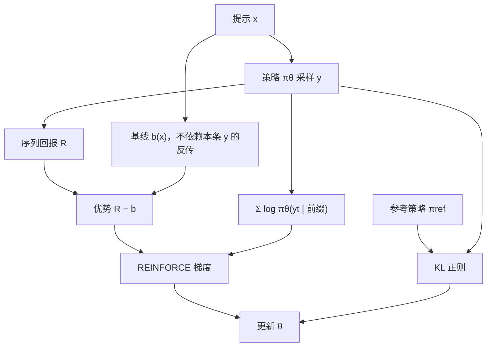

# REINFORCE / R3

用即时强化去乘对数策略梯度，不必学习值函数；减去一个不依赖当前动作的基线，可以降方差而不引入偏置。

<footer>—— Williams, Simple Statistical Gradient-Following Algorithms for Connectionist Reinforcement Learning, Machine Learning 1992</footer>

语言模型的强化学习一度被写成「必须上 PPO、必须训一个同规模 Critic」。Williams 在 1992 年给出的 REINFORCE 更朴素：从当前策略采样一整条轨迹，用这条轨迹的回报去乘每个动作的对数概率梯度。没有时序差分，没有 GAE，也没有第二套网络。DeepSeek-R1 一类工作把可验证奖励和[不依赖 Critic 的优势](/llm/critic-free-advantage)重新推到前台之后，这条 1992 年的估计器又成了默认内核。本篇把 REINFORCE 写成语言模型上的蒙特卡洛策略梯度；标题里的 R3 指工程上常绑在一起的三件套——**回报（Return）、REINFORCE 梯度、与参考策略的正则**——不是另一篇需要虚构编号的论文。

## 问题

把一次生成看成马尔可夫决策过程：状态是提示加已写出的前缀，动作是下一个 token，策略是因果语言模型 $\pi_\theta(y_t\mid x,y_{<t})$。奖励几乎总在序列结束时才出现——答案对错、格式是否合法、或者偏好模型打的一个标量。中间 token 没有逐步环境反馈。PPO 用 Critic 去自举「前缀还值多少」，在长思维链上要学的是一个与策略同样深的值函数，显存和滞后都会变成一等成本。

REINFORCE 的问题设定更窄：既然奖励是序列级的，就用蒙特卡洛回报当信用，把整段 $\log\pi_\theta(y\mid x)$ 乘上同一个 $(R-b)$。代价是方差大：同一道题，有的样本 $R=1$、有的 $R=0$，梯度噪声直接打进所有 token。要解决的不是「策略梯度能不能用」，而是「在没有 Critic 的前提下，如何让这条估计器在几百 token 的思维链上还能更新」。

### 语言模型是回合制、奖励稀疏的策略

与游戏里每步有即时分不同，数学、代码、格式约束通常只在 EOS 处给一个数。折扣 $\gamma=1$、中间 $r_t=0$ 时，每一步的回报都等于终端 $R$。于是 token 级优势退化成同一个标量，广播到整段。这不是实现偷懒，而是稀疏奖励下蒙特卡洛估计的定义。谁先写对、谁在中途走错，REINFORCE 本身不分辨——那是[过程奖励](/llm/prm-guided-search)或逐步验证要补的结构。

不要把 REINFORCE 写成「比 PPO 更旧所以更差」。PPO 的裁剪与 GAE 是为了稳定 *有 Critic* 的更新；当你已经决定不训 Critic、奖励又是可验证的 0/1，Williams 估计器才是与数据生成过程同构的那一条，PPO 的价值头反而可能是多余的偏置源。

## 方法

对提示 $x$ 从 $\pi_\theta$ 采样 $y$，得到标量回报 $R(x,y)$（规则、奖励模型或二者之和）。Williams 的无偏估计是

$$
\nabla_\theta J(\theta)
\;\approx\;
\bigl(R(x,y)-b(x)\bigr)\,
\nabla_\theta \log\pi_\theta(y\mid x),
$$

其中

$$
\log\pi_\theta(y\mid x)=\sum_{t=1}^{|y|}\log\pi_\theta(y_t\mid x,y_{<t}).
$$

$b(x)$ 可以是 0、提示上的移动平均、贪心解码的回报（ReMax 一类），或同提示上其他样本的函数（[群体相对](/llm/group-relative-baseline)、留一法）。只要 $b$ 不依赖当前这条 $y$ 里正在反传的那些 token，估计仍无偏，方差通常下降。

### R3：回报、梯度、正则三条绑在一起

工程路径很少只留纯 $\mathbb{E}[R\nabla\log\pi]$。常见三件套是：

1. **Return**：序列级 $R$，可验证任务上常是 0/1 再加格式分。
2. **REINFORCE**：用 $(R-b)$ 缩放整段对数概率，或对每个 token 乘同一优势再按长度平均。
3. **Regularizer**：对参考策略 $\pi_{\mathrm{ref}}$ 加 KL，或在重要性比率上裁剪，防止更新把分布拉崩。

本篇把这三件套叫 R3。它不是新的定理：KL 项来自 RLHF 实践（Ouyang 等 InstructGPT，2022），裁剪来自 Schulman 等的 PPO（2017），梯度本体仍是 Williams。实现上可以没有价值网络、没有 GAE $\lambda$，但几乎总会留下参考模型或冻结的 SFT 锚。少了第三条，高奖励样本会把低频 token 的概率打到数值不稳定的区域；少了基线，批次里全对或全错时梯度要么爆炸要么为零。

## 机制

无偏性来自策略梯度定理：在期望意义下，$\mathbb{E}_{y\sim\pi}[(R-b)\nabla\log\pi(y)]$ 等于 $\nabla\mathbb{E}[R]$，只要 $b$ 对当前动作可视为常数。方差来自 $R$ 本身的波动，以及 $\nabla\log\pi$ 在长序列上的范数——思维链一长，对数概率是许多项的和，同等优势会被长度放大。所以实现必须先约定损失是「token 平均」还是「序列和」：前者让长短答案的有效步长更接近，后者会偏向更长的轨迹。R1 类训练里长度上升，部分正是因为更长的搜索提高了组内相对回报；这是目标在定价「思考时间」，不是优化器偷偷改了架构。

与 Actor-Critic 的差别在信用分配的分辨率。Critic 可以给每个前缀不同的 $V(s_t)$，使后半段的错误少牵连已经正确的前缀。REINFORCE 把同一标量打到每一个 token 上：对的前缀和错的后缀一起被加强或一起被抑制。[群体相对基线](/llm/group-relative-baseline)只降低 *提示之间* 的尺度差异，不恢复 *序列内部* 的时间结构。若任务真的需要逐步对错，应把过程分写成显式奖励，而不是指望纯 REINFORCE 自己学会逐步信用。

对「停用 token」或填充位置必须把损失掩掉。否则 padding 的对数概率也会乘上优势，模型会学到用无意义长度去凑奖励。长度惩罚应写进 $R$，不要靠没掩码的 pad 当隐式正则。

## 边界与工程取舍

### 可验证奖励之外，纯蒙特卡洛会很吵

开放式写作、多目标偏好、奖励模型本身在漂移时，单条 $R$ 的噪声大于 0/1 数学题。这时 PPO 的 Critic 或离线偏好方法可能更稳，不是因为 REINFORCE「过时」，而是因为基线估不准。组大小为 1 且 $b=0$ 时，R3 退化成带 KL 的原始 REINFORCE，简单题会过拟合到少数提示，难题梯度稀疏。参考策略必须与采样策略同源：用过期的 SFT 当 $\pi_{\mathrm{ref}}$ 而在线策略已经走远，KL 会变成恒定的拖曳，看起来像「不收敛」。

不要把温度、top-$p$ 写进训练目标却在采样时关掉。REINFORCE 的期望是对 *实际采样分布* 取的；推理用贪心、训练用 $T=1.0$，优化的是另一个策略。评测若截断 `max_tokens`，终端奖励统计的是截断分布，梯度与产品行为脱节。R3 省的是 Critic 显存，不省采样：每步更新仍要若干完整 rollout，墙钟往往被 decode 带宽限制，见[Decode 的显存墙](/llm/decode-memory-wall)。

引用停留在 Williams 1992 年的期刊论文、InstructGPT 的 KL 约束实践，以及 DeepSeekMath / R1 报告里对策略梯度族的采用。不要给「R3」编造 arXiv；它在本系列里是工程配方名，不是一篇独立论文。

## 小结

- REINFORCE 用蒙特卡洛回报乘 $\nabla\log\pi$，不必学习值函数；基线只要不依赖当前动作，降方差且保持无偏。
- 语言模型把整段生成当一条轨迹，稀疏终端奖励使优势在 token 上广播为同一标量。
- R3 指回报、REINFORCE 梯度、参考 KL/裁剪三件套，不是新的理论对象。
- 损失按 token 平均还是按序列求和，会改变长度激励；填充必须掩码。
- 组内基线与过程奖励解决的是不同问题：前者稳尺度，后者才有逐步信用。
- 采样分布必须与梯度假设一致；截断生成等于在评测另一条策略。
- 出处：Williams, *Simple Statistical Gradient-Following Algorithms for Connectionist Reinforcement Learning*, Machine Learning, 1992；Ouyang et al., *InstructGPT*, 2022；Shao et al., *DeepSeekMath*, 2024。
