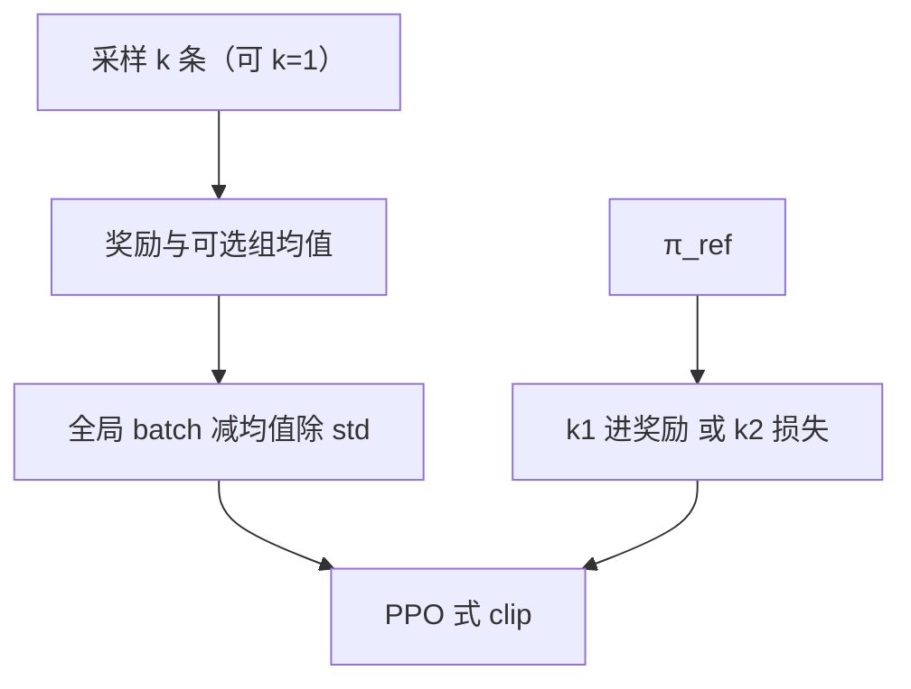

# REINFORCE++

    
提示级标准化用同一题的几个样本估均值和标准差，估计有偏且易过拟合；改成全局 batch 标准化，critic-free 的优势才能随 batch 变大而接近无偏。

    <footer>—— Hu、Liu、Xu、Shen，REINFORCE++: Stabilizing Critic-Free Policy Optimization with Global Advantage Normalization，arXiv:2501.03262</footer>

[RLOO](/llm/rloo)、[ReMax](/llm/remax)、[GRPO](/llm/grpo) 都去掉 PPO 的 critic，却几乎都在**同一提示的局部组**里构造基线。Hu 等人把这条局部标准化写成有偏估计：中心化奖励与组内 std 不独立，$k=4$ 时 std 还可能接近 0 把优势打爆。**REINFORCE++** 的核心是 **Global Advantage Normalization**：在整个训练 batch 上减均值、除标准差。实现挂在 OpenRLHF。本篇写两个变体各自的主场，不把 GRPO 公式再推一遍。

## 问题

PPO 的价值头在 LLM 上贵。Critic-free 方法用同题多样本估 $A$，代价是 $k$ 很小。局部 $(r-\mathrm{mean})/\mathrm{std}$ 有三处伤。理论上，分子分母相关，估计有偏（论文附录 A）。实践上，一组奖励碰巧接近，std→0，优势爆炸。目标上，策略被奖励「赢过本题其它样本」，容易在简单题上刷相对名次，对全局高回报与 OOD 无帮助。

通用 RLHF 还面对另一约束：提示要多样。若每题 $k=4$，同样的生成预算下题数变成 1/4，指令覆盖变窄。作者因此需要一种 **$k=1$ 也合法**的算法——局部组方法在 $k=1$ 时直接未定义。PPO 把这个问题交给价值网络：任意提示都能得到 $V(s)$。Critic-free 路线一旦离开「同题多样本」，就必须另找一个随 batch 稳定的尺度。全局标准化是把 critic 的「跨状态可比」近似成「跨当前 batch 可比」，用大 $N$ 换掉第二套权重。

### 两个变体不要混名

REINFORCE++（可 $k\ge 1$）：把 KL 惩罚进逐步奖励（k1 风格），再对 $A$ 做全局标准化，走 PPO 式 clip。主打通用偏好、要提示多样性时取 $k=1$。REINFORCE++ **w/ Baseline**（$k\gt 1$）：先减**组均值**做尺度重整，再除**全局 std**（不用组内 std），KL 用单独的 $k_2$ 损失 $\frac12(\log\pi_\theta/\pi_{\mathrm{ref}})^2$。主打复杂推理 / agent。后者才是「有组采样的 ++」，不要把 GRPO 的局部 std 安到这个名字上。

GRPO 常用 Schulman 的 $k_3$ KL 无偏正估计。++ w/ Baseline 改 $k_2$ 当损失，梯度对反向 KL 更稳。这是实现差分，与全局标准化独立。

## 方法

**全局标准化。** 对 batch $\mathcal{D}$ 内所有优势

$$
A^{\mathrm{norm}}=\frac{A-\mathrm{mean}(A\mid\mathcal{D})}{\mathrm{std}(A\mid\mathcal{D})+\varepsilon}.
$$

$|\mathcal{D}|$ 到 1024 量级时，均值与标准差近似常数，偏差随 $N$ 消失。然后最大化与 PPO 相同的 clip 代理。

**$k=1$ 的 $A$。** 终点奖励减从 $t$ 起的 KL 和：

$$
A_{q,o_t}=r(o,q)-\beta\sum_{i=t}^{T}\mathrm{KL}(i),\quad
\mathrm{KL}(t)=\log\frac{\pi_{\mathrm{old}}(o_t\mid\cdot)}{\pi_{\mathrm{ref}}(o_t\mid\cdot)}.
$$

**w/ Baseline。** $A'=R-\mathrm{mean}_{\mathrm{group}}(R)$，再对 $A'$ 做全局标准化。组均值对付 0/1 与 $[-1,1]$ 混量纲；全局 std 提供稳定尺度。形式上等价于：无 critic、GAE 的 $\lambda=\gamma=1$、基线换成该两步标准化的 PPO。

通用 RLHF 实验：Llama-3-8B-SFT，BT 奖励模型约 70 万偏好对，2 万提示。Chat-Arena-Hard 上 ++（$k=1$）得分 46.7，与 GRPO（$k=4$）的 46.8 持平，长度更短（832 vs 860）。训练中 GRPO 的 KL 飙得快，像在黑奖励模型；++ 的 KL 更稳。小数据过拟合实验：局部标准化在 AIME 训练集上满分、测试集崩，全局标准化仍能泛化。复杂 agent 设定下 w/ Baseline 优于 GRPO 与 PPO（以原文表为准）。代码：https://github.com/OpenRLHF/OpenRLHF 。

## 机制

全局标准差来自成百上千条轨迹，几乎不会因某一题的四个样本撞车而归零，这直接关掉 GRPO 的除零式爆炸。减全局均值让简单题的稳分不再天然占满正优势：一道题必须相对**本 batch 的其它题**也好，才得到大正 $A$。代价是跨题可比性假设——batch 若全是同一难度切片，全局基线接近组基线。

$k=1$ 能工作，是因为基线不再依赖同题同伴，而依赖同时训的其它提示。这与 [群体相对](/llm/group-relative-baseline) 的哲学相反：后者坚持对照必须在同提示内。++ 认为局部对照在 RLHF 里造成过拟合；在竞赛数学里，w/ Baseline 仍保留组均值，只是把「除 std」上交全局，折中两条路。训练动态上，局部 z-score 会让策略很快抬高奖励模型分，同时 KL 陡增——典型的长度与套话黑客。全局标准化把「相对同题同伴更好」改成「相对本步所有轨迹更好」，奖励曲线涨得慢，但每单位 KL 换到的分更高。小训练集上的 AIME 切分把这一点变成可引用的过拟合实验：组内标准化可以在训练题上饱和，测试年分崩；全局标准化不能靠「赢过另外三条」背题。

Logic-RL 等后续工作在谜题上采用 REINFORCE++，说明规则奖励域也可以用全局标准化，不限于 BT 奖励模型。算法不绑定奖励来源。

### 与 Dr. GRPO 的除 std 之争

[Dr. GRPO](/llm/dr-grpo) 认为题级 std 造成难度偏差，主张**不要除**。[DAPO](/llm/dapo) 仍除组内 std。++ 同意局部 std 有害，但用**全局** std 换稳定性，而不是删掉标准化。三者对「要不要 z-score」的答案分别是：题内要、不要、batch 内要。实现时必须写明除的是哪一组统计量。

## 边界与工程取舍

全局标准化假设 batch 足够大且混合良好。极小 batch 退化成带噪的局部方法。$k=1$ 在可验证数学上缺少同题负例，探索可能不够，作者才提供 w/ Baseline。PPO clip 仍在，熵崩溃、超长截断等问题 DAPO 处理的，++ 原文不当成主贡献。

论文版本从「对 prompt 与 RM 稳健」改到「全局优势标准化」，引用时钉 arXiv:2501.03262 的版本。OpenRLHF 默认超参与论文表格可能不一致，复现看配置而不是库名。早期版本强调对奖励模型与提示截断的稳健，后期版本把理论重量放在局部估计的偏差证明上；读二次文献时不要把 v1 摘要与 v9 的两个变体表混成一次实验。

$k=1$ 的 ++ 生成条数等于提示数，墙钟通常优于 $k=4$ 的 GRPO；这是预算叙事，不是定理上方差更小。可验证域里同题对照往往更值。

### 何时不必用 ++

已经在用 GAE critic 且价值头稳，PPO 仍是默认。MoE 长链崩塌的主因是 token 级 IS，应看 [GSPO](/llm/gspo)。只要开源 R1 配方对齐，社区更多实现 GRPO/DAPO，++ 的生态样本更少。

## 小结

- REINFORCE++ 用全局 batch 标准化优势，替代 GRPO/RLOO 的提示级 std。
- 主变体允许 $k=1$，适合通用 RLHF；w/ Baseline 先减组均值再除全局 std，适合复杂推理。
- Llama-3-8B 上 $k=1$ 与 GRPO $k=4$ 的 Arena-Hard 接近，KL 更稳、更不易过拟合简单题。
- 与 Dr. GRPO「去掉 std」、DAPO「保留组内 std」构成三条标准化轴。
- 出处：Hu 等，*REINFORCE++*，arXiv:2501.03262；OpenRLHF。
