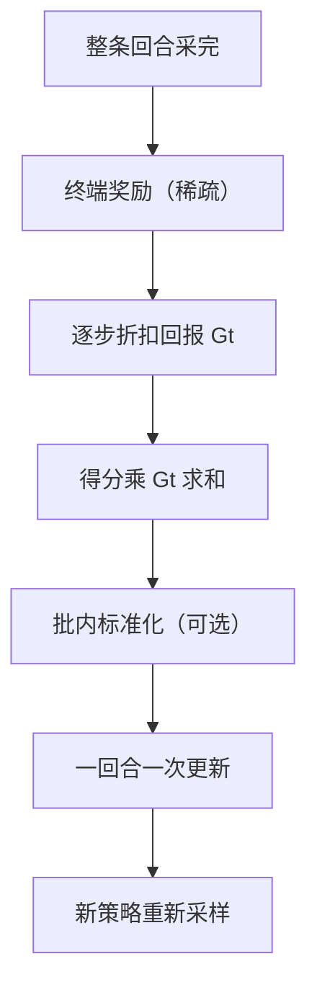
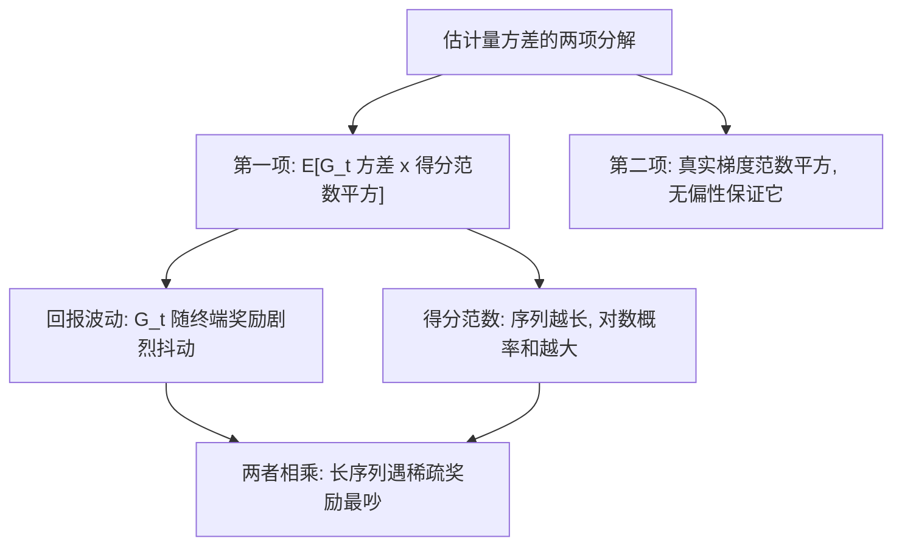

# REINFORCE 与方差

REINFORCE 便宜、无偏、不需要任何模型点头；代价是用整条轨迹的命运，为一小步参数更新作证。

<footer>—— 据 Williams, 1992；Sutton &amp; Barto, Reinforcement Learning, 2018 §13.3 整理</footer>

[上一课](/llm/policy-gradient-theorem)把 $\nabla_\theta J$ 写成得分函数乘回报的期望，并说明转移核为何整段消失。定理只保证无偏，没保证好用：把期望换成一次采样，估计量的方差可能大到把方向淹没。本课写这条定理的最直接实现 REINFORCE——整条回合采完、按回报加权更新一次；方差从哪里来（长回合、回报尺度、信用分配），以及不引入新估计量时能做哪些经验减缩。成体系的减法——基线与优势——留给下一课。

## 问题

REINFORCE 的更新是：采一整条回合，对每步算 $g_t=G_t\,\nabla_\theta\log\pi_\theta(a_t\mid s_t)$，求和更新一次。无偏，但方差有三处来源。其一，$G_t$ 是从 $t$ 到回合末的随机和：回合越长，求和的项数越多，波动越大；语言模型的思维链几百个 token 共享一个终端奖励，等于用一次抛硬币监督几百个决策。其二，回报尺度直接进梯度：奖励从 $\{0,1\}$ 换成 $\{0,100\}$，等效学习率放大百倍，调好的步长随之作废。其三，信用分配：一个标量乘整段对数概率，对的前缀和错的后缀一起被赏罚，梯度里混进与「该步好坏」无关的噪声。

「用一次抛硬币监督几百个决策」可以算得更具体：思维链 500 token、终端奖励 0/1。一次更新里这 500 步的梯度全被同一个 0 或 1 乘——奖励 1 时全体受赏（含中途写错的部分），0 时全体受罚（含推对的部分）。「每一步各自该得几分」的信息完全没进来。

不这么做会错在哪：只看平均回报不看梯度方差去调学习率与批大小，会得到「有时收敛有时发散」且换一天就复现不了的结果——噪声才是这条方法的主参数。

## 方法

经验减缩有四件先做。批内标准化：对一批 rollout 的回报减均值、除标准差后再加权——这是下一课基线思想的批量预演，零成本。Token 平均还是 token 求和要钉死：求和时同样的优势被长序列放大，训练会向长答案漂移。多样本平均：同一 $\theta$ 下采 $N$ 条轨迹取均值，标准差降 $\sqrt{N}$ 倍，成本线性涨。最后是梯度裁剪：把梯度范数截到上限以下。工程止血，但它改的是估计量本身——有偏，报告里应当承认。

$\sqrt{N}$ 这个规律值得记牢：标准差要降 10 倍，样本得采 100 条；降 100 倍就要 10000 条。堆样本压方差贵得离谱——这就是为什么这条路线迟早要走到基线与优势函数：靠结构省方差，而不是靠流量。

二值奖励、成功率 0.2 时，64 条 rollout 里期望只有约 13 条带正信号；若整批全 0 且权重就是 $G_t$ 本身，梯度恰为零——不是学稳了，而是这批没有信号。全对批则反向：一切样本都被推高，方差全靠参考正则去收。

## 机制

把方差写成两项看得更清楚：$\mathrm{Var}[\hat g]=\mathbb{E}[G_t^2\lVert\nabla_\theta\log\pi_\theta(a_t\mid s_t)\rVert^2]-\lVert\nabla_\theta J\rVert^2$。无偏性只照顾第二项（估计对准期望），第一项——回报波动与得分范数的耦合——原封不动。得分范数随序列长度增长：对数概率是几百项的和，同等回报下长序列的梯度天然更吵。这也解释了为什么 REINFORCE 每回合只更新一次：回合没结束 $G_t$ 未定义，蒙特卡洛把「无偏」换成了「必须等剧终」，而长回合与稀疏终端奖励把这笔交换变得昂贵。

常见误区：把「无偏」当成「可信」。无偏只承诺平均而言方向对，不保证单次更新可用——方差大到一定程度，单次梯度与真实方向可能几乎不相关。所以工程上宁可接受梯度裁剪带来的小偏差，也要先让训练曲线跑得起来。

## 边界

无偏性依赖数据来自当前策略：复用旧轨迹要重要性加权，而比率方差随回合长度爆炸，[截断重要性采样](/llm/truncated-importance-sampling)是那条线上的工程答案。梯度裁剪、早停这类操作都让估计有偏，收益是能跑通；「理论纯度」在这里不是美德，但要记账。评估时应报告梯度范数与回报分布，不只报平均分。基线能把上面第一项压下来多少、代价是什么，是下一课的主题。

## 小结

- REINFORCE = 策略梯度定理的蒙特卡洛实现：回合更新、按回报加权得分。
- 方差三源：回合长度、回报尺度、单标量信用分配；得分范数随序列长度增长。
- 经验减缩：批内标准化、token 平均约定、多样本平均、梯度裁剪（有偏）。
- 全零批次权重为零时学习静默停摆，监控要看得见这件事。
- 复用旧数据必须处理重要性比率，其方差随回合长度爆炸。
- 出处：Williams, 1992；Sutton &amp; Barto, 2018，§13.3。
