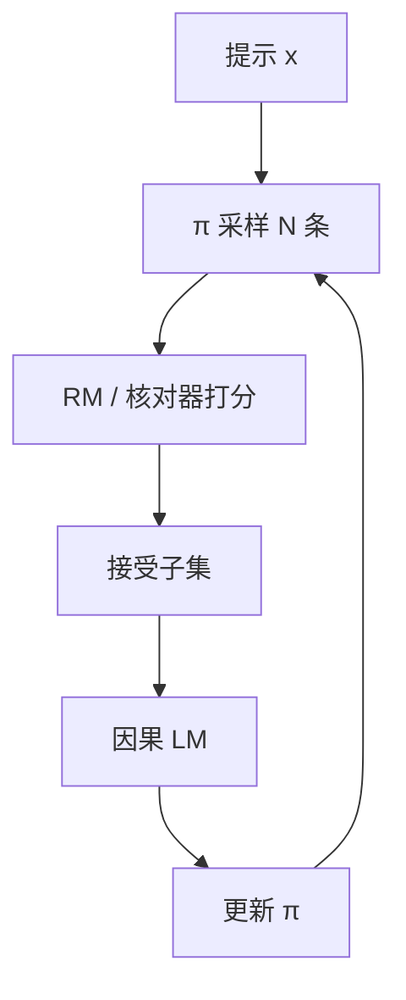

# Reject Sampling / RFT

先按现行策略多写几条，再用奖励或核对器留下合格的，最后把留下的当示范做监督学习。没有策略梯度，也没有价值函数。

<footer>—— 接到 Ouyang 等人的最优选作答；Llama 2 与 DeepSeek-R1 中的拒绝采样阶段</footer>

拒绝采样微调（常写作 RFT：Rejection sampling Fine-Tuning）把强化学习缩成「采样—筛选—SFT」三步。策略（或 SFT 模型）对每个提示生成 $N$ 条完成，奖励模型、规则核对器或人工留下通过的子集，学生（通常就是同一策略）在子集上做因果 LM。Ouyang 等人用最优选（best-of-$N$）作答作为与 PPO 对照的推理时基线；训练里把胜方写回数据集，就是同一思想的离线版。Llama 2 的对话对齐写明使用拒绝采样；DeepSeek-R1 在多阶段里用拒绝采样再 SFT，把 RL 轨迹里可读、可核验的样本冻成示范。它与 [序列蒸馏](/llm/sequence-distill) 共用「完整序列当标签」，筛选器从教师换成了奖励。

## 问题

PPO 要在线生成、四模型常驻、调 KL 与 critic。许多团队已经有可用的 RM 或可验证奖励，却负担不起稳定的 actor-critic。他们需要一种把「高分样本」变成参数更新的办法，且更新规则必须是普通 SFT——优化器、并行、检查点都复用指令微调栈。

拒绝采样回答的是：若我能从 $\pi$ 里抽出 RM 更高或核对通过的 $y$，最大似然这些 $y$ 能否把 $\pi$ 推向高奖励区。能，但只沿着「已经采到的支撑集」推，不会主动去探索 RM 的未知漏洞以外的新句式——探索完全来自采样温度与 $N$。$N=1$ 且不过滤，退化为普通 SFT；$N$ 很大而 RM 有偏，退化为高效的奖励黑客模仿。

### 与推理时 Best-of-N 不是同一层

推理时 Best-of-N：部署仍用旧权重，每次请求采 $N$ 条再拣一条，算力花在服务延迟上。RFT：拣选发生在训练期，部署仍是一条 decode。Ouyang 把 Best-of-N 当作评估 RLHF 收益的参照；那是测试时计算。RFT 把参照写进权重，测试时可以 $N=1$。不要把论文里的 Best-of-N 曲线直接写成「我们做了 RFT」。

筛选器可以是 RM、编译器、数学等式、或「格式标签是否齐全」。可验证域应优先规则，少用 RM，以免把讨好句式写进示范。R1 的拒绝采样阶段服务的是可读性与正确轨迹的冻结，不是再训一个 critic。

## 方法

对提示集 $\mathcal{D}$，现行策略 $\pi$ 采 $\{y_i\}_{i=1}^N$，得分 $s(x,y_i)$。接受规则可以是：取 argmax、取高于阈值、取通过核对的全部、或按分加权。接受集上

$$
\mathcal{L}_{\mathrm{RFT}} = -\mathbb{E}_{(x,y)\sim \mathrm{Accept}(\pi,s)}[\log\pi_\theta(y\mid x)]
$$

$\pi_\theta$ 可从 $\pi$ 初始化。一轮之后 $\pi$ 变了，应再采样再筛，否则数据相对新策略离线过期——与 [离线蒸馏](/llm/online-offline-distill) 同一时间表。多轮 RFT 是「离线 RL」的极简版：没有重要性加权，把过期完全交给周期性刷新。

$N$ 与温度决定候选覆盖。温度过低，N 条近重复，筛选没有信息；过高，通过率塌掉，接受集太小，过拟合几条幸运轨迹。应按接受率而不是按 $N$ 的名义值去调。同一 $x$ 若零通过，应丢弃或改提示，不要把失败样本当负 SFT——那是另一种目标，需要显式的负对数或对比损失，不是拒绝采样的定义。

### 和 PPO 的梯度差在哪

PPO 对未接受的样本也给梯度：负优势降低其概率。RFT 对未接受样本的梯度为零——它们根本不进 batch。于是「明显更差」的完成不会被主动压低，只是相对地越来越少被采样到。若差样本与好样本共享大量前缀，只学好样本也可能抬高差样本的前缀概率。这是最大似然筛选数据的固有缝，要用多样化的负例协议或真正的偏好对才能补，那已经离开 RFT。

## 机制

在奖励把序列排成全序、且 $\pi$ 对高分区仍有覆盖时，反复「采—筛—SFT」近似一种硬 EM：E 步用现行策略提出候选，M 步把质量高的当成标签。没有价值函数，基线是「没被选中就不出现」。方差表现为：小接受集上的过拟合、以及筛选器噪声被当成确定性标签。

与教师序列蒸馏的差别是标签来源。蒸馏的 $y$ 来自更强教师，筛选可选；RFT 的 $y$ 来自自己（或同族策略），筛选是必须的，否则就是在自己的随机噪声上 SFT，会强化平均水平而不是上尾。实践中两者常拼接：教师或 RL 策略写出长链，核对通过后当 RFT / 蒸馏语料，学生只做 SFT。DeepSeek-R1 蒸馏段不再 RL，本质是高质量拒绝样本上的序列模仿。

接受规则一变，整份数据的定义就变。必须把 $N$、温度、阈值、核对脚本的版本写进数据集名。只记「RFT 一轮」无法复现。

## 边界与工程取舍

### 它不能替代探索性 RL

RFT 不会为了抬奖励去发明 SFT 没写过的推理模式——除非采样偶然打出，并被筛选器留下。R1-Zero 那种「长链自己长出来」依赖策略梯度对可验证奖励的探索，不是拒绝采样能替代的。已有较强 SFT、只需把上尾质量写进权重、并想避开 critic 时，RFT 很合适。从基座空转探索时，应走 GRPO / PPO 一类在线 RL。

RM 当筛选器时，黑客会被高效写入示范，比 PPO 还干净：因为 SFT 会把黑客句式当标准答案记住，KL 锚也没有第三阶段那种逐步惩罚（除非你在 SFT 里另加）。可验证奖励上 RFT 干净得多，仍要防「答案对、过程胡编」的假推理，与 [链蒸馏](/llm/cot-distill) 同一风险。

Llama 2 同时使用拒绝采样与 PPO，说明二者可作流水线相邻阶段，而不是论文竞赛里的互斥宗教。顺序通常是：SFT →（可选 RFT）→ 在线 RL →（可选再 RFT 冻可读样本）。

## 小结

- RFT 用现行策略多样本，经 RM 或核对器接受后做 SFT，无 critic、无策略梯度。
- 未接受样本不产生负梯度；探索只来自采样与轮次刷新。
- 推理时 Best-of-N 花的是延迟；RFT 把拣选写进权重。
- 适合榨上尾、避开 PPO 稳定性；不适合从零涌现长链推理。
- 出处：Ouyang et al., NeurIPS 2022（Best-of-N 对照与偏好数据）；拒绝采样出现在 Llama 2 与 DeepSeek-R1 的后训练描述中。
