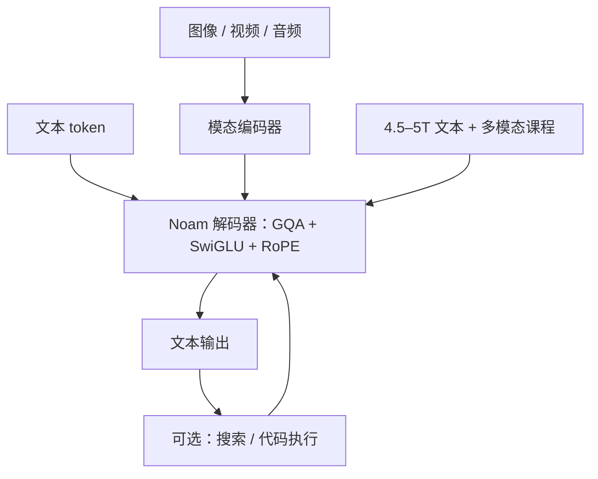

# Reka 模型卡

    
Reka 从零训练 Core、Flash、Edge 三档原生多模态模型，处理文本、图像、视频与音频输入；Flash 与 Edge 在各自算力档上对标更大的稠密模型，Core 则逼近当时的前沿闭源。

    <footer>—— Reka Team，Reka Core, Flash, and Edge，arXiv:2404.12387</footer>

2024 年 4 月，Reka 发表模型卡式技术报告：不是「在 Llama 上接视觉适配器」，而是**从零训**的编码器—解码器家族。公开写清的尺寸是 **Edge 7B、Flash 21B**；**Core 的参数量故意留空**（表中为「仍在训练、还在变强」），不得用传言填一个 70B 或 100B。本篇按 arXiv:2404.12387 写架构零件、数据配比、上下文与评测口径，把 Core 当「未披露宽度的旗舰 API」而不是假开源权重。

## 问题

2023–2024 的多模态主流是：冻一棵语言骨架，再训投影层吃图像。这条路省算力，但音频、视频与语言的早期融合浅，且许可绑定在底座上。Reka 要验证的是：一家算力远小于 Google / OpenAI 的团队，用大约数千张加速器，能否从零做出三档都原生吃四种模态、且 Flash 能在价格—质量图上落在 Pareto 前沿附近。第二个问题是披露粒度：评测表很全，结构表对 Core 缺最关键的一列——宽度。读者必须习惯「有 MMLU、无参数量」这种模型卡。

### 稠密三档，不是 MoE 故事

报告写明当时版本是**稠密**模型。Edge 约 **4.5T** 文本 token，Flash 约 **5T**，知识截止 **2023 年 11 月**。常规上下文 8k；Flash 与 Core 的长上下文档到 **128k**，针检索在支持长度上通过，并称 128k 模型似乎能外推到 256k、但再长不行。Edge 的长上下文表上是 64k。把 Core 写成 MoE 或把 7B 写成「蒸馏自 Core」，报告没有提供这种句子。

Flash / Edge 词表为约 100k 的 SentencePiece，基于 tiktoken（GPT-4 一类）。另有 span 掩码哨兵与工具相关特殊符。Core 的词表是否完全相同，报告未单独列表，公开信息有限。

## 方法

骨架被称作接近 PaLM 的 「Noam」配方：[SwiGLU](/llm/swiglu)、[GQA](/llm/gqa)、RoPE、[RMSNorm](/llm/rmsnorm)，**没有** PaLM 的并行注意力—FFN 层。整体是模块化编码器—解码器：图像、视频、音频进编码器，语言解码器出文本；文本输出可以触发网页搜索、代码执行等函数调用再喂回。输出模态当时只有文本，没有原生出图。预训练走多阶段课程，混合分布、上下文长度与目标会变。训练精度 bfloat16，框架 PyTorch，峰值算力约 **2500 张 H100 + 2500 张 A100**，集群来自多家供应商；Flash 与 Edge 在「数百张 H100、数周」量级上训成。节点故障率按供应商差异很大，报告把硬件彩票写成方法的一部分。

### 数据配比是少数写清的超参

文本侧大约 25% 代码相关、30% STEM、25% 网页抓取、约 10% 与数学有关；约 15% **显式**多语（32 种分层加权），另加 110 语种维基作底。多语分档：P1 含德、中、日、法、韩、西、意、阿、印地等；P2 与更多长尾列在表 3。多模态数据是图像、视频、文档与网页的大规模集合，混合「按质量与多样性手调」，没有开源副本。长上下文除真实指令外，用自家族模型对预训练长文档做 **reverse instruction tuning**（由文档反写指令）来造 SFT。

评测上，Core v0.5 在 MMMU / VQAv2 称接近 GPT-4V；多模态聊天盲测优于 Claude 3 Opus 的偏好位次（报告口径）；视频 Perception-Test 上 Flash 与 Core 超过 Gemini Ultra。文本 MMLU Core 报 83.2。这些是 **2024 年 4 月快照** 对当时对照模型的表，不能平移到 2025 年的 GPT-4o / Gemini 2.5。Flash 21B 被用来对标 Grok-1、Gemini Pro 1.0、Mistral Medium 等更大或更贵的系统，叙事是「算力档超常发挥」。

表 2 注明 Core 尚未训完。把 v0.5 的分数当成 Reka 永久旗舰，会被后续 API 静默更新打脸。对比必须写版本。

## 机制

原生多模态的机制是早期把连续信号送进同一套解码器条件，而不是推理时把 CLIP 描述当英文前缀。代价是必须从零训编码器与对齐，数据与稳定性都更贵。GQA 降低 KV，使 128k 服务有斜率；RoPE 与长上下文课程负责相位，报告没有公开基数 $\theta$。128k 能外推到 256k 的针测试，只说明 passkey 几何还在，不保证 256k 综合问答。

Reverse instruction tuning 的机制是：长文档已经在预训练里，用强模型写「问什么能用这段文档答」，再 SFT，使长上下文不仅是「能取回一句」，还有问—答格式。这与 Llama 3.1 的长窗口 SFT 同类，数据不可复现。工具调用写在图 2，细节「超出本报告范围」——JSON schema 与成功率公开信息有限。

### Core 作为裁判

报告用 Core 对回答打 1–100 分，发现点式打分与第三方盲测 ELO 排序接近，用来在送人类评测前做内部门禁。机制上这是用旗舰当廉价裁判，循环风险是家族风格自洽：Flash 与 Core 同源，裁判可能偏爱自家腔。作者承认与成对 Arena 仍有差别。

## 边界与工程取舍

Core 参数量、层数、头数、训练 token **公开信息有限**。不得把 21B 的数据配比外推成 Core 的配比。权重以 API（chat.reka.ai）为主，不是 Llama 式可下载旗舰。对照表里的 Claude 3 / GPT-4-0613 已过时；复现应重跑，而不是引用 2024-04 的「第二偏好」。医疗子集上 Core 与专科模型互有胜负，不能当医疗器械。

工程上，7B Edge 才是本地档；21B 已是工作站。多供应商集群与 Ceph I/O 是他们的训练现实，不是推荐架构。输出仅文本，不能把 Reka 当原生 TTS / 生图模型。后续 Flash / Core 的产品改名与价目以官网为准。训练损失曲线在报告里只给 Core 一张图，用来说明「激进学习率下仍少尖峰」；没有公开 token 级吞吐或 MFU，不能把它读成可复现的集群手册。多语 15% 显式加权解决的是切得动与有表示，解决不了低资源语种的事实覆盖——维基 110 语只是底噪。

真实编号：arXiv:2404.12387，2024-04-18。展示页 showcase.reka.ai 是定性例子，不是可引用基准。Grok-1 在表里作为「更大稀疏模型」对照，结构见 [Grok-1](/llm/grok-1)，不要反过来说 Reka 是 MoE。

## 小结

- Reka Edge 7B / Flash 21B / Core（尺寸未披露）从零训的稠密多模态编码器—解码器：SwiGLU、GQA、RoPE、RMSNorm，输入含音视频，输出为文本。
- Flash / Edge 约 5T / 4.5T 文本 token；长上下文 Flash/Core 128k，Edge 64k；知识截止 2023-11。
- Core 参数量公开信息有限；评测是 2024-04 对当时闭源模型的快照。
- 出处：Reka Team，*Reka Core, Flash, and Edge: A Series of Powerful Multimodal Language Models*，arXiv:2404.12387。
