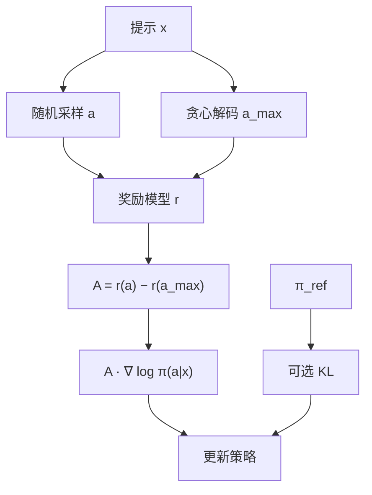

# ReMax

    
RLHF 的转移是确定的、奖励打在整段上、前向又足够快；不必再训一份价值模型，用贪心解码的回报当基线，就能把 REINFORCE 的方差压下来。

    <footer>—— Li 等，ReMax: A Simple, Effective, and Efficient Reinforcement Learning Method for Aligning Large Language Models，ICML 2024</footer>

InstructGPT 以来，语言模型的强化学习段几乎默认写成 [PPO](/llm/schulman-ppo)：策略、参考、奖励模型、再加上与策略同规模的 critic。Li、Xu、Zhang 等人指出，PPO 是为一般 MDP 设计的，而 RLHF 有三条 PPO 用不上的性质：模拟（一次前向）很快、token 转移确定、奖励只在轨迹终点出现。他们据此把算法收回到 [REINFORCE](/llm/reinforce-llm)，再用贪心（argmax）回复的奖励做减性基线，称为 ReMax。本篇按 ICML 2024 原文（arXiv:2310.10505）写问题、估计器与实验边界；无 critic 优势的通式见 [优势估计不依赖 Critic](/llm/critic-free-advantage)。

## 问题

PPO 在连续控制里要对付随机转移、逐步奖励和高方差回报，价值网络与 GAE、裁剪、多 epoch 都有理由。搬到 LLM 之后，这些配件变成显存税：7B 上作者测算，价值模型连同激活、梯度与优化器状态大约占 GPU 显存的 46%，奖励模型本身只占约 4%。超参也多：GAE 的 $\lambda$、价值损失系数、clip、采样温度与价值头学习率要一起扫。Zheng 等人当时已经写过「PPO 在 RLHF 里很难调」；作者的立场更硬——不是调不好，而是任务结构不需要它。

他们把 RLHF 看成上下文老虎机：提示 $x$ 固定，整段回复 $a_{1:T}$ 是一个动作，奖励 $r(x,a_{1:T})$ 由冻结的奖励模型给出。没有环境随机性，方差只来自策略自己的采样。朴素 REINFORCE 的梯度是 $r\nabla\log\pi$，无偏，但 $r$ 跨提示尺度差极大：原文在 Llama-2-7B 的一个 mini-batch 里看到奖励从 $-14.25$ 到 $7.25$，训完一个 epoch 仍从 $-8$ 到 $7$。简单题的高分会淹没难题上的微弱正例，梯度范数跟着爆。需要一种**按提示自适应**、又不另训网络的基线。

### 三条 RLHF 性质 PPO 没有用

**快速模拟**：给提示就能采样完整回复，不必与物理引擎交互。**确定转移**：下一个状态就是把 token 拼上去，没有转移噪声。**轨迹级奖励**：中间 token 没有真实 $r_t$，GAE 是在拟合人为拆开的过程。这三条合在一起，Williams 1992 的 REINFORCE with baseline 比带 critic 的近端策略更贴任务。DPO 走另一条路，离线、无奖励模型在线查询；ReMax 保留在线 RM，只去掉价值头。

ReMax 的「Max」来自贪心解码的 argmax，不是最大熵。基线 $b(x)$ 是当前策略贪心回复的奖励，随 $\theta$ 和 $x$ 变，但不依赖正在反传的那条随机样本，故估计仍无偏。把它写成「PPO 去掉 critic」会漏掉：原文连 clip 与 GAE 都不用。

## 方法

对每个提示 $x$，从当前 $\pi_\theta$ 采一条随机回复 $a_{1:T}$，再以温度 0 解出贪心回复 $a_{1:T}^{\mathrm{greedy}}$。两条都送进奖励模型。梯度为

$$
\widehat{\nabla}\propto\bigl(r(x,a_{1:T})-r(x,a_{1:T}^{\mathrm{greedy}})\bigr)\nabla_\theta\log\pi_\theta(a_{1:T}\mid x).
$$

随机条优于贪心则强化，劣于贪心则压低。KL 正则仍相对参考策略，写法与常见 RLHF 一致，不经过 critic。作者强调实现大约六行：采样、贪心采样、两次打分、相减、乘对数梯度。去掉的超参包括 GAE $\lambda$、价值损失权重、价值学习率、以及若干与 critic 同步的 clip。

实验主设定：full-hh-rlhf（Bai 等，112k 训练 / 12.5k 评测）按 InstructGPT 比例切成 SFT、RM、RL 三份；基座含 Llama-2-7B 与后续的 Mistral-7B。硬件叙述是 $4\times$ A800-80GB、bf16，ReMax 可在不 offload 的情况下训 7B，PPO 则要靠显存节省技巧。他们报告 7B 上大约省 46% GPU 显存，墙钟也短一截。Mistral-7B + ReMax 在 AlpacaEval 对 text-davinci-003 的胜率写到 94.78%，MT-bench 7.739，作为当时开源 7B 的一条排行榜声明。HH 上相对 SFT / PPO / DPO 的 GPT-4 胜率以原文图 7 为准。

### 与 PPO、REINFORCE、DPO 并排

相对裸 REINFORCE：同一套前向次数多一次贪心解码与一次 RM 查询，换来按提示归一。相对 PPO：没有价值头的前向、反向与优化器状态，也没有 GAE；近端约束若还要，得另加 KL 或自己 clip，原文主算法不加 PPO 式比率裁剪。相对 DPO：DPO 的隐含基线是 $\log\pi_{\mathrm{ref}}$，适应提示、不适应训练过程中奖励尺度的漂移；ReMax 的贪心基线跟着当前 $\pi_\theta$ 走。这不是「谁取代谁」：没有在线 RM 时 DPO 更省；有 RM、且显存被 critic 卡住时，ReMax 是原文推荐的锤子。

## 机制

### 贪心基线为什么能降方差

无偏基线只需与当前样本独立。贪心回复由同一 $\theta$ 确定生成，不依赖随机条的 token，满足条件。直观上它估计的是「当前策略的众数回报」：随机条相对众数的优势，尺度被钉在这道题此刻的策略水平上。跨提示的绝对奖励差被消掉一块，这正是作者观察到的 $-14$ 到 $+7$ 那种病。理论部分在二臂老虎机上证明：当最优臂尚未占优时，该基线降低方差；过优化之后方差界仍有限，不影响他们给出的收敛叙述。作者把「过优化区方差未必更小」写成可接受甚至有益——RLHF 本就不该把 RM 吃到饱和。

贪心条必须 stop-gradient。若把贪心路径的对数概率也反传，基线不再独立，无偏性坏掉。实现上两条计算图要切开：随机条走策略梯度，贪心条只提供标量 $b(x)$。

### 方差来自策略内部，不是环境

原文花了篇幅区分「MDP 转移噪声」与「策略采样噪声」。MuJoCo 里两者都有；LLM 里只有后者。因此「REINFORCE 在经典 RL 里方差大」不能直接翻译成「LLM 上也不能用」。小模型时代 Ranzato、Li 等人已经在字幕与对话上用过 REINFORCE；卡住大模型的是奖励尺度跨提示变化，不是转移随机性。ReMax 针对的就是这一条。

## 边界与工程取舍

贪心解码对开放生成并不总是「典型好回答」：温度 0 常更短、更套话，RM 可能系统性地给它偏低或偏高分，优势会被拧歪。数学可验证任务上，贪心与采样的对错结构不同，组内多条样本的 [RLOO](/llm/rloo-paper) / [GRPO](/llm/grpo-paper) 往往更贴「同题对照」。ReMax 每提示额外一条贪心生成，decode 墙钟不是零；省的是 critic 显存，不是总 token。AlpacaEval 94.78% 绑定当时的裁判、对手模型与 Mistral-7B 检查点，不是可移植的绝对能力。

原文没有过程奖励、没有逐步优势。若步骤对错才是信号，应看 [VinePPO](/llm/vineppo) 或过程监督，而不是把贪心基线硬拆到 token 上。DPO 对照实验说明的是「有在线 RM 时简单策略梯度够用」，并不否证离线偏好学习。

「省 46% 显存」是 7B、他们那套并行与是否 offload 的数字。把这句话抄到 70B 或 MoE 上没有依据。价值头占比随实现（是否与策略共享骨干、是否 ZeRO）会变。

### 何时不必上 ReMax

已经在用组采样且 $k\ge 2$，留一或组标准化通常比单条对贪心更稳，不必再插一条温度 0。没有奖励模型、只有成对偏好，用 DPO 家族。开放域 RM 噪声很大、贪心条经常被黑成极端分时，基线本身会成为攻击面。需要逐步信用分配时，ReMax 的整段优势不够。

## 小结

- ReMax 是带贪心回报基线的 REINFORCE，专打 RLHF 的确定转移与轨迹级奖励，不训 critic。
- 优势为随机回复奖励减贪心回复奖励；估计无偏，尺度按提示自适应。
- 原文报告 7B 上大约省 46% GPU 显存，并去掉 PPO 的一批超参。
- Mistral-7B 的 AlpacaEval / MT-bench 数字是当时开源 7B 排行榜声明，须带裁判协议。
- 与 RLOO/GRPO 同属无 critic；差别是基线取贪心一条，而不是同组多样本。
- 出处：Li, Xu, Zhang, Lin, Yu, Sun, Luo，*ReMax: A Simple, Effective, and Efficient Reinforcement Learning Method for Aligning Large Language Models*，ICML 2024，arXiv:2310.10505。
