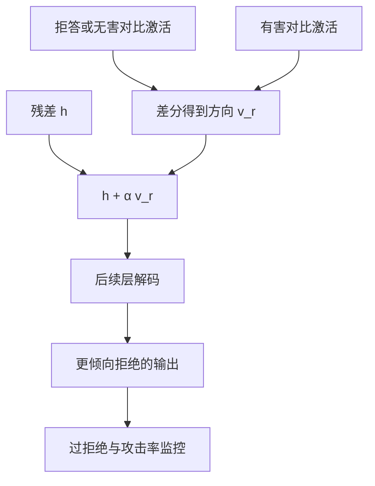

# 表示工程抑制有害行为

从对比激活里读出与拒答或有害性相关的方向，再在推理时把该方向加到残差上，行为会沿这一线性控制移动——包括移向更稳的拒绝。

<footer>—— Zou et al., Representation Engineering: A Top-Down Approach to AI Transparency, 2023</footer>

表示工程（Representation Engineering, RepE）主张：许多高层概念在残差流里近似线性可分，可以用对比输入提取阅读向量，再以激活加法做控制。用于安全时，目标是**抑制有害续写、增强拒答**，而不是演示如何关掉对齐。本篇只写读取、控制、与 Circuit Breaker 的差别、以及防御评测；不提供用于降低拒答的向量配方，不提供对比提示对的可复制清单。

## 问题

要调节模型行为，默认手段是改权重：SFT、[DPO](/llm/dpo)、RL。周期长，且每次改动都可能伤有用性。若拒答在表示里已经有一个可读写的方向 $v_r$，则推理期做

$$
h \leftarrow h + \alpha v_r
$$

就能在不改权重的情况下滑动拒绝强度。Zou 等人展示了多种概念（真实性、有害性、拒答相关）的读写。安全工程关心的问题是：这个旋钮是否够稳，能否在对抗输入下仍然指向拒绝，以及会不会把无害请求一并拒掉。

线性假设会失败的地方也必须写进问题：概念纠缠、层选择错误、对比集污染（「有害」对比里混进了「只是技术细节」），都会让 $v_r$ 变成「提到某些话题就拒」的关键词方向。

### 读向量不是因果证明

从「有害提示的均值激活减去无害提示的均值激活」得到的差，是相关方向，不一定是因果电路。加法干预能改变行为，说明该方向**足够**驱动输出，仍可能有平行路径。因此 RepE 是控制与探测工具，不是安全认证。评测要以行为为准：干预后标准化攻击是否下降、无害任务是否保持。

同一套方法也可以提取「降低拒答」的向量。公开讨论若只写如何提取、不写使用约束，会被直接反向使用。本篇把符号固定为增强拒绝，并在部署上要求 $\alpha$ 的符号与范围由服务端锁定。

## 方法

对比集：同一模板下的允许请求与不允许请求，或配合回答与拒绝回答，在选定层、选定 token 位置（常取最后提示 token 或助手开场位置）取激活，平均后做差，再归一化，得到 $v$。推理时对指定层的残差广播加法，或只加在若干 token 位置。$\alpha$ 由验证集网格搜索：攻击成功率下降与过拒绝上升的帕累托点。可对多层使用同一 $v$ 或分层的 $v$，层数越多控制越强、损伤越大。

与 LoRA 式 Circuit Breaker 的集成：可以用 RepE 先定位有效层与方向，再把「沿 $v$ 的投影清掉或反向」写成训练目标，见[电路断开](/llm/circuit-breaker)。只做推理期加法的优点是可随时关掉、可按租户调 $\alpha$；缺点是调用方若能控制推理代码就可以把 $\alpha$ 设成 0 或反向。故在不可信运行环境里，RepE 加法不能当唯一防线。

### 位置与解码的耦合

加在提示末 token，影响的是开场分布，类似把模型推入拒答吸引域，与[prefilling](/llm/prefill-jailbreak) 方向相反。只加在开场、后续 decode 不加，控制可能随生成消退，模型先拒后泄。应对每个新 token 的残差都加，或把方向写进权重。评测必须标明干预的时间范围：仅 prompt、全程、还是仅前 $k$ 个生成步。

## 机制

线性表示假说：概念 $c$ 对应方向 $v_c$，激活在 $v_c$ 上的投影预测模型是否「处于 $c$」。拒答与有害性可能是两个相近但不同的方向：增强拒答不等于消除有害知识。投影大时，后续层把它读成「应当输出拒答话术」的特征，logits 上拒答词上升。对抗输入若把表示推到与 $v_r$ 正交的另一有害方向，加法就失效——这是许多越狱仍然成功的几何原因，也是需要 Circuit Breaker 把整块区域改道、而不是只加一条向量的原因。

读取本身可当检测器：投影超过阈值则触发更强的 $\alpha$ 或触发[Llama Guard](/llm/llama-guard)。检测与控制共用同一方向时，攻击者优化输入降低投影，会同时骗过检测与控制，故检测宜用异构信号（字符串分类器 + 表示）。

$\alpha$ 过大时，无害请求的激活也被推过拒答阈值，表现为万能拒绝。网格搜索必须包含无害集，不能只在红队集上调到成功率最低。

### 防御评测

对照：无干预；$+\alpha v_r$；故意的 $-\alpha$（仅在隔离环境用于敏感性分析，不作为产品配置）；随机方向对照（排除「任何向量都能改变行为」）。指标：HarmBench 类攻击成功率、过拒绝、通用能力、以及 GCG 在固定预算下是否仍能把投影压回去。若白盒优化能找到与 $v_r$ 对抗的后缀，说明线性控制不够，需要改道训练或输出门。对 [many-shot](/llm/many-shot-jailbreak)，应在长上下文下重估 $v_r$：任务向量可能旋转方向。多语言分别提 $v_r$，不要假设英文方向平移到其它语言。

## 边界与工程取舍

RepE 依赖能跑内部激活的部署：闭源 API 通常不给残差钩子，于是这条防线只存在于自托管。自托管里，钩子也扩大了攻击面（恶意插件改 $\alpha$）。产品应把干预配置放在不可被请求参数覆盖的层。线性方向对风格敏感：诗歌、代码、低资源语言上，$v_r$ 可能失效或过拒。应分域校验。

与分类器相比，RepE 不解释政策条款，只滑动已经存在的行为轴；政策细节仍要靠 [宪法分类器](/llm/constitutional-classifiers) 或 Llama Guard。与 Circuit Breaker 相比，RepE 更快做实验、更弱做默认防御。合理顺序是：用 RepE 探测方向与层 → 把有效干预固化为电路断开或适配器 → 外挂异构分类器。本篇不给出对比集原文，避免被用来构造反向向量。

论文里漂亮的线性可分图，往往来自精心构造的对比集。生产流量的激活云更乱。上线前用真实无害流量看投影分布，再定阈值，不要只用实验室对比集的间隙。

## 小结

- 表示工程从对比激活读取方向，用残差加法增强拒答、抑制有害续写。
- 它是推理期控制与探测，不是因果认证，也不是唯一防线。
- $\alpha$ 的符号必须由服务端锁定；不可信运行环境里加法可被关掉或反向。
- 干预的层与时间范围要写进评测；仅开场加法可能先拒后泄。
- 与 Circuit Breaker 互补：先探测，再把改道写进权重；外挂分类器补政策细节。
- 必须同时扫攻击成功率与过拒绝；随机方向与反向 $\alpha$ 做对照。
- 出处：Zou et al., *Representation Engineering: A Top-Down Approach to AI Transparency*, 2023。
