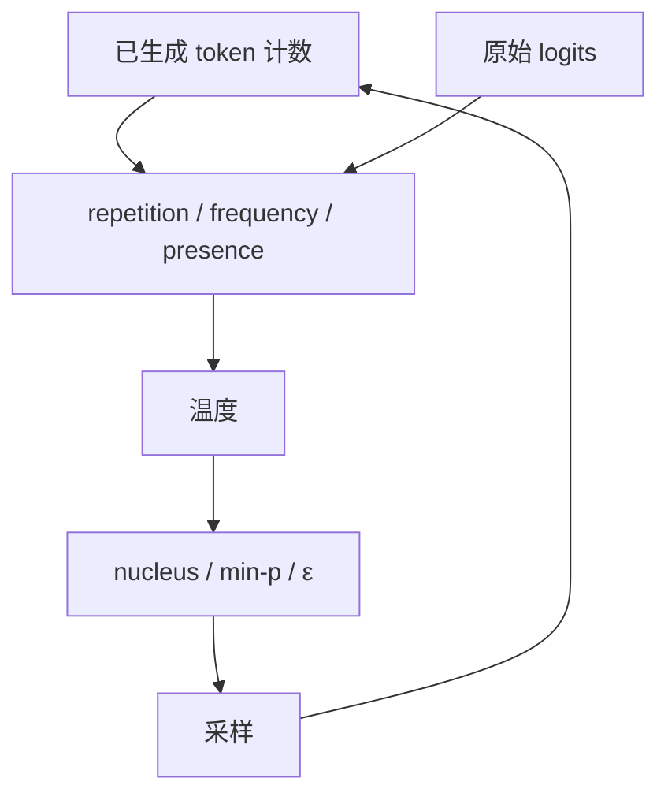

# Repetition / frequency penalty

    
把已经出现过的 token 的 logits 按重复惩罚缩小，可以压住短循环；它改的是逐步打分，不是在序列级减去「重复次数」这一项损失。

    <footer>—— Keskar et al., CTRL: A Conditional Transformer Language Model for Controllable Generation, 2019</footer>

Holtzman 等人指出，极大似然解码容易把文本锁进重复圈：一旦某短语成为高概率续写，条件分布会继续强化它。截断采样（nucleus、min-$p$）从支撑上砍长尾，对「圈内 token 仍然合法且概率很高」帮助有限。CTRL 引入的 repetition penalty 以及后来 API 里的 frequency / presence penalty，是另一条路：看已经写出的上下文，把出现过的 token 从本步 logits 里压下去。它们不改变训练，只在解码器里改分。效果来得快，副作用是话题漂移、拒绝合法重提，以及与截断、温度的次序纠缠。

## 问题

自回归没有显式的「禁止最近 $n$ 个 token」项。重复可以是立刻的（`的的的`）、短循环的（`是的是的是的`）、或篇章级的（同一论点换同义词再说一遍）。模型在这些续写上的条件概率往往很高，因为局部连贯、训练语料里也有修辞反复。Nucleus 留下的核里，循环 token 常常仍在头部。束搜索更糟：累计对数概率会奖励能稳定续写的圈。

若在训练里加覆盖惩罚或对比目标，成本高，且与下游任务纠缠。推理期惩罚的吸引力是：零训练、逐步可调、能立刻打断圈。代价是惩罚对象是 *token 身份*，不是 *重复这一语言现象*。功能词、协议要求的闭合括号、代码里必须再次出现的标识符，都会被同一规则误伤。中文与 BPE 还会把「重复」切碎：表面重复的词可能对应不同子词，子词重复却未必是字面重复。

### 出现过、出现次数、与「像不像上文」

Presence 只问是否出现过：见过一次与见过二十次同等减分。Frequency 按计数线性（或按实现约定）加码，圈越转越痛。CTRL 的 repetition penalty 是乘法，作用在 logits 上且对正负分要分开处理，避免把已经为负的 logit 除以大于 $1$ 的因子后变成更接近零——那会反向鼓励重复。三者都不看隐状态相似度；看表示是否塌缩的是 [Contrastive Search](/llm/contrastive-search)。把余弦惩罚与频率惩罚当成同一旋钮，调参时会对不上论文曲线。

OpenAI 兼容接口里的 `frequency_penalty` / `presence_penalty` 加在 logits 上，通常再进温度与 nucleus。CTRL 论文的 $\theta$ 是相除。不要把「惩罚 $1.2$」在两种公式之间互换。

## 方法

CTRL 的规则针对已生成集合 $G$。对词表中每个 token $i$，设原始 logit 为 $\ell_i$，惩罚 $\theta\ge 1$。若 $i\in G$，则

$$
\ell_i' =
\begin{cases}
\ell_i / \theta & \ell_i > 0,\\
\ell_i \cdot \theta & \ell_i \le 0.
\end{cases}
$$

未出现的 token 保持 $\ell_i$。正 logit 被缩小，负 logit 被拉得更负，重复项无论在 softmax 前的哪一侧都被抑制。$\theta=1$ 关闭惩罚。常见取值在 $1.05$–$1.3$；过大时模型开始回避任何复现的内容词，叙述会跳题。

Presence / frequency 是加法族。设 $c_i$ 为截至当前的出现次数，$p,f$ 为两个标量，

$$
\ell_i' = \ell_i - p\cdot \mathbf{1}_{c_i>0} - f\cdot c_i.
$$

$p$ 打击「再用一次已经用过的词」，$f$ 打击高频词。许多实现还把窗口限制在最近 $W$ 个 token，避免开篇专有名词在全文里永远减分。计数是 token 级还是解码后的字符串级，要写进协议：前者实现简单，后者更接近用户看到的「重复了这句话」。

### 与截断采样的叠放顺序

惩罚改 logit，截断看的是改完之后的分布。先惩罚再 nucleus，核里已经少了重复项，采样不太容易回到圈里；先 nucleus 再惩罚，可能把质量已经集中在少数重复 token 上，惩罚后再归一化会把剩下的核扭曲得更厉害，甚至只剩功能词。Min-$p$ 的 $p_{\max}$ 若在惩罚之后计算，门槛会随「被压下去的冠军」一起下降，等于自动给非重复项放行，这往往是想要的。投机解码必须在草稿与目标上用同一套惩罚与同一段已接受前缀计数，否则接受比比较的不是同一个条件分布。

## 机制

重复圈能自我维持，是因为条件分布在局部 $n$ 元上峰值极高，采样或贪心都会再选同一个续写。乘法或加法惩罚把这个峰值从本步打分里挖掉，迫使质量流向尚未用过的 token。它不修复表示塌缩：若隐状态已经几乎不变，下一层仍会提出相似的头部，惩罚只是在头部里改排序。因此长循环有时会变成近义循环——字面 token 不再重复，语义仍在原地打转。Contrastive Search 用隐状态相似度直接打这项，频率惩罚做不到。

功能词与标点的出现次数天然高。Frequency 会对 `的`、`,`、`the` 持续加码，句子被逼得越来越短、越来越不像人话。Presence 对开篇出现的主题词同样不友好：一篇讲「注意力」的文章会越来越不敢再写这两个字。窗口化、只惩罚非停用词、或只惩罚重复的 *短语* 而不是单 token，都是在承认 **token 计数是重复的粗糙代理**。代码与 JSON 里标识符必须复现，全局频率惩罚会把合法程序变成改名竞赛；这类任务应关惩罚，改用语法约束。

长度归一化与重复惩罚解决的不是同一偏置。前者补偿「更长序列对数和更负」；后者补偿「局部条件分布爱循环」。束搜索里可以两项都加，但目标函数已经不是 $\log\pi$，不要再声称 MAP。

### 中文与子词把「重复」切碎

BPE 下「重复重复」可能是两个相同 token，也可能是 `重`+`复` 的两次。只按 token 计数会漏掉跨 token 的字面重复，也会把必须成对出现的子词当成重复。解码后再做字符串级 $n$ 元惩罚更接近阅读感受，但流式输出时要缓存足够的尾巴才能判定，且与 [stop sequences](/llm/stop-sequences) 一样存在「部分匹配还不能提交」的问题。服务实现若只在 `input_ids` 上做 `unique`，应在文档里写明，避免产品与评测各打各的。

## 边界与工程取舍

惩罚不是多样性算法。它减少已见 token 的再采用率，不增加未见表征的覆盖；温度与截断仍然决定能从多宽的核里跳出去。安全过滤应放在最终字符串：惩罚可能把拒绝套话打散成新的违规说法，也可能把必须重复的安全声明压掉。翻译与摘要需要对齐源文中的反复用词，默认开频率惩罚会系统性漏译。

CTRL 的 $\theta$ 对正负 logit 分支，是为了 softmax 前的符号；若先把 logits 减最大值再惩罚，符号会变，必须在原始 logit 上做。加法惩罚与很大的 $f$ 可以把整行打成很大的负数，随后 softmax 由数值最大的「不太负」的项主导，表现为突然插入罕见词。这不是创意，是分布被推到训练流形之外。

不要用重复惩罚去替代 [Mirostat](/llm/mirostat) 或 typical 采样。前者控的是逐步惊奇度，后者控的是信息量是否靠近熵；重复是序列统计。评测退化时同时报重复 $n$ 元率与主题一致性，只报不重复会选出跳题的赢家。

出处以 Keskar et al., *CTRL*, 2019 的 repetition penalty 为主；frequency/presence 是随后服务 API 的加法变体，以各厂商文档为准，不要回溯成 CTRL 公式。

## 小结

- 重复惩罚在解码期改已出现 token 的 logits，打断短循环，不改变训练分布。
- CTRL 用按符号分支的乘法 $\theta$；API 常用 presence（是否出现）与 frequency（出现次数）的加法项。
- 惩罚对象是 token 计数，不是语义重复；功能词、代码标识符、主题词会被误伤。
- 与温度、nucleus、min-$p$ 的次序会改变核的形状，必须写入采样协议。
- 隐状态塌缩导致的近义反复，需要对比搜索一类表示级惩罚，仅靠频率不够。
- 子词与流式输出会让「重复」的定义在 token 级与字符串级之间漂移。
- 出处：Keskar et al., *CTRL: A Conditional Transformer Language Model for Controllable Generation*, 2019。退化现象的对照见 Holtzman et al., ICLR 2020。
