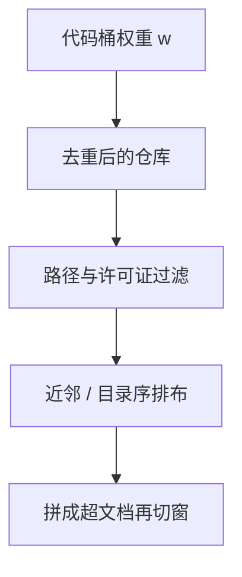

# 仓库级代码排布

源文件不是独立网页：import、测试与配置隔着路径互相指认。把仓库打散按文件随机洗牌，模型就学不到一次改动该同时看见的那些邻居。

<footer>—— 据 Li 等 StarCoder、Rozière 等 Code Llama 对仓库级上下文的处理整理</footer>

[上一课](/llm/multilingual-alpha-sampling)用 $p^\alpha$ 给自然语言语种加权重。代码的「语种」是 Python 与 Java，但依赖图活在仓库里，不活在语言识别标签里。本课不重讲 α。缺口是：代码桶内部如何排布，才能让同一仓库的文件在上下文中共同出现，而不是被全局 shuffle 拆成互不认识的碎片。后课 FIM 改训练目标；本课先改数据的空间邻近。

## 问题

网页可以近似 i.i.d. 文档。Git 仓库不行：`foo.py` 的符号在 `test_foo.py` 与 `utils.py` 里被引用。按文件随机采样，窗口里几乎看不到定义与调用同屏。StarCoder 一类语料强调 The Stack 的仓库结构；Code Llama、DeepSeek-Coder 的报告里也把仓库级上下文当成代码能力的来源之一。配比里写「15% 代码」若只是把文件当网页喂，fertility 还在，依赖却没了。

去重也要改单位。文件级 MinHash 会删掉大量合法的相似工具函数；仓库级去重（近重复项目、fork）才能去掉模板生成的整库拷贝，而不误杀同组织下的近邻文件。这与 [网页去重](/llm/web-clean-dedup) 同族，分辨率不同。

### 许可证与生成文件

仓库级采样会把 `LICENSE`、`node_modules`、锁文件、小数据样例一并带进窗口。必须在仓库内再过滤路径，否则 α 式「多喂代码」喂的是许可证全文。生成代码（protobuf、前端 build）会主导频率，污染词表与模型。

同一仓库超长时不能整库塞进上下文。排布的目标是提高「相关文件同批出现」的概率，不是承诺无限仓库注意力。

## 方法

以仓库为抽样原子：先按仓库加权（星标、语言、去重后体积），再在仓库内按拓扑或启发式排文件——依赖图近邻、同目录、测试与实现成对、README 与源文件相邻。把排好的文件拼接成超文档，再按上下文窗口切段，段与段之间尽量不把一对定义/引用切开。无法建图时，退化为「同仓库文件连续打包，目录字典序」，仍优于全局文件洗牌。

与领域 $w$ 的接口：代码桶的 token 份额由配比决定；桶内概率质量按仓库分配，而不是按文件均匀。小仓库过采样会让玩具项目占满，应设体积下限与上限。StarCoder 对许可证与近重复仓库的过滤，应发生在加权之前。

### 与词表的关系

仓库级文本会改变标识符共现，但不改变已经冻结的切分。若词表几乎没见过该语言的 API，FIM 与仓库排布只能让模型在碎片上拼名字。词表语料里要有代码分层，本课不再重训 $V$。

多语言仓库（文档英语、代码俄语注释）不要拆成两个 α 桶再拼回来，否则 README 与源文件永远不同屏。

## 机制

语言模型的条件分布在窗口内是全连接的。把互相指认的文件放进同一窗口，等于把依赖边变成注意力可以打分的位置对；洗牌则把这些边赶到跨窗口，只能靠参数记忆，而参数记不住每个仓库。这是数据布局对架构的补偿，不是新的注意力公式。

## 边界

排布不提供填空式的双向条件——那是 FIM。也不解决超长单文件；长文档上采样课会处理「要不要更频繁地见到长序列」。仓库级还放大隐私与密钥泄漏面，扫描应在打包前做完。下一课在已经邻近的代码序列上改目标：故意挖中间，让模型学会在左右上下文之间填。

## 小结

- 本课不重讲语种 α；代码桶的原子是仓库不是文件。
- 同库近邻打包，让定义与引用进入同一窗口。
- 去重、许可证、生成目录在加权前处理。
- 排布补偿的是数据布局，不是无限上下文。
- 出处：Li et al., StarCoder, 2023；Rozière et al., Code Llama, 2023；Kocetkov et al., The Stack。
