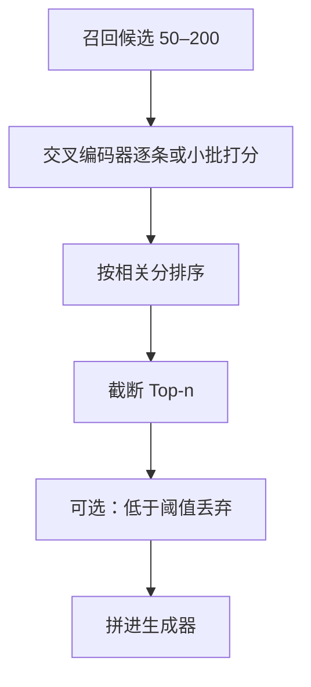

# 重排序

    
先用便宜的双塔从海量块里召回，再用查询与文档交叉编码的模型把前几十条排准；精度在第二段买，召回在第一段买。

    <footer>—— 对照经典两段式 IR；交叉编码器重排见 Nogueira 与 Cho 将 BERT 用于段落重排的路线</footer>

向量近邻和 BM25 都是 *独立编码*：查询编码一次，文档编码一次，分数是两个向量的比较。这才能对百万级块做 ANN 或倒排。独立编码看不到「查询词在文档里如何对齐、否定词是否把意思翻过来」，Top-k 里会混进主题相近、答案不对的块。重排序在第一段检索之后，用更贵的模型对少量候选（查询，文档）联合打分，输出新的排列，再截给生成器。Nogueira 与 Cho 把 BERT 当点式重排器，后续有对式、列表式以及专用 reranker 检查点。本篇写两段式为什么必要、打分形式、以及延迟预算如何决定 $k$。它接在 [混合检索](/llm/hybrid-retrieval) 之后，不替代切分。

## 问题

双编码器的上界是「块向量是否靠近查询向量」。否定（「不含乳糖」）、比较（「A 与 B 的差异」）、约束（「2023 年之后的条款」）常常要求词级交互。把这类交互做进召回意味着文档不能离线编码，百万级库不可行。于是 IR 长期用两段：召回保命中，重排保前排精度。RAG 把前排块喂给 LLM，生成器对第一位特别敏感——错误块放在提示开头，会主导抄写。只加大召回 $k$ 而不重排，等于让生成器自己当重排器，又贵又不稳。

重排器也会失败：候选里根本没有真值，再排也是乱序；或对风格相似的官方口吻打分过高，把不含答案的「概述」排到前面。所以重排不能弥补召回缺口，只改变 *已召回集合* 的排列。评测必须同时看召回@k（重排前）与 nDCG / 答案命中在重排后的 Top-$n$。

### 双塔召回与交叉编码器

双塔（双编码器）把查询和文档分开过 Transformer，cls 或池化向量做点积。交叉编码器把 `[CLS] query [SEP] doc` 拼起来，用整段自注意力做交互，输出一个标量相关分。代价是每个（查询，候选）一次前向，无法离线。典型配置：召回 50–200 块，重排后取 3–10 块进 LLM。ColBERT 一类延迟交互介于两者之间：离线存 token 向量，在线做细粒度匹配，比全交叉便宜、比双塔准，工程复杂度更高。

生成器用的 LLM 不是免费的交叉编码器。它能读块，但提示位置偏差、[中间丢失](/llm/long-context-vs-rag) 和抄写惯性会让它「重排」得很差。专门训在相关分上的小交叉编码器，往往比把 50 块塞进大模型更稳、更便宜。

## 方法

点式：每个候选独立打分，按分排序。实现简单，适合校准成概率后做阈值（低于阈值的块不送进生成器）。对式：模型看（查询，正例，负例）或比较两个文档，训练目标更贴近排序，推理若要完整排列则次数变多。列表式：一次看查询与一组文档，能建模文档间相对位置，推理批形状更别扭。生产 RAG 里点式交叉编码器最常见：延迟可预期，每条候选一次前向，可批量化。

训练数据应来自标注相关或强蒸馏（大模型当教师打分），而不是只用「BM25 第一名当正例」——那会让重排器学会模仿第一段的偏见。难负例（双塔排得高但不含答案）比随机负例更有用。领域切换要微调：通用网页 reranker 在内部工单、代码库上会把「像文档的散文」打高、把「像补丁的片段」打低。

### 点式、对式、列表式

点式分数便于设「没有足够证据则拒答」的阈值，这对 RAG 比单纯排序更重要——乱序里的第一名仍可能全错。对式更擅长区分两个都还行的块，但要把 $m$ 个候选排好，朴素比较是二次次前向。列表式吃显存，候选数一大就要再截断，等于重排前还有一次重排。工程上常点式打分 + 稳定排序，用验证集选 $n$ 与阈值。不要把 LLM 生成的「请按相关性排序」当列表式重排的替代评测，除非你把它当成单独系统并报延迟。

与生成器拼接顺序：按重排分降序。有人把最相关块放在两端以缓解中间丢失，这是对长上下文位置偏差的补丁，应在验证集上测，不要当默认物理定律。引用片段应使用重排后的 ID，避免日志里写召回第一、模型实际读的是重排第三。

## 机制

交叉注意力让查询 token 直接看见文档 token，否定词、数字约束、是否包含答案跨度可以被同一层利用。这就是为什么 Top-10 精度通常明显升、而召回@200 几乎不变。延迟近似为 $m$ 次编码器前向（可批），$m$ 是重排窗口。$m$ 从 20 加到 200，精度先升后饱和，费用线性涨。饱和点取决于召回质量：第一段已经很准时，重排增益小；第一段靠混合检索堆出的杂列表，重排增益大。

分数校准影响阈值。不同查询的绝对分不可比时，不要用全局阈值砍块，改用「至少留 1 块、最多留 $n$ 块、分差小于 $\delta$ 则多留」之类相对规则。重排器与嵌入模型应版本绑定：换切分或换双塔后，难负例分布变了，旧 reranker 可能把新召回的真值打低。

重排不是生成。相关分高的块仍可能过时或与另一块矛盾。生成器提示里应允许「多篇冲突时说明冲突」，不要假设排序第一即真值。时间过滤属于召回元数据，不要指望 reranker 从散文里读出「已废止」。

### 延迟预算与截断 k

预算应倒推：用户可接受的检索阶段毫秒数，减去 BM25 与 ANN，剩余给交叉编码器，再除以单条前向时间，得到 $m$ 的上限。超出则减小 $m$ 或换更小 reranker，而不是默默把重排做成同步阻塞的大模型调用。异步预取、对 Top 召回先返粗结果再回流重排，会改变产品语义（答案可能跳动），要显式设计。批内不同查询的 $m$ 相同更利于 GPU；可变 $m$ 更省，但调度复杂。

## 边界与工程取舍

没有真值的候选集上，重排可能把错误块排得更「自信」，生成器更爱抄错。此时阈值拒答比硬送三条更安全。多跳 RAG 每跳都重排会叠加延迟，可只在最后一跳重排，或只对即将送进生成器的集合重排。不要对同一块的重叠切分分别重排却不去重，否则前三名是同一节的三次重复。

引用 Nogueira & Cho 的 BERT 重排路线、后续 monoBERT / 商用 rerank API 的文档；不要把某一家云 API 的分数当作论文指标。ColBERT、SPLADE 可作为召回升级，与「双塔 + 交叉」两段式是不同点，评测时分开。

把 LLM 当 reranker（listwise 提示）与用小交叉编码器，是两种系统。前者延迟和费用接近又一次生成，适合离线标注或小流量；线上热路径默认小模型点式重排。

## 小结

- 两段式：独立编码召回保覆盖，交叉编码重排保前排精度。
- 重排不能创造召回里不存在的真值，评测要同时报重排前后。
- 点式便于阈值拒答；对式、列表式更贴近排序但推理成本更高。
- $m$ 由延迟预算倒推，增益会饱和。
- 分数与切分、双塔版本绑定；冲突块和高分过时块仍要在生成侧处理。
- 不要让大模型默默承担重排，除非延迟与评测已按该系统算。
- 出处：Nogueira & Cho, Passage Re-ranking with BERT；两段式 IR 的经典分工；候选来自双塔 / BM25 / 混合检索。
