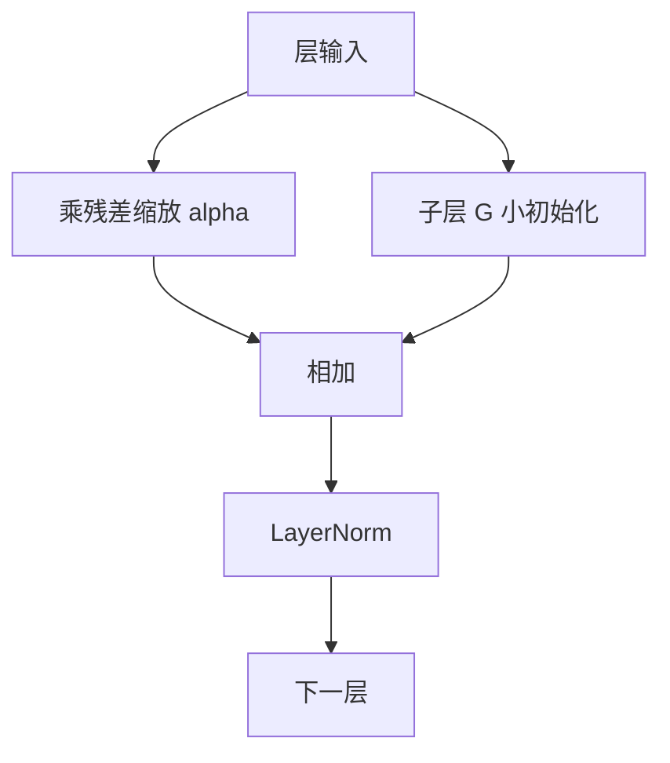

# 残差连接与 DeepNet

把残差主干放大、把子层初始化缩小，Transformer 可以叠到上千层而不在训练初期散掉。

<footer>—— Wang 等，DeepNet，2022</footer>

残差连接 $x+F(x)$ 让梯度有一条近道，但近道的增益若随深度失控，深层不是学不动，就是一更新就炸。Xiong 等人已经说明 Post-LN 会切断这条近道。Wang 等人 2022 年的 DeepNet 走另一条路：保留 Post-LN 的「每层输出都归一」这一表示习惯，用随深度变化的常数 $\alpha$ 缩放残差，并用 $\beta$ 缩小子层初始，使一千层的 Transformer 可以训起来。它针对的是深度，不是宽度，也不是位置编码。

## 问题

堆 $N$ 层时，若每层 $F_l$ 在初始化附近输出与 $x$ 同量级的噪声，残差和的方差会随 $N$ 上涨；若 Post-LN 再把上涨压回去，雅可比又把底层梯度压小。Pre-LN 用单位主干避开切断，但主干范数可以随层累积，极深时仍可能数值溢出或把有效更新相对主干变得微不足道。

需要一种可分析的增益控制：让每一层对主干的改写是 $O(1/N)$ 量级的小步，同时底层仍能收到足够梯度。He 等人的残差网络已经用「恒等映射为主」的直觉走过一遍；Transformer 的 $F$ 含 softmax 与 FFN，初始化方差与深度的关系必须重写。DeepNet 的问题是给出一套与 $N$ 挂钩的缩放，使 Post-LN Transformer 可以到千层，而不是劝所有人改用 Pre-LN。深度病态有两种相反的脸：更新太大则散，更新相对主干太小则底层学不到。DeepNorm 同时做两件事——主干乘 $\alpha>1$ 以保住信号，子层初始乘小系数以限制每步改写。只做其中一件会偏到另一张脸上。

## 方法

DeepNorm 把 Post-LN 块写成

$$
x_{l+1}=\mathrm{LN}\bigl(\alpha\,x_l + G_l(x_l)\bigr)
$$

其中 $G_l$ 是注意力或 FFN 子层，$\alpha$ 随总层数 $N$ 增大。子层参数在初始化时再按 $\beta(N)$ 缩小，使 $G_l$ 起步时小于被放大的主干。编码器与解码器、自注意力与交叉注意力的 $\alpha$、$\beta$ 公式在论文中分别给出，依赖于该侧的层数；工程上应使用原文的分组，而不是自造一个与 $N$ 无关的全局常数。

训练不改变优化器种类，但深度上升后应配合适当的学习率，而不是沿用浅 Post-LN 的 warmup 却期望千层自己稳。Wang 等人在机器翻译与语言模型设定下把层数推到极深，展示损失可降、而不是只展示「能跑」。

## 机制

### 残差分支的方差爆炸

初始化时把 $G_l$ 看作近似线性的随机算子，输出方差与输入方差、参数方差成正比。无缩放的 $x+G(x)$ 若每层都给主干加上不可忽略的噪声，经过 $N$ 层后表示被随机游走过一次，LN 再强行拉回单位尺度，等于每层都在洗牌。深层的有用梯度必须穿过一连串「加法 + 标准化」的病态雅可比。放大主干、缩小 $G$，是让加法项里 $x$ 占主导，LN 几乎在归一一个已经很大的恒等项，雅可比接近「对主干友好」的极限。

这与 Pre-LN 的单位通路不同：Pre-LN 的恒等不经过 LN；DeepNorm 的恒等经过 LN，但被 $\alpha$ 抬成主导项，LN 的局部线性接近缩放后的恒等，而不是接近「噪声与信号各一半」。

### DeepNorm 的缩放与初始化

$\alpha(N)$ 增大，残差流在进入 LN 前更像 $\alpha x$，梯度回传到 $x$ 时带有 $\alpha$ 再被 LN 的 $\sigma$ 除。$\beta(N)$ 缩小 $G$ 的初始权重，使前向里 $G(x)$ 相对 $\alpha x$ 是摄动。二者必须配对：只放大 $\alpha$ 而 $G$ 仍按常规初始化，摄动仍可能与主干同阶；只缩小 $G$ 而不放大主干，Post-LN 仍可能在深层把残差通路压扁。论文从更新范数的上界推导配对关系，而不是从网格搜索里偶然得到两个魔术数。

实现时最常见的错误是只在残差加法写了 $\alpha$，却忘了按 $\beta$ 改初始化，或用预训练浅模型的权重直接塞进千层骨架。DeepNorm 是训练方案，不是把已有 48 层模型的残差乘一个常数就能变成 1000 层。

### 千层 Transformer 的工程含义

能叠千层，不等于应当叠千层。参数与深度可以互换：同样参数，极深而窄的网络在并行上更难受，流水线切分、激活检查点、以及每层很小的有效更新都会让吞吐变差。DeepNet 的价值是证明 Post-LN 的深度上限可以被缩放规则抬高，从而在「深度换宽度」的研究里有一条稳定基线。生产大模型仍多选中等深度加宽度、Pre-LN 与 RMSNorm，因为那条路的工具链更熟。

## 边界与工程取舍

DeepNorm 与 Pre-LN 不是互斥到不能讨论，但公式是为 Post-LN 写的。把 $\alpha$ 接到 Pre-LN 的 $x+F(\mathrm{LN}(x))$ 上会改变已有的单位通路，需要重新推导，不能抄编码器的 $\alpha(N)$。它也不替代混合精度、梯度裁剪与合适的 $\varepsilon$。

与并行 Attention-FFN 组合时，一层里两条 $G$ 同时加到主干，摄动方差加倍，$\beta$ 可能需要再调。与 RoPE、ALiBi 无关：位置通道不进入 $\alpha$。

原文的实验深度远大于当时主流翻译模型，但与后来的解码器千亿参数不是同一坐标系。引用 DeepNet 应强调「残差缩放使极深 Post-LN 可训」，而不是宣称千层已经是语言模型的最优深度。

### 何时动残差增益

默认 Pre-LN 中等深度不必上 DeepNorm。当层数明显增加、Post-LN 梯度消失或初始化即 NaN、又希望保留每层 LN 输出时，再引入 $\alpha$ 与 $\beta$。先加梯度裁剪与更小学习率，确认不是别的数值问题，再改残差定义，否则会把优化器问题写成架构问题。

## 小结

- 残差连接提供梯度近道，但深层需要对主干与子层的增益配对控制。
- DeepNorm 在 Post-LN 中把主干乘 $\alpha(N)$，并把子层初始化按 $\beta(N)$ 缩小。
- 目的是让每层对表示的改写保持小摄动，同时 LN 不切断主导的恒等项。
- 它使 Transformer 训练深度可以到千层量级，不自动成为参数分配的最优解。
- 公式依赖编码器/解码器层数，不能当与 $N$ 无关的全局常数抄。
- 与 Pre-LN 默认栈正交：生产模型仍可不用 DeepNorm，只要深度与顺序匹配能力。
- 出处：Wang 等，*DeepNet: Scaling Transformers to 1,000 Layers*，2022；残差病态与 LN 位置见 Xiong 等（2020）；LayerNorm 见 Ba 等（2016）。
