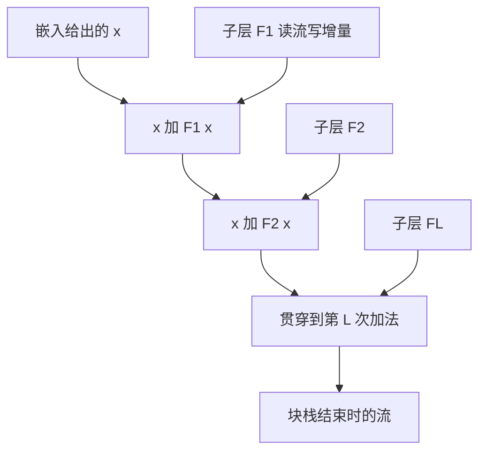

# 残差流

我们把层改写成对输入的残差函数，让优化去拟合增量而不是整份映射；深度于是可以加，而不必每一层都重新发明恒等。

<footer>—— 据 He et al., Deep Residual Learning for Image Recognition, CVPR 2016 整理</footer>

[上一课](/llm/embedding-dmodel)把每个位置上的向量宽度钉成 $d_{\mathrm{model}}$，并说明这就是整网共享的总线宽度。本课不重讲查找表、tying 或 $|V|$。缺口是：许多层都要改写这条宽为 $d$ 的向量。若每层用一个全新的映射覆盖掉输入，深度一大，梯度与信息都难以穿过。残差把更新写成 $x\leftarrow x+F(x)$：有一条贯穿始终的流，各层只往上写增量。后面的 Transformer 块、注意力与 FFN，都是这条流上的读写器。

## 问题

[词表宽度与 d_model](/llm/embedding-dmodel)给出的 $X\in\mathbb{R}^{n\times d}$ 是嵌入查找的结果。若第一层输出一个与 $X$ 同形但完全重写的 $Y=F_1(X)$，第二层再完全重写，则第 $L$ 层要读到嵌入身份，必须经过 $L$ 次可能丢失的变换。He 等人在视觉里展示：让层学习增量，恒等成为默认，深度才加得上去。序列模型面临同一件事，只是「图像残差」换成了「每个位置一条宽为 $d$ 的流」。

这条流还承担通信。不同子层、不同位置（位置间的混合是注意力的事，下一课才拆）要把消息写到一个共享的地方，供更上层读取。若没有共享的相加空间，每层的输出空间与下一层的输入空间可以对不齐。残差相加强制所有增量活在同一 $\mathbb{R}^{d}$ 里。这就是把 $d_{\mathrm{model}}$ 叫总线宽度的原因：它不是某一层的超参，是通信协议的位宽。

### 覆盖式映射的失败模式

没有残差时，层必须同时做两件事：保留还需要的旧信息，以及写入新计算。深度增加，保留变得更难，优化更愿意走捷径。残差把保留变成加法上的默认，层可以接近零映射而不破坏已经写在流上的内容。训练初期 $F$ 接近零是健康的：流上主要是嵌入，随后各层慢慢叠加。

解释文献常把这条贯穿的 $x$ 叫做 residual stream：注意力和 FFN 是读流、写增量的插件，流本身才是中心对象。本课采用这个说法，但不把后续的回路分析提前做完。

## 方法

对任意子层 $F$，残差更新是

$$
x \leftarrow x + F(x).
$$

$F$ 可以含归一化、线性、非线性，但必须输出与 $x$ 同形，否则不能加。嵌入给出 $x$ 的初值；此后每一个注意力子层、每一个前馈子层都是一次这样的加法（归一化插在 $F$ 前还是加完后，是后课 Pre-LN / Post-LN，本课不展开）。$L$ 个块之后，流等于嵌入加上所有子层增量的叠加。

因为加法可交换，增量的顺序在代数上是「先写的还在」，后写的只是再加一项。非线性与归一化使 $F$ 依赖当前 $x$，所以实际上顺序有关：后层读到的是已经被前层改过的流。可交换的是已经写出的向量，不是计算图。

### 流上的读与写

读：子层用线性投影从 $x$ 取出自己需要的方向（查询、键、值，或 FFN 的升维）。写：子层的输出投影把结果映回流的宽度，再加回去。读写都发生在同一 $d$ 维里，所以不同子层可以抢同一组方向，也可以分工占用几乎正交的方向。带宽有限：宽度 $d$ 决定能有多少线性可分的通信信道，不是无限公告板。

$x+F(x)$ 要求 $F$ 的输出尺度与 $x$ 匹配。初始化过大，增量盖过嵌入；过小，层等于不存在。深度与学习率会放大这件事，后续才有残差缩放、DeepNet 一类补丁。本课只把加法协议定下来。

## 机制

梯度方面，加法给出一条不经过 $F$ 的捷径：$\partial L/\partial x$ 含 $\partial L/\partial x_{\mathrm{out}}$ 的直接项。即使 $F$ 的 Jacobian 病态，嵌入与早先增量仍能收到信号。这正是残差能加深的原因。信息方面，早先写入的方向若不被后来的增量对消，就会一直躺在流上，供很深的层读取——「远距离」不必穿过乘性瓶颈，只需在加法上存活。

对消确实会发生。后层可以学习写出前层增量的近似负方向，把某条消息擦掉。残差不保证记忆，只保证擦除必须显式地写一个抵消项，而不是默认发生。解释时看到某层对某方向的贡献，要用该层写出的增量，而不是用该层输入的范数。

### 与层归一化的接口

归一化会改写尺度，从而改写「流上已经写了多少」的读法。它插在残差分支里还是插在主干上，会决定捷径是否仍是干净的加法。本课不选位置，只声明：无论怎么插，最终仍要回到可相加的 $d$ 维。后续规范化课序默认本课的加法已经成立。

不要把残差理解成「多连一根电线所以更好」。关键是增量学习与同宽相加。宽度一旦在嵌入课定下来，这里就不能偷偷改 $d$。

## 边界

残差假定同形相加。形状不同就要投影，投影本身又是一层可以毁掉捷径的映射。并行地把注意力增量与 FFN 增量加到同一输入上（并行块）仍是残差，只是两个 $F$ 读的是同一快照；那是后课，本课的协议兼容它。没有残差的深层 Transformer 在历史上不稳定，不作为本栏主干。

本课是「残差块」课序的第一课。下一课把 $F$ 拆成注意力加前馈两种读写器，仍不推导注意力公式。再往后才是扩展比与块内路径。流的说法将贯穿这些课：改的是谁来读、谁来写，不是加法本身。

## 小结

- 残差更新 $x\leftarrow x+F(x)$ 让各层学习增量，嵌入与早先写入默认保留。
- $d_{\mathrm{model}}$ 是这条流的位宽；所有子层必须读写同一宽度。
- 梯度捷径不经过 $F$；擦除信息必须显式写出抵消项。
- 归一化位置会影响尺度，但不取消加法协议。
- 后续块、注意力、FFN 都是流上的插件，不再重讲 $x+F(x)$。
- 出处：He et al., CVPR 2016；流作为 Transformer 中心对象的说法见 Elhage 等对 residual stream 的讨论。
