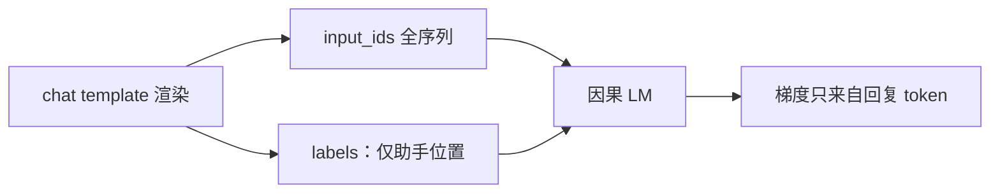

# 仅回复损失

用户段是条件，助手段才是被监督的完成；把提示也送进交叉熵，模型会学着把问题再写一遍，而不是学着回答。

<footer>—— 与 Ouyang 等 InstructGPT（NeurIPS 2022）、Touvron 等 Llama 2（2023）的 SFT 实践一致：损失落在示范完成上</footer>

[上一课](/llm/instruction-data-lineage)分清了 FLAN / Alpaca / ShareGPT 三条表。表一旦经[chat template](/llm/chat-template)渲染，下一个缺口是：**哪些 token 进梯度**。预训练对整段因果语言建模；SFT 若原样照搬，用户问题、系统约束、工具结果都会被当成「下一词」。仅回复损失（response-only / completion-only）把交叉熵限制在助手完成上，提示只作条件。本课写掩码契约，不改谱系，也不谈[打包](/llm/sft-packing-mask)如何把多条样本塞进同一序列。

## 问题

一条渲染后的样本形如 $\texttt{prefix}\circ\texttt{response}$。完整因果损失是

$$
\mathcal{L}=\sum_{t\in T}-\log p_\theta(x_t\mid x_{\lt t}),
$$

若 $T$ 含前缀，梯度鼓励模型在「用户刚问完」的位置上复述用户、或把系统提示续成更长的系统提示。评测时前缀由产品写入、不可改，训练时却在预测它，训练–推理目标不一致。多轮更严重：上一轮助手已在上下文里，若再对用户轮计损失，模型学会用用户口吻说话。

FLAN 短输入上，漏掩码表现为背题面；ShareGPT 长多轮上，漏掩码表现为角色崩溃。两种看起来像「微调毁了模型」，根因是 $T$ 选错，不是[学习率](/llm/full-sft-hparams)选错。

### 掩码是模板的对偶

模板负责标出角色边界，掩码负责决定边界内谁被学习。只改模板不改掩码，用户段仍进损失；只改掩码不改模板，角色在输入里看不见，掩码成了随机开关。[上一课](/llm/instruction-data-lineage)的三条谱系对应不同的「回复」定义：FLAN 的输出字段、Alpaca 的 `Response`、对话里所有 `assistant` 轮（有时含工具参数）。必须按谱系定义 $T$，不能写死「最后一个段落」。

部分实现提供 <code>train_on_inputs=False</code>（如早期 Alpaca-LoRA 脚本）。默认若为 True，等于关闭本课。核对方法是打印 <code>labels</code>：前缀应为 ignore_index，助手段才是 token id。

## 方法

渲染整段对话，构造与 `input_ids` 等长的 `labels`：对系统、用户、（通常）工具结果位置写入忽略下标（PyTorch 惯例 $-100$），对应对齐的助手 token 写入真实 id。损失对忽略下标跳过。多轮则每一轮助手都进 $T$，不只最后一轮——否则模型只学「如何收尾」，不学中间轮。

工具调用若希望模型发出函数名与参数，这些 token 算回复，应进损失；工具返回的观察是下一轮条件，通常掩码。与[模板](/llm/chat-template)的 `add_generation_prompt` 对齐：训练时完整助手正文在损失里，推理时生成从助手起始标记之后开始。

特殊情况要写进配方。续写式任务（补全代码、填空）的「提示」本身是未完成文本，损失应从补全起点算，而不是从角色标记算。FLAN 分类任务若把标签词当回复，只对标签位置计损失即可，不必对解释性废话计损失——除非你确实想学那种废话。

## 机制

忽略前缀不改变注意力：前缀 token 仍作为键与值，回复位置仍能看见它们。改变的是参数更新的来源。设回复段梯度为 $\nabla_\theta \mathcal{L}_{\mathrm{resp}}$，前缀段若也计损失，会多一项 $\nabla_\theta \mathcal{L}_{\mathrm{pref}}$。后者沿残差刷到嵌入与底层，驱动模型把高频用户 n-gram 写进先验。SFT 数据远小于预训练，这项很容易压过「如何回答」的信号。

仅回复还有信噪比含义。前缀往往更长，尤其是 ShareGPT 与检索增强。全序列平均损失会被前缀主导，看起来很低（前缀好预测），回复质量却没动。报表应打回复段负对数似然，而不是整段 loss。这与预训练「整段都是目标」的日志习惯必须切开。

仅回复不是「不学上下文」。上下文通过条件进入 $p(\text{response}\mid\text{prefix})$。它禁止的是把条件本身当生成目标。若任务真是续写用户草稿，应把草稿标成助手段，而不是关掉掩码。

## 边界与工程取舍

不是所有后训练都仅回复。继续预训练、领域自适应的第一阶段（见后课[领域适配](/llm/domain-adaptation-ft)）常对全文计损失。偏好方法（DPO 等）在完成上比较，前缀同样是条件。本课只约束监督 SFT。

掩码过窄也会出事：若系统里有必须学会的固定拒答句，却全部掩码，模型只能从稀少助手示范里学拒绝。那时应把该句挪到助手示范，而不是把整个系统段解掩码。全参与 [LoRA](/llm/lora) 用同一套 labels；LoRA 不减免掩码错误，只让错误更新进适配器。

调试顺序：先对训练/推理[模板](/llm/chat-template)，再打印 `labels` 热图，最后才动 $\eta$。角色崩溃优先当掩码 bug。

## 小结

- SFT 的交叉熵应落在助手完成上；前缀只作因果条件。
- `labels` 与 chat template 是对偶：模板标角色，掩码选梯度。
- 多轮应对每一轮助手计损失；工具观察通常掩码，工具调用通常不掩码。
- 报表看回复段 NLL；整段 loss 会被长前缀粉饰。
- 漏掩码表现为复述用户或角色崩溃，常被误诊为学习率或遗忘。
- 出处：与 InstructGPT、Llama 2 的 SFT 目标一致；实现契约见各框架的 completion-only / `train_on_inputs=False`。
