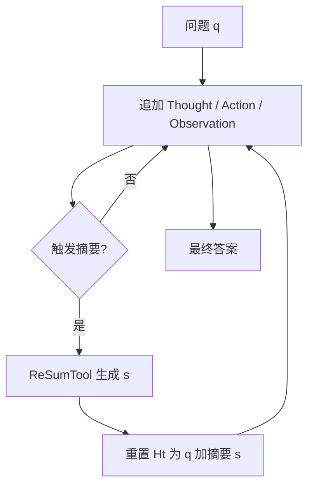

# ReSum 递归摘要

    
周期性调用外部工具把交互史收成可重启的推理状态，从摘要继续探索，从而在不改代理架构的前提下突破 ReAct 的窗口顶。

    <footer>—— Wu、Li、Zhao、Zhang 等，ReSum: Unlocking Long-Horizon Search Intelligence via Context Summarization，arXiv:2509.13313</footer>

通义实验室 Xixi Wu、Kuan Li、Yida Zhao、Liwen Zhang 等提出 **ReSum**：Web 代理要多实体、高不确定的长搜，ReAct 把每轮思维、动作、观察追加进 $H_T$，32k 级窗口会在答案出现前耗尽。ReSum 在触发器响时用摘要工具 $\pi_{\text{sum}}$ 把历史压成 $s$，令 $q'=(q,s)$ 并重置 $H\leftarrow(q')$，再继续。相对改内部记忆 token 或重训整网，这是对 ReAct 的即插修改。无训练时平均绝对提升约 4.5%；ReSum-GRPO 再加约 8.2%。1K 样本上 WebResummer-30B（WebSailor-30B + ReSum-GRPO）BrowseComp-zh Pass@1 33.3%、BrowseComp-en 18.3%。本篇写周期性重启与优势广播，对照 [Compaction](/llm/compaction-summarize) 与 [SUPO](/llm/supo-context)。

## 问题

BrowseComp 类题需要十几到几十次 Search/Visit。WebSailor-7B 在 BrowseComp-en 上：做对的轨迹多在约 10 次工具内结束；失败轨迹常超过 10 乃至 20 次，token 打穿 32k。失败往往是**被截断**，不是已经证伪。加长窗口只推迟顶满，且长上下文上指令遵循会掉。改架构（记忆 token、专用压缩头）则与现成代理不兼容。搜索轨迹还有一个产品现实：同一套 ReAct 脚手架已经部署在多尺寸开源 Web 代理上，能在提示循环外加一层摘要重启，比让每家都重训记忆头更便宜。这也是作者反复强调「对 ReAct 改动最小」的原因——兼容性本身是方法的一部分，不只是工程客气话。

通用聊天摘要不适合搜证：要抽出可核验证据、信息缺口、下一步可执行方向。小模型做不到；大模型 API 贵。于是有 ReSumTool-30B：用强开源模型在 SailorFog-QA 的 ReSum 滚动上收 $\langle$对话, 摘要$\rangle$ 对，SFT 到 Qwen3-30B-A3B-Thinking。作者称摘要质量优于更大的 Qwen3-235B 与 DeepSeek-R1-671B（任务特化评价，不是通用摘要榜）。

### 摘要是新的用户问题

重置后模型看到的是 $(q,s)$，不是带完整 tool 配对的对话。若 $s$ 丢掉一个已排除的实体，后续会重复死路；若把猜测写成事实，后续当前提。这与 Anthropic compaction「用摘要重启窗口」同构，但 ReSum 的 $s$ 被明确要求列出缺口与下一步，面向搜索而非代码仓库。工具仍是 Search（多查询、每查询 top-10）与 Visit（Jina 取页 + 72B 抽证据）这一套 WebSailor 栈。

触发可以是 token/轮数阈值，也可以是策略主动要求摘要。论文主线是系统触发；ACM 批评它不是代理发起、且原文丢弃。两者可以叠：阈值保底，策略早停。

## 方法

初始化 $H_0=(q)$，与 ReAct 一样追加 $(\tau_t,a_t,o_t)$。触发后 $s\sim\pi_{\text{sum}}(\cdot\mid H_t)$，历史换成 $(q,s)$。资源上限（工具次数）仍在，超限记失败。即插实验：同一 Web 代理换范式，三基准平均 +4.5% 绝对点。

标准代理不天生会「从压缩状态推理」。SFT 要专家 ReSum 轨迹且可能冲掉原有技能，故用 RL。**ReSum-GRPO**：轨迹在每次摘要处切开成多段，每段当一条训练 episode；整条滚动的轨迹级优势**广播**到所有段。这样既学摘要条件下的下一步，也学「收集让摘要更好的证据」。相对普通 GRPO，改动在切段与优势赋值，不在新梯度公式。数据仅 1K 量级时 WebResummer-30B 即超过多数所列开源 Web 代理。

### 广播优势的信用分配

长搜里早期几步只是在攒证据，终局才有对错。若只优化最后一段，前期搜索策略无信号；若每段自计分，中间摘要没有环境真值。轨迹级奖励广播让所有段共享终局成败，类似把一次 BrowseComp 对错记到整条探索上。代价是方差大：一段无关摘要也会吃到终局正优势。这是工程取舍，论文用 GRPO 组内归一化缓和。

## 机制

信息论上每次摘要是有损编码，解码器是同一个策略。ReSumTool 的特化是把编码目标从「流畅概要」改成「可继续的搜索状态」。即插提升说明许多失败确是窗口顶满；GRPO 再提升说明策略要适应 $q'$ 这种前缀——思维链里对「摘要里写过的缺口」的利用不是零样本就完美。

与 MEM1 比：MEM1 每步覆盖内部状态，无独立摘要模型；ReSum 保留 ReAct 多轮原文直到触发，然后一次性替换。与 SUPO 比：SUPO 让**同一策略**写摘要并端到端 RL；ReSum 的摘要器可冻结（ReSumTool-30B），策略只适应读摘要。ACM 表 1 因此标 ReSum：可压缩、可训练、有损、非代理发起、数据未完全按 ACM 标准开源。即插数字说明许多 Web 代理其实已经会搜，缺的是把搜到的东西活过窗口边界；GRPO 数字说明「会读摘要」仍要练，不能假设通用指令模型零样本就对齐压缩前缀。

「无限探索」是相对窗口而言。实现仍有工具次数与墙钟上限。不要把 ReSum 写成已经取消费用约束。

### 与产品 compaction 对齐

Claude Code 类产品按窗口百分比压，提示保架构决策。ReSum 提示保证据链与缺口。领域不同，合同相同：摘要重启 + 最近状态。代码代理应保留文件指针；搜索代理应保留 URL 与已排除实体。混用提示会压错对象。

## 边界与工程取舍

数字绑在 WebSailor 系与三搜索基准。不要把 33.3% BrowseComp-zh 写成通用代理 SOTA。摘要器与策略分离时，摘要器落后会导致系统性信息缺口。原文丢弃后不可审计网页原文，合规场景要另存日志。1K RL 样本效率高，也意味着超参与种子敏感，复现应对多种子。

出处：Wu et al.，*ReSum: Unlocking Long-Horizon Search Intelligence via Context Summarization*，arXiv:2509.13313。GRPO 见 Shao 等 DeepSeekMath。BrowseComp 见 Wei 等。WebSailor 见 Li 等。

## 小结

- ReSum 周期性把 ReAct 历史摘要成 $q'=(q,s)$ 并重置窗口，以最小改动换长程搜索。
- ReSumTool-30B 特化搜证摘要；ReSum-GRPO 切段并广播轨迹优势。
- 即插约 +4.5 绝对点，GRPO 再约 +8.2；WebResummer-30B 用 1K 样本达到文中开源对照位。
- 有损且默认非代理发起；要无损回查看 ACM，要策略自己写摘要看 SUPO。
- 出处：arXiv:2509.13313。
