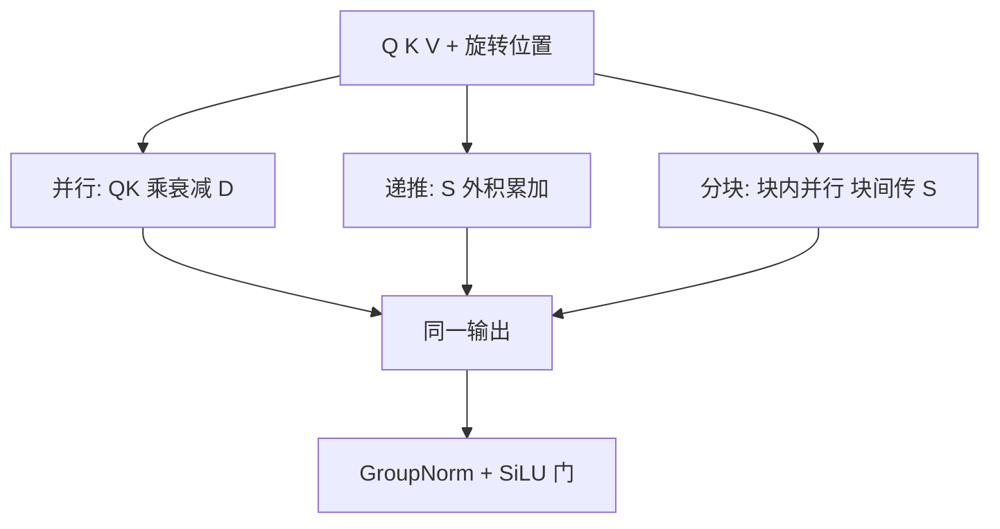

# RetNet

    
保留机制同时具有三种等价算法：并行用于训练，递推用于常数状态推理，分块递推用于长序列；不可能三角被写成同一条公式。

    <footer>—— Sun et al., Retentive Network: A Successor to Transformer for Large Language Models, 2023</footer>

Transformer 的训练并行以推理期 $O(N)$ 的 KV 与逐步注意力为代价；RNN 反过来。微软 Sun、Dong、Wei 等人 2023 年的 Retentive Network（RetNet）声称同时占据「训练并行、推理便宜、效果够好」三点。核心不是又一个线性核，而是 **retention**：从带衰减的递推推出与注意力同构的并行形式，再推出分块形式。并行是 $QK^\top$ 与衰减矩阵的 Hadamard 积再乘 $V$；递推是 $S_n=\gamma S_{n-1}+k_n v_n^\top$、$o_n=q_n^\top S_n$；分块则块内并行、块间传递 $S$。再配上类似 xPos 的复数位置、多尺度 $\gamma$（每头不同衰减）以及 GroupNorm 加 SiLU 门。本篇写 retention 三范式与原文架构，不把后来各种「RetNet 变体」打包进来。

## 问题

作者把目标画成不可能三角：现有工作往往保两边、丢第三边——线性注意力推理便宜但质量掉；softmax 质量好但 KV 贵；RNN 推理便宜但训练不并行。大模型场景下三条同时要：预训练必须吃满 GPU 的矩阵乘；部署必须降低显存与逐步延迟；缩放曲线不能明显差于 Transformer。

理论步骤是：先写一条线性递推，证明它等于某种带相对衰减的「注意力」；于是同一函数可以选算法，而不是选模型。缺的工程件是位置（否则衰减只认距离、不认方向与周期）和多时间尺度（单一 $\gamma$ 无法同时做短句法与长语篇）。还要把归一化从 softmax 行随机改成可与递推兼容的 GroupNorm，否则并行与递推的数值对不齐。三种范式必须对同一组 $Q,K,V,\gamma$ 给出同一输出（在浮点误差内）。若实现时并行用了 softmax 而递推用了状态，那就不是 RetNet，只是两个不同层。

## 方法

### 并行表示

因果 retention 写成

$$
\mathrm{Retention}(Q,K,V)=(QK^\top\odot D)\,V,
$$

其中 $D_{nm}=\gamma^{n-m}$（$n\ge m$），否则为 0。没有 softmax。位置用复数旋转（xPos 一类）：$q_n$ 乘 $e^{in\theta}$，$k_m$ 乘 $e^{-im\theta}$，点积带相对相位，再被 $\gamma^{n-m}$ 衰减。这一形式是标准的 batched GEMM，训练与短序列前向都走它。相对 softmax，少了行内竞争，多了显式时间衰减。

### 递推表示

令 $S_n=\gamma S_{n-1}+k_n v_n^\top\in\mathbb{R}^{d\times d}$，则 $o_n=q_n S_n$。每步 $O(d^2)$（按头则是头维平方），状态大小与序列长度无关。这就是推理路径：没有 KV 列表，只有 $S$。$\gamma<1$ 使旧外积指数衰减，状态不会像无衰减线性注意力那样无界堆积。论文报告在 8k 输入等设定下，相对 Transformer 推理显存、吞吐、延迟有数倍到一个数量级的改进（随模型大小变化）。

### 分块递推

长训练序列上纯并行仍要物化块内 $B\times B$ 的分数，纯递推又浪费 GPU。把序列切成块长 $B$：块内用并行 retention（含块内 $D$），块间把末态 $S$ 递推进去，块内查询还要乘上「块起点相对块内位置」的 $\gamma$ 尺度。复杂度对全长线性，激活峰值由 $B$ 决定。预训练可用并行或分块；超长用分块；解码用递推。三者共享权重。

多尺度 retention（MSR）：不同头固定不同的 $\gamma$，从接近 1（长记忆）到明显小于 1（短记忆），覆盖多时间尺度。输出侧 GroupNorm 按头归一，再经 SiLU 门控与投影，补上 softmax 被拿掉后的尺度控制。$\gamma$ 在原文里按头设置为常数，不是每步由输入预测。这与 Mamba 的选择式 $\Delta$ 不同：RetNet 的遗忘速度是架构超参，训练中可学的是 $Q,K,V$ 与门，不是 $\gamma$ 本身（实现上有人把它改成可学，那就超出原文）。

## 机制

retention 与线性注意力同族：结合律来自把 $q^\top k$ 与 $v$ 换成先 $kv^\top$ 再被 $q$ 读。衰减 $D$ 使等价递推稳定，也引入「越远越小」的先验，这既是归纳偏置也是对无限记忆的拒绝。softmax 能把几乎全部质量给单一键；retention 的权重 $q_n^\top k_m\cdot\gamma^{n-m}$ 仍是平滑的，尖峰靠 $q,k$ 的尺度与旋转对齐，没有竞争归一。GroupNorm 防止输出范数随 $n$ 漂移，使并行与递推在深网上对齐——否则一种算法训、另一种算法推，会系统性错位。

不可能三角的「效果」边来自：保留点积（相对 AFT/RWKV 更像注意力）、多尺度 $\gamma$、旋转位置、门控。论文的语言建模缩放曲线用来支撑「不是线性注意力再掉一截」。这仍是中等规模与当时数据上的曲线；是否在今日稠密 LLM 数据上仍贴着 Transformer，要单独验证。

分块的正确性依赖衰减在块边界的因式分解：$\gamma^{n-m}=\gamma^{n-n_0}\gamma^{n_0-m}$。写错块间尺度，块与块之间会出现缝，长序列损失会在块长整数倍处抖动。这是实现 bug 的高发区，不是理论缺陷。

## 边界与工程取舍

解码是主收益：常数 $S$ 对抗 KV。Prefill 很长时，并行/分块 retention 仍要做 $QK^\top\odot D$，带宽与 Flash softmax 竞争，未必更快。精确针测、需要 softmax 竞争的拷贝任务，retention 通常弱一档；产品路径上可混少数注意力层，但那就不是纯 RetNet。

$\gamma$ 与训练长度耦合：训练 2k、推理 32k 时，长头的 $\gamma^{32000}$ 可能下溢到 0，等于没有长记忆。需要按目标长度设计 $\gamma$ 网格，或对超长用分块并把跨块 $\gamma^{B}$ 用 log 域乘。状态 $S$ 是 $d_{\mathrm{head}}\times d_{\mathrm{head}}$ 每头，头多而头维大时，状态体积可以接近短上下文的 KV，常数优势要在足够长的生成里才显现。

与 [RWKV](/llm/rwkv) 选择：要点积与多尺度衰减、更贴注意力实现，用 RetNet；要 AFT 式逐通道 WKV 与现成开源权重生态，用 RWKV。二者都不要假设「线性 = 一定省显存」而不测量 $S$ 与 KV 的字节数。论文标题里的 successor 是架构主张，不是生态事实。工具链、Flash 核、投机解码、量化，Transformer 领先一整代；RetNet 的部署收益必须自己写核才能落地。

## 小结

- Retention 由带 $\gamma$ 衰减的递推导出，并行、递推、分块三种算法计算同一函数。
- 并行形式是 $(QK^\top\odot D)V$，没有 softmax；递推状态 $S$ 与长度无关。
- 旋转位置与多尺度 $\gamma$、GroupNorm、SiLU 门构成完整 RetNet 块。
- 推理省 KV 是主收益；质量边依赖点积与多时间尺度，仍弱于 softmax 的硬选择。
- 块边界的 $\gamma$ 因式必须写对，否则长序列出现周期缝。
- $\gamma$ 网格要按目标上下文设计，否则超长处长头下溢。
- 出处：Sun, Dong, Huang, Ma, Xia, Xue, Wang, Wei, *Retentive Network: A Successor to Transformer for Large Language Models*, 2023。
