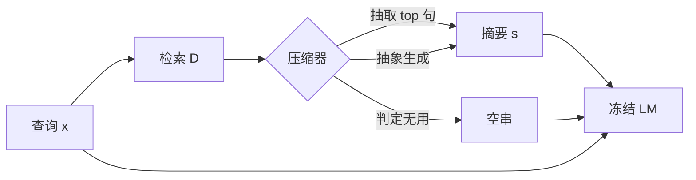

# 检索式上下文压缩

把检索到的文档先压成相对查询的短摘要再拼进提示，既能少算 token，也减轻模型在长检索结果里找证据的负担。

<footer>—— Xu、Shi、Choi，RECOMP: Improving Retrieval-Augmented LMs with Compression and Selective Augmentation，ICLR 2024</footer>

RAG 把文档前置进上下文，推理费用随检索块线性涨，而且块一多，读者更容易 [丢掉中间](/llm/lost-in-middle)。Xu、Shi、Choi 提出 **RECOMP**（Retrieve, Compress, Prepend）：在黑盒 LM 之前加一个小压缩器，按查询把 $N$ 篇检索文档收成短文本 $s$，再前置。$s$ 要短、要有助于端任务、并尽量忠实于证据；若检索无用，允许输出空串，即 **选择性增强**。Jiang 等的 LongLLMLingua（arXiv:2310.06839）从另一头做：用小模型按问题相关的对比困惑度做 token 级修剪，并调整块顺序以对抗位置偏差。二者都是 **查询条件下的压缩**，与对整段代理轨迹做 [摘要压缩](/llm/compaction-summarize) 不同：前者的原文在索引里还在，压缩是为这一次生成服务的视图。本篇写这条检索侧路径。

## 问题

前置全文检索块有三害。算力：LM 要编码远长于问题的 token。利用：即使换成长上下文骨干，中间证据仍可能读不到。干扰：Mallen 等与 Shi 等已表明无关或弱相关文档会伤害生成。加长窗口不自动取消这三害，见 [腐烂](/llm/context-rot)。需要在检索器与生成器之间加一层，把「可能有关的许多段」变成「这一问真正该看见的几句」。

现成摘要模型不是为「让下游 LM 答对」训练的，会保留流畅叙事、丢掉答案跨度。RECOMP 因此不优化 Rouge，而优化 **前置 $s$ 之后端任务是否变好**。抽取式压缩用对比学习选出「接上就能引出目标输出」的句子；生成式压缩从极大规模 LM 的查询型摘要蒸馏到小 encoder-decoder。压缩器必须明显小于生成器，否则只是把费用挪到另一张卡上。

### 压缩率与空摘要

论文报告：语言建模与开放域问答上，oracle 压缩可到约 **6%** token 仍不掉点甚至超过全文前置；训练过的压缩器在语言建模上约 25% 压缩率接近不掉点，问答上压到原文 5%–10% token 时相对跌幅通常不超过约 10%。空摘要不是失败：检索与问题无关、或参数记忆已够用时，前置噪声不如不前置。这与「总是 RAG」的产品默认相反，却直接针对干扰文档问题。

检索式压缩改变的是这一次提示，不删除语料库。用户要引用原文时，应保留句级指针。若压缩器改写后无法指回段落，合规场景应只用抽取式，不用抽象式。

## 方法

形式化：给定输入 $\mathbf{x}$、目标 $\mathbf{y}$、检索集 $D=\{d_i\}_{i=1}^{N}$，压缩器 $c_\theta(\mathbf{x},D)\mapsto \mathbf{s}$。生成器 $M$ 冻结，$M([\mathbf{s};\mathbf{x}])$ 应趋向 $\mathbf{y}$。抽取式：把 $D$ 打成句子，双编码器分别嵌入句子与 $\mathbf{x}$，内积表示「前置该句对产生 $\mathbf{y}$ 有多有用」，取 top 句拼接。训练用对比目标，正例是能改善端任务的句子。抽象式：以 $\mathbf{x}$ 与拼接后的 $D$ 为条件生成 $s$，监督来自 GPT-3 一类极大模型的查询摘要蒸馏。忠实性主要靠抽取式「几乎逐句来自原文」；抽象式在第 6 节做人工忠实检查，不作为训练项。

LongLLMLingua 的粗到细：先按问题相关分数排文档、丢掉整篇噪声，再在篇内按对比困惑度删 token，最后把高相关块移到模型更敏感的位置（明确针对 Liu 等的位置偏差）。NaturalQuestions 上相对 GPT-3.5-Turbo 可到约 +21.4% 且 token 约 1/4；LooGLE 上报约 94% 费用下降；约 10k token 提示在 2×–6× 压缩时端到端延迟 1.4×–2.6×。LLMLingua / Selective-Context 更偏 **无查询** 的信息量修剪，LongLLMLingua 强调无查询会留下与问题无关的「看起来信息量大」的噪声。

Provence（Chirkova 等，arXiv:2501.16214）把抽取式再做成动态句数：不必预先指定留几句，从零到全留。与 RECOMP 抽取式的差别是：后者常把句数当超参，前者试图按篇决定。工程上还可以叠：先句级 RECOMP / 重排，再可选 token 级 Lingua。

### 与重排、摘要压缩的分工

重排改变块的 **顺序与去留**，通常不改块内文本。检索式压缩继续在块内剪句或剪 token，或跨块合成一句答案线索。窗口内轨迹摘要面对的是自生成历史，没有「语料库里的原文」可回指，失真代价更高。因此：对检索块用 RECOMP/Lingua；对代理轨迹用 compaction 与外存。不要用 Lingua 去剪尚未结束的推理草稿，对比困惑度会把正在写的公式当冗余。

## 机制

抽取式的归纳偏置是：有用性 ≈ 与查询在嵌入空间的对齐，且该对齐要用端任务对比来校准，而不是用无监督相似。否则会选出「主题像、不含答案」的句——这正是干扰项。抽象式用极大模型当教师，图的是跨文档综合；失败模式是幻觉与不可引用。选择性空串把压缩器变成门控：相当于学会「何时不 RAG」。LongLLMLingua 的位置重排不增加信息，只把剩余高信号块送到 U 形曲线的高峰，是在压缩之后对 [Lost in the Middle](/llm/lost-in-middle) 的补丁。

查询条件是这条路线的核心。无查询压缩适合「这段话本身有信息量就要留」（如压缩书籍章节供人读）。RAG 的读者只关心 **这一问**。用无查询 Lingua 压检索块，会留下与问题正交的高信息句，窗口看起来更短，干扰密度可能更高。

压缩率不是目标函数。6% oracle 说明信息理论上够用；训练压缩器到 6% 若掉点，应放宽长度而不是硬刷压缩率排行。费用曲线要和端任务一起报。

### 忠实与可转移

RECOMP 称压缩器在语言建模上可从训练所用的 LM 转到其他 LM；问答上转移更弱，因为答案跨度对生成器更敏感。抽取式默认更忠实，但 Zhang 等指出抽取也可能通过并列改变含义，只是比抽象少见。评测应抽查：答案是否被 $s$ 支持、$s$ 是否被 $D$ 支持。只报 EM/F1 会掩盖「答对了但引用了压缩器幻觉」。

## 边界与工程取舍

RECOMP 假设 $D$ 已给定，不改进检索器。垃圾进则垃圾压：压缩器不能从无关 $D$ 里变出答案，最多输出空串退回参数记忆。多跳需要的证据分散在多篇且必须联合时，句级 top-N 可能拆断链条，HotpotQA 上更要盯召回而不是平均压缩率。token 级修剪会破坏代码与表格对齐，编程、法律条款优先句级或整块去留。

与 JIT 检索的边界：压缩器仍把 $s$ 在 **生成开始前** 放进窗口；JIT 把载荷留到工具调用时。混合是合理的：先压一轮给规划，细节用路径再读。不要把 LongLLMLingua 的 NQ +21.4% 抄到任意长上下文任务上，那是该文设定下相对 GPT-3.5-Turbo 的数。

黑盒 API 按输出 token 与输入 token 计费。压缩器自己的前向若跑在本地小模型上，通常划算；若压缩器也是 GPT-4 级，RECOMP 的「小压缩器」前提不成立，应改抽取式或重排。

## 小结

- 检索式压缩在 RAG 的检索与生成之间插入查询条件下的短视图，降低费用并减轻中间丢失与干扰。
- RECOMP 提供抽取式与抽象式压缩器，并允许空摘要做选择性增强；oracle 压缩率可到约 6%。
- LongLLMLingua 用粗到细的查询相关修剪加位置重排，同时打费用、延迟与位置偏差。
- 无查询修剪不适合 RAG；轨迹摘要与检索压缩的原文可回指性不同，不要混用。
- 压缩器小于生成器、评测看端任务与忠实性，而不是 Rouge 或压缩率榜。
- 出处：Xu 等，*RECOMP*，ICLR 2024，arXiv:2310.04408；Jiang 等，*LongLLMLingua*，arXiv:2310.06839。
