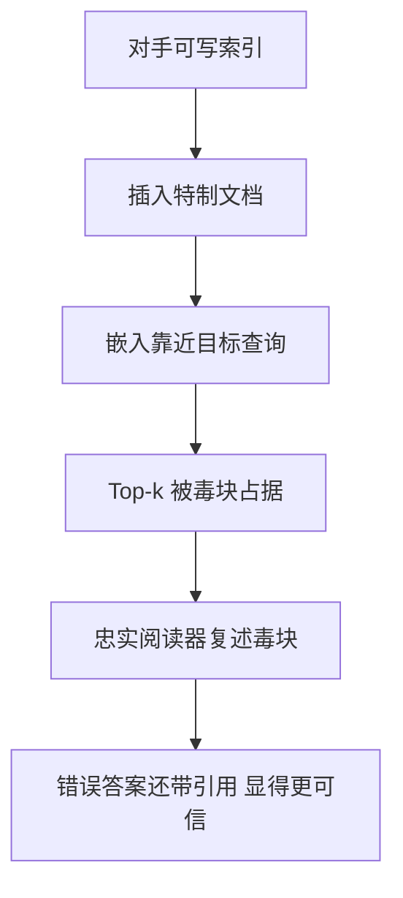
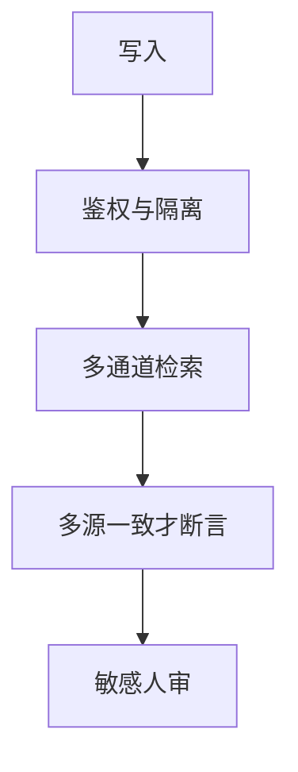

# 检索投毒防御

索引可写，对手就愿意写。少量特制文档可以在向量空间里抢走特定查询的 Top-k，阅读器会把毒块当证据。

<footer>—— 对照 PoisonedRAG 一类对稠密检索投毒的研究；防御走校验与隔离，不公开投毒配方</footer>

[上一课](/llm/rag-vs-finetune)把可更新集合选成知识住所。可更新即攻击面。本课写检索投毒的**防御评测与工程边界**。缺口不是再讲 InfoNCE，而是：召回率高可以来自毒块。课程在此结束；下一课程多模态生成不再默认检索集合可信。

## 问题

对手若能向语料库插入或篡改文档（网页抓取、共享知识库、供应链），可以把嵌入推到目标查询附近，使 Top-k 被占。阅读器越「忠于上下文」，越会复述毒块——忠实度指标会反向奖励中招。直觉类比：往图书馆塞进一本封面做得最像「权威答案」的假书。检索员按「哪本最像问题」取书，拿到的就是它；而阅读员越诚实、越习惯照书念，就越会把假书内容当真话输出。两个各自「称职」的环节叠在一起，恰好把毒送进答案——这是检索系统特有的失败方式。与[间接注入](/llm/indirect-injection) 同构：检索块是不可信输入。与训练数据投毒不同：不必碰权重。

```mermaid
flowchart TD
  A["对手可写索引"] --> B["插入特制文档"]
  B --> C["嵌入靠近目标查询"]
  C --> D["Top-k 被毒块占据"]
  D --> E["忠实阅读器复述毒块"]
  E --> F["错误答案还带引用 显得更可信"]
```

公开描述具体如何构造毒向量，会变成教程。评测只定义：在隔离库上插入标记过的对抗文档，看目标查询是否被劫持、以及防御后是否恢复。

本课不提供投毒文档的写法或绕过过滤的特征。只讨论检测、隔离、交叉验证与权限。

## 方法

防御层叠：写入鉴权与审核；来源信誉；新文档隔离观察；检索结果与独立通道交叉（BM25 与稠密不一致时降权）；阅读器提示「块可能不可信」并要求多源一致才断言；敏感查询走人审。「劫持率」和「误杀率」是一对必须一起看的数：劫持率是毒块仍占进 Top-k 的比例，误杀率是防御把合法文档错误降权的比例。只压劫持率会造出一台见谁都拦的安检机——系统「安全」了，检索也废了。评测两者都要报，并给出你选的平衡点。检测：近重复簇、异常高的查询–文档分、同一作者短时间占满多查询的 Top-k。评测用内部红队库，报告劫持率与误杀率（合法文档被降权）。

```mermaid
flowchart TD
  WR["写入"] --> AUT["鉴权与隔离"]
  AUT --> RET["多通道检索"]
  RET --> CON["多源一致才断言"]
  CON --> HUM["敏感人审"]
```

## 机制

稠密空间连续，小扰动可改变近邻。稀疏词法对字面异常更敏感，故混合通道提高发现不一致性的机会，不是为了刷召回。阅读器无怀疑地最大化 $p(y\mid x,\mathrm{blocks})$ 时，毒块就是最强条件。常见误区：以为「换一个更强的嵌入模型」就能免疫投毒。嵌入空间是连续的，攻击者总能朝目标查询的方向微调文档——模型升级只是抬高了门槛，没有关闭这扇门。根本的防御动作是在打分之外引入**来源**维度：谁写入的、有没有审核、其他通道是否佐证，这些是嵌入模型本身给不了的。防御必须在目标函数外加「来源」变量，不能只加更好的嵌入模型。

## 边界

内网只读镜像、无用户生成内容时，投毒面小但仍有供应链（供应商文档）。公开互联网 RAG 面最大。检索课结束。下一课从像素如何进生成模型讲起，默认文本索引的教训已经学完。

## 小结

- 可写索引可被劫持；忠实阅读器会放大毒块。
- 鉴权、隔离、多通道交叉、多源一致、敏感人审。
- 评测劫持率与误杀；不公开投毒配方。
- 出处：稠密检索投毒现象的公开研究（PoisonedRAG 等）；间接注入课。
