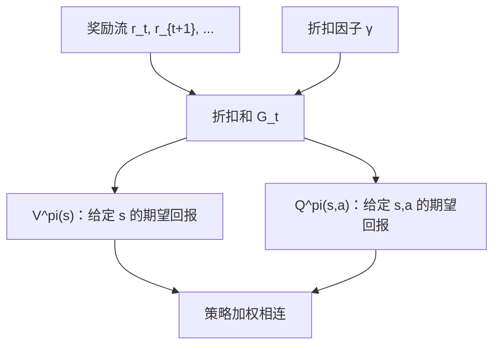
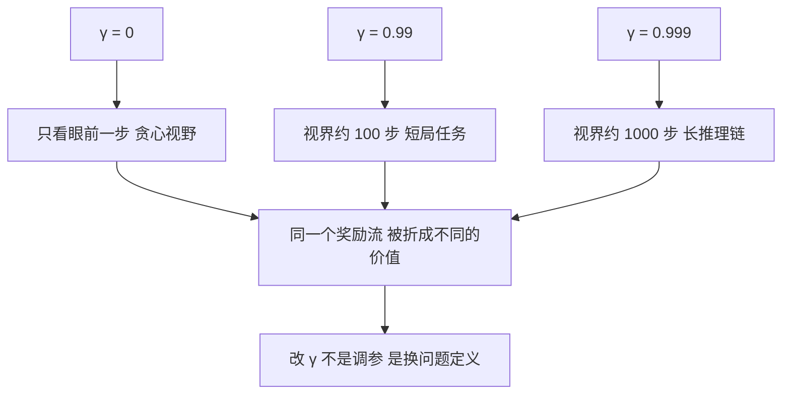

# 回报、折扣与价值函数

价值不是这一步拿到了多少，而是从这一步往后还能拿到多少的折扣总和；决策比较的从来是后者。

<footer>—— 据 Sutton &amp; Barto, Reinforcement Learning: An Introduction, 2018, 第 3 章；折扣表述见 Howard, Dynamic Programming and Markov Processes, 1960 整理</footer>

[上一课](/llm/mdp-five-tuple)把序贯决策钉成五元组 $(S,A,P,r,\gamma)$ 与轨迹分布，把优化目标写成对 $p^\pi$ 的期望；但「期望什么」还没定义——一条轨迹只给出一列奖励，怎么把它压成一个可以比较的数。本课补这个缺口：回报 $G_t$ 与折扣因子 $\gamma$，以及价值函数 $V^\pi$ 与动作价值函数 $Q^\pi$；并给 $\gamma$ 三种读法。

## 问题

奖励流 $r_0,r_1,r_2,\dots$ 无限长，直接求和可能发散，两个「无穷」没法比较；而且各时刻的奖励量纲相同却意义不同：眼前的分数与一千步之后的分数不在一个价位上。直觉类比：这和金融里的折现是一回事——一年后到账的一块钱，今天不值一块钱，要打个折才等值。$\gamma$ 就是这个折扣率的近亲：$\gamma^{100}$ 表示「100 步之后的奖励折算到今天还剩几成」。折扣不是嫌远期奖励不重要，而是给「未来」一个统一的汇率，让不同时刻的钱能加到一起。吃糖一步爽而长期有害，说的就是「每步奖励之和」与「这个状态值得去吗」是两回事。决策需要一个把「从现在起的全部未来」折叠成单个实数的泛函。

## 方法

回报定义为折扣和：

$$G_t=\sum_{k=0}^{\infty}\gamma^k r_{t+k},\qquad \gamma\in[0,1)$$

价值函数与动作价值函数是回报的条件期望：

$$V^\pi(s)=\mathbb{E}_\pi[G_t\mid s_t=s],\qquad Q^\pi(s,a)=\mathbb{E}_\pi[G_t\mid s_t=s,\ a_t=a]$$

两者由策略加权相连：$V^\pi(s)=\sum_a \pi(a\mid s)\,Q^\pi(s,a)$；而 $Q^\pi$ 比期望再多走一步：$Q^\pi(s,a)=r(s,a)+\gamma\,\mathbb{E}_{s'\sim P}[V^\pi(s')]$。$V$ 评「处境」，$Q$ 评「处境里的这个动作」；后面策略改进要用 $Q$（换 argmax 的动作），基线要用 $V$（减去处境均值），分工在此埋下。

$\gamma$ 有三种读法，各有用处：

1. **时间偏好**：$\gamma$ 近 $1$ 是耐心，远期与近期几乎同权；$\gamma=0$ 只看眼前一步。它把「多远的事还算数」写成单个参数。
2. **有效视界**：几何级数主要质量集中在约 $1/(1-\gamma)$ 步内。$\gamma=0.99$ 视界约百步，$\gamma=0.999$ 约千步。数字实例：$\gamma=0.99$ 时，100 步后的奖励权重只剩 $0.99^{100}\approx 0.37$，500 步后约 $0.0066$——基本可以忽略；把 $\gamma$ 调到 $0.999$，同样的 0.37 要到 1000 步才出现。若每步奖励上限是 1，回报的总上界 $1/(1-\gamma)$ 也从 100 变成 1000：同一个数既控视界也控有界性。
3. **几何收敛**：$|G_t|\le r_{\max}/(1-\gamma)$，无穷和有界；这是后面贝尔曼算子成为压缩映射的前提之一。

## 机制

价值函数为什么是正确的中间量：它把「无限长的未来」折成每个状态一个数，于是「规划整条轨迹」降维成「比较几个数」。没有这一步，决策要在指数多的轨迹上做选择；有了它，状态取代轨迹成为运算对象。代价也在这里：$V^\pi$ 是期望，条件在策略上——换策略就换价值，$V^\pi$ 不是「这个状态客观上多好」，而是「这个状态在 $\pi$ 手里多好」。混淆两者会在后面把评估与改进搅在一起。

$\gamma$ 的改动不是调参而是换目标：视界从百步变千步，早期步骤的信用被重新放大。上面第二种读法解释了后训练里一个常见现象——把折扣从 $0.99$ 调到 $0.999$，长推理链的行为显著改变：不是模型变了，是问题定义变了。

常见误区：把 $\gamma$ 当成学习率那样的纯数值旋钮去网格搜索。学习率只影响「多快找到答案」，$\gamma$ 决定「答案是什么」——两组不同 $\gamma$ 下的回报不可直接比较，A/B 出来的「谁分高」比的其实是两道不同的题。每次改 $\gamma$，都应视为重新定义了任务。

$\gamma=1$ 在回合有限（必到 EOS）时也可用，但要求终止有保证；一旦轨迹可能无限长，$\gamma\lt 1$ 就从选项变成必需品——它同时管发散和管收敛。

## 边界

本课只定义，不给算法：$V^\pi$ 按定义要枚举所有轨迹，实际不可算——把它变成递归方程是下一课的事。也不讲平均奖励准则（无折扣、比长期步均值的另一套理论，视界语义完全不同）。$V$ 与 $Q$ 的关系式在本课只是代数，下一课它会升级成方程。

后课默认：$G_t$ 是折扣回报，$V^\pi$/$Q^\pi$ 是它的条件期望，$1/(1-\gamma)$ 是视界尺度。

## 小结

- 回报 $G_t=\sum_k\gamma^k r_{t+k}$ 把奖励流折成一个可比较的实数。
- $V^\pi$ 评处境，$Q^\pi$ 评动作；策略加权相连，$Q$ 比 $V$ 多看一步。
- $\gamma$ 三读法：时间偏好、有效视界 $1/(1-\gamma)$、几何有界性（压缩的前提）。
- 价值条件在策略上，换策略即换价值；改 $\gamma$ 是换问题不是调参。
- 定义不可算：枚举轨迹指数级，递归化留给贝尔曼方程。
- 出处：Sutton &amp; Barto, *Reinforcement Learning*, 2018 第 3 章；Howard, *Dynamic Programming and Markov Processes*, 1960。
