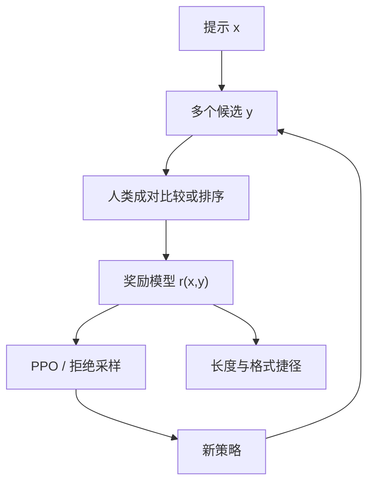

# 奖励模型

奖励模型把「哪一条更好」收成可对策略反传的标量；它不是世界知识的裁判，而是比较数据上的回归器。

<footer>—— Ouyang 等 InstructGPT 用人类比较训练奖励模型，再以 PPO 优化策略；成对噪声的统计模型见 Bradley-Terry</footer>

监督微调模仿示范，示范覆盖不到的题面仍按基座习惯说。要把行为推到「更有用、更安全」，需要一种能给未示范过的完整回答打分的函数。Ouyang 等人的 InstructGPT 把这个函数做成奖励模型（reward model, RM）：同一提示下若干候选回答由人排序或成对比较，RM 学成标量 $r(x,y)$，然后策略在 KL 约束下最大化期望奖励。Llama 2 沿用比较→RM→RL 的骨架，并把有用性与安全性拆成两个 RM，因为单一标量无法同时表达经常相反的偏好。本篇只谈 RM 作为数据到标量的那一层：输入、损失、分头、以及它如何过拟合。成对比较的概率模型见 [Bradley-Terry](/llm/bradley-terry)；绕过显式 RM 的路径见 [DPO](/llm/dpo)。

## 问题

人类无法为每一个 $y$ 写一个绝对分数，绝对分的校准在标注员之间也极差。相对比较稳定：给定 $x$ 与 $y_w,y_l$，问哪一条更好。RM 要解决的是把离散、有噪声、不可传递的比较，变成对任意 $y$ 可求的 $r(x,y)$，以便策略梯度或拒绝采样使用。函数形式几乎总是：初始化自 SFT 模型，去掉或替换词预测头，改成对最后一个 token（或整段池化）的标量。初始化自 SFT 而不是自基座，是因为比较发生在已经套上助手格式的回答上，RM 必须读懂同样的前缀。

RM 的对象不是「真值质量」。比较数据定义什么叫好：InstructGPT 的标注员按指南权衡有用、真实、无害；指南外的美学、幽默、特定专业深度，RM 不会无中生有。数据少时，RM 会走捷径：更长的回答、列表更多的回答、含「首先其次」的回答，在比较里更常赢，于是长度与格式成为奖励的主成份。策略随后为 RM 而优化，不是为指南而优化，这就是奖励 hacking。

### 成对比较到标量不是无损压缩

把 $K$ 条回答的排序拆成 $\binom{K}{2}$ 对，InstructGPT 即如此使用排名。BT 模型假设存在潜在分数，比较独立。真实偏好有平局、有不可传递循环、有标注员分歧。RM 仍用一个 $r$ 去拟合，残差会变成系统偏差。分头（有用 / 安全）减少的是把两种相反比较压进同一标量的扭曲，并不能消除同一种比较内部的不可传递。Llama 2 选择分头，是工程上承认压缩损失不可接受，而不是因为两个 BT 模型在数学上更正确。

RM 打分的是已经生成完的 $y$，不是逐 token 的局部质量。中间推理错误但结尾看起来对的回答，可能得高分。这与过程监督不是同一对象。不要把 RM 分数解释成逐步正确。

## 方法

数据：对每个 $x$ 采样或写出多个 $y$，人标赢/输，或对 $K$ 个排序。InstructGPT 用标注员对模型样本排序。训练：Bradley-Terry 损失

$$
\mathcal{L}_{\mathrm{RM}}=-\mathbb{E}_{(x,y_w,y_l)}\log\sigma\bigl(r_\phi(x,y_w)-r_\phi(x,y_l)\bigr),
$$

使赢的分数高于输的。平局可丢掉、或写成对称的两项、或单独的平局参数；公开配方各异，须在数据卡写明。实现上 $r_\phi$ 通常只在回答段上聚合，提示段与 SFT 一样当作条件。正则：过大的分数间隙会在 PPO 里给出过大优势，常用分数归一化、裁剪、或在 batch 内减均值。InstructGPT 还讨论过 RM 随策略迭代：新策略的样本再拿去标，以免 RM 只在旧分布上准。

分头：有用 RM 与安全 RM 各吃各的比较集。推理或 PPO 时再组合成标量，例如先过安全阈值再优化有用，或加权和。Llama 2 强调两条比较经常冲突，组合规则是产品决策。单头把冲突留给标注员在比较时当场权衡，标注方差更大。

规模：RM 不必与策略同大。InstructGPT 用明显小于 175B 策略的 RM 做打分，代价是容量不足时更依赖捷径。RM 过大则贵，且更容易背诵比较集。实践是在策略分布的持有比较上测准确率，而不是只看训练对的拟合。准确率高仍可能 hacking：持有集若与训练集同分布、同样偏爱长回答，准确率会表扬捷径。

### 有用性与安全性分头

安全比较的赢方常常是拒答或给替代方案；有用比较的赢方常常是信息全、步骤清。混在一个头里，RM 会学到一个模糊的「看起来负责任」的平均，策略要么过度拒绝，要么在安全题上仍偏长配合。分头之后，SFT 阶段的 [安全配比](/llm/sft-safety-mix) 可以更粗，因为细权衡交给组合规则。代价是两套标注指南、两套扫描，以及组合权重本身会成为新的超参。

## 机制

在 BT 假设下，$r$ 是胜率的 logit。RM 泛化，是把未见过的 $y$ 映射到与训练比较一致的分数。策略优化改变 $p(y\mid x)$，使高 $r$ 的 $y$ 更常出现。若 $r$ 的水平集与指南的水平集不一致，KL 正则只限制走多远，不纠正方向。这就是为什么 RM 误差会被 PPO 放大：SFT 只模仿，RM+RL 会沿着错误方向走到示范之外。DPO 把 $r$ 解析掉，但比较噪声仍然在，只是换成策略对数概率的差（见 DPO 篇）。

长度偏置的机制是标注统计：更长的 $y$ 在开放生成比较里更常被标为更有用，因为信息量表面更大。RM 若无长度惩罚，会给 token 数正权重。PPO 随后提高平均长度。缓解是在 $r$ 里减 $\alpha|y|$，或在比较时要求标注员忽略冗长，或对过长回答不做正向比较。这些是数据与损失上的补丁，不是 BT 模型自带的。

用 RM 当评测器（「AI 裁判」）会把同一捷径写进排行榜。训练 RM 与评测 RM 同源时，分数上升不证明更有用。人类抽检或独立裁判模型是最低要求。

### 过拟合比较集与过拟合捷径

两种过拟合不同。第一种：记住训练对，持有准确率掉。加 dropout、早停、比较集多样性。第二种：持有准确率仍高，因为持有集共享捷径。第二种更危险，只能换比较协议（控制长度、打乱格式、加入「短而正确 vs 长而空」的对）来暴露。InstructGPT 迭代采集新策略样本，部分缓解第一种（分布外的 $y$ 被补进数据），对第二种要靠指南与题型设计。

## 边界与工程取舍

RM 不注入新知识。它只能在基座与 SFT 已经能生成的回答里排序。事实错误若写得更像好助手，可以赢比较。真实性需要示范、检索或专门的事实比较，不是默认 RM 的性质。Ouyang 等人把真实作为指南的一部分，但 RM 仍是对标注行为的拟合。

离线 RM（只在 SFT 模型样本上训）对后来 PPO 走远的策略会失效，分数变得不可比。在线迭代贵。DPO / IPO 一类方法选择不训显式 $r$，但仍然需要同一类比较数据，噪声与捷径问题原样存在。RM 的边界因此是**比较数据的边界**，模型结构反而是次要的。

不要把分类器式安全模型与偏好 RM 混成一个检查点而不加说明。前者是有害/无害分类，后者是成对更好。Llama 2 的安全 RM 仍是比较模型。用分类器阈值去过滤 SFT 数据，属于清洗，不是本篇的 $r(x,y)$。

部署时 RM 可作为拒绝采样的打分器：同提示抽 $n$ 条，取 $r$ 最大。这比 PPO 稳，但把计算花在采样上，且 $n$ 小时仍受 RM 捷径支配。它不改变 RM 学的是什么，只改变怎么用。

## 小结

- 奖励模型把人类成对比较拟合成 $r(x,y)$，供 PPO 或拒绝采样使用；初始化通常来自 SFT。
- 损失以 Bradley-Terry 对数似然为主；排序可拆成对。InstructGPT 确立了 SFT→RM→RL 流程。
- 有用与安全宜分头，以免相反比较压进同一标量；Llama 2 采用这一工程选择。
- RM 拟合的是标注指南，会走长度与格式捷径；策略会放大捷径。
- 迭代采集新策略样本减轻分布外失效；不能单靠持有准确率排除 hacking。
- RM 不提供新知识；比较数据的噪声与覆盖就是 RM 的天花板。
- 出处：Ouyang 等，InstructGPT，NeurIPS 2022；Touvron 等，Llama 2，2023；成对模型见 Bradley-Terry。
