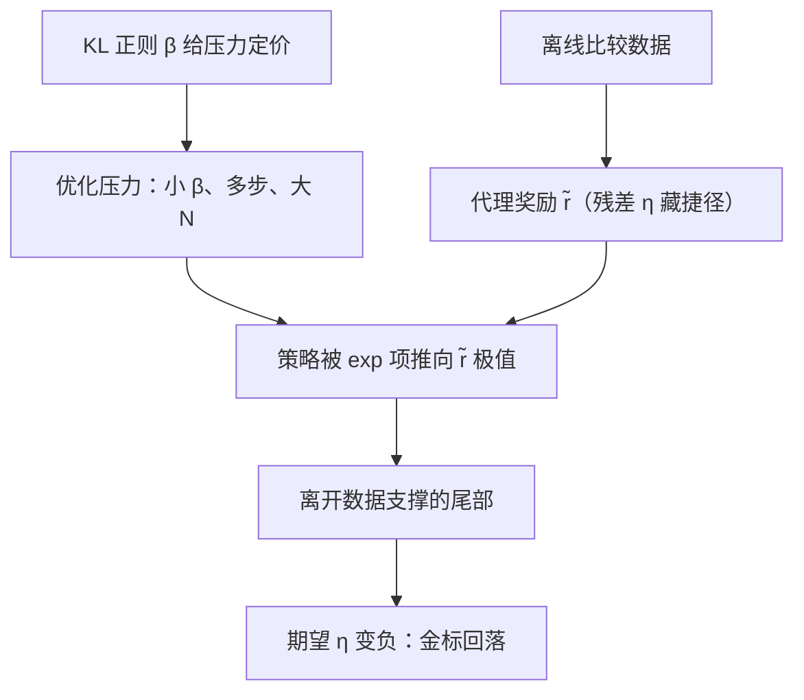

# 奖励过优化的理论视角

度量一旦成为目标就不再是好度量；优化器不会停在相关性失效的地方，它专门去那里。

<footer>—— Strathern 1997 对 Goodhart 定律的表述；理论骨架据 Skalse 等 2022、Gao 等 2022 整理</footer>

[上一课](/llm/offline-rl-shift)把保守主义的动机钉在「数据支撑外价值不可信」上，并指出 RLHF 里离线的是奖励来源。[RM 过优化与 Goodhart](/llm/rm-overoptimization) 已画过实证曲线：代理奖励一路涨，金标先升后降，更大的 RM 只推迟拐点。本课补理论骨架：间隙从哪来、优化压力如何放大间隙、哪些量可以被监控。实证课给形状，本课给可以推导的骨头。

## 问题

设真实奖励 $r^\star$（人类抽检、更大 RM、任务通过率）与代理 $\tilde r$（训练出的 RM）。写恒等式

$$\mathbb{E}_\pi[r^\star]=\mathbb{E}_\pi[\tilde r]+\mathbb{E}_\pi[\eta],\qquad \eta=r^\star-\tilde r,$$

$\eta$ 是残差。$\tilde r$ 在离线比较数据上拟合，残差里藏着捷径：长度、清单、客套、表面正确。关键不在残差存在，而在**残差与代理相关**：两者被同一批捷径驱动，$\tilde r$ 高分处 $\eta$ 系统性偏正还是偏负并不对称——把 $\pi$ 推向 $\tilde r$ 的高分尾部，落点集中在 $\eta$ 最偏正的样本附近，于是 $\mathbb{E}_\pi[r^\star]$ 先随 $\mathbb{E}_\pi[\tilde r]$ 上升、后被负的 $\mathbb{E}_\pi[\eta]$ 拖垮。Goodhart 的变体分类里（回归式、极值式、因果式、对抗式），RL 撞的是极值式：优化不是被动选一个点，而是主动搜索相关性最失效的尾部。

## 方法

三块骨架，各对应一个可操作的量。其一，**优化压力旋钮**。KL 正则目标

$$\max_\pi\ \mathbb{E}_\pi[\tilde r]-\beta\,\mathrm{KL}(\pi\,\|\,\pi_{\mathrm{ref}})$$

的解形如 $\pi\propto\pi_{\mathrm{ref}}\exp(\tilde r/\beta)$：$\beta$ 调小、PPO 步数加长、Best-of-N 的 $N$ 调大，都在给 $\exp$ 的指数加压，策略向 $\tilde r$ 的极值集中（实现见 [PPO 在语言模型中的实现](/llm/ppo-llm)）。其二，**标度律骨架**。Gao 等把「代理减金标」之差对优化强度（KL、$N$）的曲线在 RL 与 Best-of-N 两条路线上拟合出同族形状，系数随 RM 与金标的规模差变化——金标越强、间隙涨得越慢，但拐点只被推迟。其三，**可钻性的形式化**。Skalse 等把 reward hacking 写成：若存在策略使代理高、真奖励低，代理就是可钻的；可钻性是常态而非病态，问题只是优化器离它多近。

Gao 等的曲线里 RL 与 Best-of-N 同形，但 RL 到拐点更快：同样一份优化强度预算，交给 PPO 比交给推理期选择更早透支代理的信用。

## 机制

三块骨架扣回上一课的离线视角：RM 是离线拟合的，策略被优化压力推离数据支撑，支撑外残差 $\eta$ 无约束——所以 Goodhart 放大 = 优化 × 外推，不是两个独立毛病，是同一台机器的两个齿轮。这解释了几件事为何有效、为何有限。KL 有用，因为它直接给压力定价：$\beta$ 是唯一标了价的旋钮。集成与校准（下一课程展开）只能挪拐点：它们压小 $\eta$ 的方差，不改变极值处相关性失效。RLVR 也不是解药：把 $\tilde r$ 换成验证器（[RLVR](/llm/rlvr)）消灭了 RM 的间隙，验证器自己成为新代理——奖励黑客换了宿主（[奖励黑客](/llm/reward-hacking-llm)），GRPO 组内同一验证器的奖励照样能被格式与猜测攻击吃掉。

## 边界

骨架的限度要说清。恒等式是定义不是定理，它不给 $r^\star$；Skalse 的不可钻性条件需要知道 $r^\star$ 才能检验，实际上不可得，只能靠独立金标逼近。标度律是经验规律，换任务分布或换基座会移位，不能外推成定律。理论没有给出「安全阈值」，只给出三个可监控量的关系：压力（$\beta$、步数、$N$）、间隙（双轴监控里的代理减金标）、支撑距离（KL）。把它们记成三个仪表，比记住任何一条曲线都有用。

## 小结

- 代理与真奖励之差是残差 $\eta$；危险在于 $\eta$ 与 $\tilde r$ 相关，且优化器主动搜向 $\eta$ 偏正的极值尾部。
- KL 正则解形如 $\pi\propto\pi_{\mathrm{ref}}\exp(\tilde r/\beta)$：$\beta$、PPO 步数、BoN 的 $N$ 是同一个「压力」的三种货币。
- Goodhart 放大 = 优化压力 × 离线外推；KL 是定价，集成与校准只挪拐点，RLVR 换宿主。
- 可钻性的严格定义来自 Skalse 等；标度律来自 Gao 等，两者都不给安全阈值，只给可监控量。
- 出处：Strathern 1997 对 Goodhart 定律的表述；Gao、Schulman、Hilton 2022；Skalse 等 2022。
