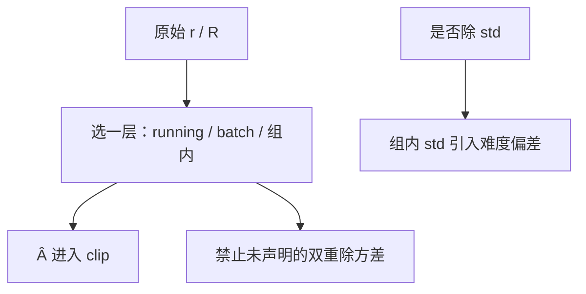

# 奖励归一化与白化

奖励的单位随 RM、校验器与长度漂移；不把尺度钉住，学习率与 clip 都在打移动靶。

<footer>—— 对照 PPO 实现里的 advantage whitening；群体方法里的组内标准化；Dr. GRPO 对标准差项的批评</footer>

[上一课](/llm/value-model-init)让 $V$ 去拟合回报。回报的量纲若一步一变，$V$ 永远在追尺度而不是追结构。缺口是：**$r$ 的零点与方差必须在进入 GAE / 组优势之前被定义。** 本课写 running 统计、batch 白化、组内标准化，以及它们如何与 [校准](/llm/rm-calibration)、[多目标加权](/llm/multi-objective-reward) 打架。不重推 [GRPO](/llm/grpo) 公式。

## 问题

RM logit、通过率、$\pm 1$ 规则奖励、逐步 KL，量纲不同。PPO 的有效步长是 $\eta\times \hat A$；$\hat A$ 随 $r$ 的标准差线性变，等于隐式改学习率。训练过程中策略变好，$r$ 的均值上升，若不减均值，正优势变成默认，clip 长期打在上侧。白化（减均值除标准差）把 $\hat A$ 钉在单位方差，学习率才有跨实验可比性。

GRPO 在**组内**做 $(r-\mathrm{mean})/\mathrm{std}$，已经是一种白化，但按题，不是按全局。Dr. GRPO（Liu 等）指出：组内 std 把「这题本来分差就大」变成优势幅度，引入难度偏差。是否除 std，是本课要显式选择的开关。running 统计的半衰期也要写进配置：太短则一步一变，太长则跟不上策略。

### 白化奖励还是白化优势

对 $r$ 做 running 标准化，再送 GAE，价值目标的量纲稳定。只对 $\hat A$ 做 batch 白化，不改变 $V$ 要回归的尺度，但稳定策略梯度。两层都做，等于除了两次方差，更新过弱。只做一次，写进配置。

校准是仿射对齐胜率；白化是训练稳定性。先校准再白化，胜率含义被再次丢掉——在线 PPO 通常只白化，把校准留给阈值与评测。

## 方法

运行均值 / 方差：对序列 $R$ 用指数滑动，再 $R'=(R-\mu)/(\sigma+\varepsilon)$。Batch 内优势白化：当前 minibatch 上对 $\hat A$ 减均除标。组内：仅对同一 $x$ 的 $G$ 条。DAPO 用规则 $\pm 1$ 再组内标准化，不再做全局 running。可验证域若已是 $\pm 1$，全局白化几乎只减均值。

多目标：必须在加权之后或之前锁一种（上一课）。加权前各自白化，则 $w$ 近似重要性；加权后再白化，$w$ 只影响合成方向，整体尺度被钉死。

## 机制

减均值去掉「人人有奖」的偏置，使相对好坏成为梯度。除标准差使难题（$r$ 分布宽）与易题（分布窄）的更新幅度同量级——这可能是优点（都学一点）或缺点（难题不该与易题同幅度，Dr. GRPO 的论点）。不除 std、只减均值，保留原始分差，学习率要随奖励定义重扫。

$\varepsilon$ 要够大。全对组 $\sigma\to 0$ 会炸；DAPO 选择直接丢掉该组，而不是除一个假的 $\sigma$。

## 边界与工程取舍

[过优化](/llm/rm-overoptimization) 监控的金标不要白化后再和代理画同一张图，否则拐点被尺度藏住。异步 off-policy 下 running 统计混了多版本策略，均值滞后，早期过估计。下一课专门处理长度进入分母或进入 $r$ 时的系统偏差，它常被误写成「再白化一次」。

白化层数、是否除 std、滑动半衰期必须写进实验卡，换奖励定义后学习率要重扫。

## 小结

- 白化钉住优势尺度，使学习率与 clip 跨实验可比。
- 只做一层：running $r$、batch $\hat A$、或组内；禁止悄悄除两次。
- 组内除 std 会混入难度偏差，是可关开关。
- 校准与白化目的不同，在线 PPO 通常只白化。
- 出处：PPO 实现惯例；Shao 等 GRPO 组内标准化；Liu 等 Dr. GRPO；Yu 等 DAPO 对零方差组的处理。
