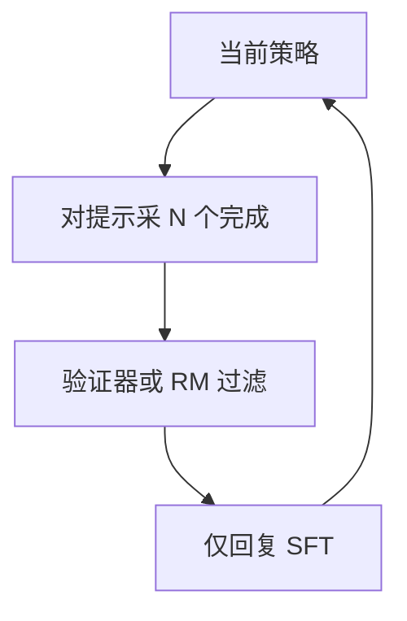

# 拒绝采样数据循环

用当前策略生成许多完成，留下奖励或验证器通过的那些，再当示范做 SFT；探索发生在采样里，学习仍然是监督学习。

<footer>—— Yuan 等数学上的 Rejection Sampling Fine-Tuning（2023）；Dong 等 RAFT（TMLR 2023）；Llama 2-Chat 亦用拒绝采样</footer>

[上一课](/llm/sft-vs-rl-efficiency)把缺口分成格式、排序与搜索。拒绝采样微调（RFT / RAFT）是搜索缺口上的中间道路：不训练在线 PPO，也不满足于静态示范。循环是：采样 → 打分 → 过滤 → SFT → 更新策略再采样。Yuan 等人在数学推理上展示「生成–筛选–再训」随采样数扩展；Dong 等人的 RAFT 用奖励模型给完成打分再微调；Touvron 等人在 Llama 2-Chat 里同样使用拒绝采样阶段。本课写这个数据闭环，并结束「SFT 工程」单元。下一单元从 [rsLoRA](/llm/rslora) 回到参数高效。

## 问题

静态 SFT 的 $y$ 来自人或教师，与学生当前 $p_\theta(\cdot\mid x)$ 可能离得很远：学生学的是模仿离线轨迹，推理时却从自己的分布采样，训练–解码错位。在线 RL 对齐分布，但要维护奖励模型、KL、价值头。拒绝采样只保留学生**已经能生成**且分数高的 $y$，再对这些 $y$ 做[仅回复 SFT](/llm/response-only-loss)，分布天然 on-policy 或近 on-policy。

问题变成工程循环：每轮采多少、阈值怎么定、失败样本是否当负例、循环几次后奖励黑客出现。没有循环就退化成一次性 Best-of-N 蒸馏；循环过多又在刷奖励模型癖好。

### 过滤器就是奖励

数学可用最终答案核对；代码可用测试；开放对话只能用 RM 或 LLM 裁判。过滤器错，SFT 会强化错法。这与[谱系](/llm/instruction-data-lineage)里教师错误同源，只是教师换成了「当前模型 + 过滤器」。

Yuan 等人文标题为 Scaling Relationship on Learning Mathematical Reasoning with Large Language Models：RFT 用模型自己的正确样本扩充 SFT。RAFT 把「正确」推广为奖励排序后取 top。

## 方法

固定提示集 $\mathcal{X}$（可含难例）。对每个 $x$，从当前 $\theta$ 采 $N$ 个完成，温度略高于部署以增加多样性。过滤器留下 $k$ 个（或通过/失败二值）。用通过的 $(x,y)$ 组成新训练集，[chat template](/llm/chat-template) 与掩码与普通 SFT 相同，[学习率](/llm/lora-vs-full-lr)按参数化选，epoch 少，避免背这一轮的幸运样本。更新 $\theta$，进入下一轮；提示集可逐渐加难。

负例：仅做正例 SFT 是标准 RFT。若把失败完成当「不要这样写」，需要对比损失或 DPO，那就离开纯拒绝采样、进入偏好。本课默认正例循环。

$N$ 与计算预算线性；过大则同一提示下完成高度相关，边际信息下降。去重（n-gram / 嵌入）与多样性温度是实用旋钮。Llama 2 把拒绝采样与 RLHF 并列：前者产示范，后者直接优化偏好，可以接力而不是二选一。

## 机制

每轮 SFT 把质量堆到过滤器通过的区域内。若过滤器是精确验证器，循环近似在扩大「会做这道题」的测度，类似自举。若过滤器是 RM，循环近似强化 RM 的高水平集，包括 RM 的虚假相关（更长、更客气）。KL 相对第一轮 SFT 基线会悄悄增大，即使没有显式 KL 项——因为每轮都在自己的高分尾巴上再训。

与纯 SFT 比：数据随策略进化，覆盖学生真实会犯的错附近的正确修补。与 PPO 比：没有逐步信用分配，整个 $y$ 被接受或拒绝，长链中间错误只能靠「整段被拒」间接压。这是样本效率换优化复杂度。

[LoRA](/llm/lora) 上做 RFT：每轮适配器迅速拟合本轮 top 完成，下一轮采样多样性下降，循环早停。全参或较高秩更利于多轮自举。NEFTune 可减轻背诵本轮样本。

## 边界与工程取舍

无可靠过滤器时不要做 RFT，回去精选 SFT。过滤器比学生强很多时（编译器、标准答案），RFT 极划算；过滤器与学生同弱时，循环放大共同偏见。安全领域用 RM 做拒绝采样，可能系统性地留下「看起来安全」的完成。计算上，RFT 的主成本在采样，不在 SFT 步，账应记在推理吞吐。

本单元收束：数据谱系、仅回复、打包、NEFTune、学习率分叉、长上下文、领域两阶段、SFT/RL 分界、RFT 循环。后课默认这些工程契约已成立，转向低秩之外的 PEFT。

## 小结

- RFT/RAFT：当前策略采样 → 过滤 → 当示范 SFT，再循环。
- 训练–解码对齐优于静态离线示范；代价是过滤器质量与采样算力。
- 精确验证器上自举干净；RM 过滤会强化奖励癖好。
- 正例 SFT 不自动提供负例；要排序就换偏好损失。
- LoRA 上多轮 RFT 容易多样性塌缩，需早停或提高容量。
- 出处：Yuan 等，数学 RFT，2023；Dong 等，RAFT，TMLR 2023；Touvron 等，Llama 2，2023。
